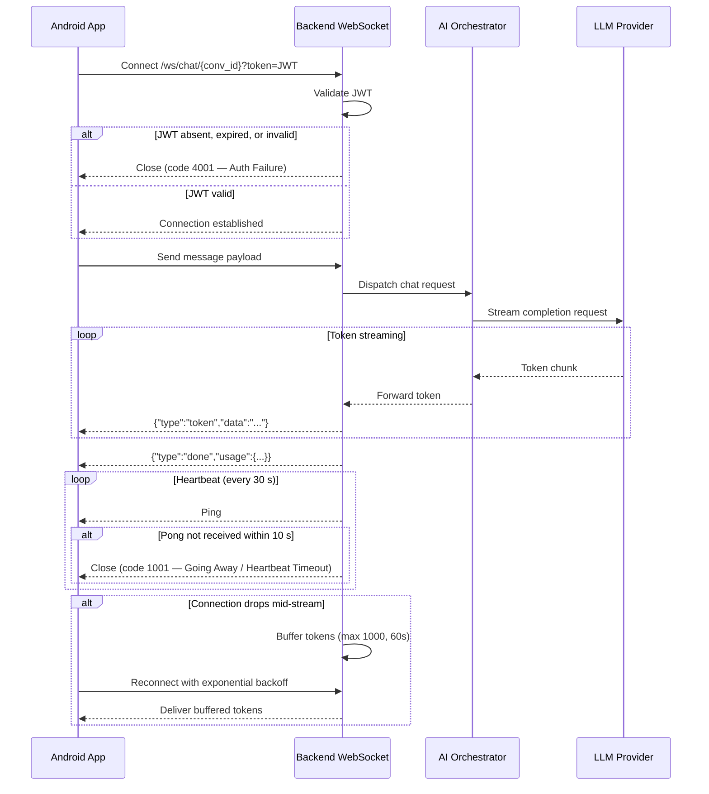

# Design Document — Android AI Assistant (Enterprise Edition)

## Overview

The Android AI Assistant is a production-ready, enterprise-grade AI platform composed of four primary system boundaries:

1. **Android Client** — A Kotlin/Jetpack Compose multi-module application implementing Clean Architecture with MVVM, offline-first data strategy, WebSocket streaming, and biometric security.
2. **FastAPI Backend** — A Python modular-monolith server providing REST and WebSocket endpoints, orchestrating AI providers, managing RAG ingestion, and enforcing security policies.
3. **AI & Data Layer** — ChromaDB for vector storage, PostgreSQL for relational data, Redis for caching and message brokering, MinIO for object storage, and Celery for background job processing.
4. **External Integrations** — Multiple LLM providers (OpenAI, Gemini, Claude, Ollama, Llama, Mistral), Firebase services, and MCP tool connectors (GitHub, Gmail, Google Drive, Google Calendar, Slack, Jira, Notion, Figma).

### Key Design Principles

- **Offline-First**: Room database is the single source of truth on Android. WorkManager syncs to the backend when connectivity is available.
- **Streaming-First**: AI responses are delivered token-by-token over WebSockets. The backend buffers tokens during transient disconnects.
- **Provider-Agnostic AI**: All LLM calls pass through a single `AIOrchestrator` abstraction. Providers are swappable without changing callers.
- **Security by Default**: JWT + RBAC on every backend endpoint, EncryptedSharedPreferences + certificate pinning on Android, AES-256 for API key storage.
- **Modular Monolith → Microservices**: Backend modules have explicit boundaries so each can be extracted into an independent service later without major refactoring.
- **Observability**: Prometheus metrics, Grafana dashboards, Loki log aggregation, and Firebase Crashlytics/Analytics are first-class citizens, not afterthoughts.


## Architecture

### High-Level System Architecture

```mermaid
graph TB
    subgraph Android["Android Client"]
        UI["Jetpack Compose UI"]
        VM["ViewModels (MVVM)"]
        UC["Use Cases (Domain)"]
        REPO["Repositories (Data)"]
        ROOM["Room Database"]
        DS["DataStore"]
        WM["WorkManager"]
        WS_CLIENT["WebSocket Client (OkHttp)"]
    end

    subgraph Backend["FastAPI Backend (Modular Monolith)"]
        NGINX["Nginx Reverse Proxy"]
        API["FastAPI REST API"]
        WS_SERVER["WebSocket /ws/chat"]
        AUTH_SVC["Auth Service (JWT/OAuth2/RBAC)"]
        AI_ORCH["AI Orchestrator"]
        RAG_SVC["RAG Pipeline Service"]
        MEM_SVC["Memory Service"]
        MCP_BROKER["MCP Broker"]
        PROMPT_SVC["Prompt Template Service"]
        NOTIF_SVC["Notification Service"]
        ANALYTICS_SVC["Analytics Service"]
        ADMIN_SVC["Admin Service"]
    end

    subgraph DataLayer["Data & AI Layer"]
        PG["PostgreSQL"]
        REDIS["Redis (Cache + Broker)"]
        CHROMA["ChromaDB (Vector Store)"]
        MINIO["MinIO (Object Storage)"]
        CELERY["Celery Workers"]
    end

    subgraph LLM["LLM Providers"]
        OPENAI["OpenAI GPT-4o"]
        GEMINI["Google Gemini 1.5 Pro"]
        CLAUDE["Anthropic Claude 3.5"]
        OLLAMA["Ollama (self-hosted)"]
        LLAMA["Llama 3.x"]
        MISTRAL["Mistral"]
    end

    subgraph MCP_Tools["MCP External Tools"]
        GITHUB["GitHub"]
        GMAIL["Gmail"]
        GDRIVE["Google Drive"]
        GCAL["Google Calendar"]
        SLACK["Slack"]
        JIRA["Jira"]
        NOTION["Notion"]
        FIGMA["Figma"]
    end

    subgraph Observability["Observability"]
        PROM["Prometheus"]
        GRAFANA["Grafana"]
        LOKI["Loki"]
        FIREBASE["Firebase (Crashlytics + Analytics)"]
    end

    UI --> VM --> UC --> REPO
    REPO --> ROOM
    REPO --> WS_CLIENT
    WM --> REPO
    REPO --> API

    Android -->|HTTPS/WSS| NGINX
    NGINX --> API
    NGINX --> WS_SERVER

    API --> AUTH_SVC
    API --> AI_ORCH
    API --> RAG_SVC
    API --> MEM_SVC
    API --> MCP_BROKER
    API --> ADMIN_SVC
    WS_SERVER --> AI_ORCH

    AI_ORCH --> PROMPT_SVC
    AI_ORCH --> MEM_SVC
    AI_ORCH --> MCP_BROKER
    AI_ORCH --> OPENAI
    AI_ORCH --> GEMINI
    AI_ORCH --> CLAUDE
    AI_ORCH --> OLLAMA
    AI_ORCH --> LLAMA
    AI_ORCH --> MISTRAL

    RAG_SVC --> CHROMA
    RAG_SVC --> MINIO
    RAG_SVC --> CELERY
    MEM_SVC --> CHROMA

    MCP_BROKER --> GITHUB
    MCP_BROKER --> GMAIL
    MCP_BROKER --> GDRIVE
    MCP_BROKER --> GCAL
    MCP_BROKER --> SLACK
    MCP_BROKER --> JIRA
    MCP_BROKER --> NOTION
    MCP_BROKER --> FIGMA

    AUTH_SVC --> PG
    AI_ORCH --> PG
    RAG_SVC --> PG
    CELERY --> REDIS
    API --> REDIS

    Backend --> PROM
    Android --> FIREBASE
```



### Android Module Dependency Graph

```mermaid
graph TD
    APP["app"] --> FEATURE_AUTH["feature-auth"]
    APP --> FEATURE_CHAT["feature-chat"]
    APP --> FEATURE_RAG["feature-rag"]
    APP --> FEATURE_CAMERA["feature-camera"]
    APP --> FEATURE_CODE["feature-code"]
    APP --> FEATURE_VOICE["feature-voice"]
    APP --> FEATURE_SETTINGS["feature-settings"]
    APP --> FEATURE_PROFILE["feature-profile"]
    APP --> FEATURE_HISTORY["feature-history"]
    APP --> FEATURE_NOTES["feature-notes"]
    APP --> FEATURE_MEETING["feature-meeting"]
    APP --> FEATURE_RESUME["feature-resume"]
    APP --> FEATURE_EMAIL["feature-email"]
    APP --> FEATURE_TRANSLATOR["feature-translator"]
    APP --> FEATURE_PRODUCTIVITY["feature-productivity"]

    FEATURE_AUTH --> DOMAIN["domain"]
    FEATURE_CHAT --> DOMAIN
    FEATURE_RAG --> DOMAIN
    FEATURE_CAMERA --> DOMAIN
    FEATURE_CODE --> DOMAIN
    FEATURE_VOICE --> DOMAIN
    FEATURE_SETTINGS --> DOMAIN
    FEATURE_PROFILE --> DOMAIN
    FEATURE_HISTORY --> DOMAIN
    FEATURE_NOTES --> DOMAIN
    FEATURE_MEETING --> DOMAIN
    FEATURE_RESUME --> DOMAIN
    FEATURE_EMAIL --> DOMAIN
    FEATURE_TRANSLATOR --> DOMAIN
    FEATURE_PRODUCTIVITY --> DOMAIN

    DOMAIN --> CORE_COMMON["core-common"]
    DATA["data"] --> DOMAIN
    DATA --> CORE_NETWORK["core-network"]
    DATA --> CORE_DATABASE["core-database"]
    DATA --> CORE_AI["core-ai"]
    DATA --> CORE_SECURITY["core-security"]

    FEATURE_AUTH --> CORE_UI["core-ui"]
    FEATURE_CHAT --> CORE_UI
    FEATURE_RAG --> CORE_UI
    FEATURE_SETTINGS --> CORE_UI
    FEATURE_PROFILE --> CORE_UI
    FEATURE_HISTORY --> CORE_UI
    FEATURE_NOTES --> CORE_UI
    FEATURE_PRODUCTIVITY --> CORE_UI

    CORE_UI --> CORE_COMMON
    CORE_NETWORK --> CORE_COMMON
    CORE_DATABASE --> CORE_COMMON
    CORE_AI --> CORE_COMMON
    CORE_SECURITY --> CORE_COMMON
```




### WebSocket Streaming Flow



**WebSocket Close Codes:**
- `4001` — Authentication failure: JWT was absent, expired, malformed, or revoked. The connection is closed before any streaming begins.
- `1001` — Going Away / Heartbeat timeout: The backend sends a ping every 30 seconds; if no pong is received within 10 seconds, the connection is closed with code 1001.

### RAG Pipeline Flow

```mermaid
flowchart LR
    UPLOAD["Document Upload\n(PDF/DOCX/TXT/MD)"] --> STORE["Store in MinIO"]
    STORE --> QUEUE["Enqueue Celery Job\n(status: queued)"]
    QUEUE --> EXTRACT["Text Extraction\n(OCR or native)\n(status: processing)"]
    EXTRACT --> CHUNK["Chunking\n(512 tokens, 64 overlap)"]
    CHUNK --> EMBED["SentenceTransformer Embedding\n(all-MiniLM-L6-v2)"]
    EMBED --> VECSTORE["ChromaDB Storage\ncollection: documents_{user_id}\n(status: completed)"]
    VECSTORE --> NOTIFY["Push Notification\n(ingestion complete)"]

    FAIL["Extraction / Chunking /\nEmbedding Error"] --> FAILSTATUS["status: failed\n(structured error message)"]

    QUERY["User Query"] --> RETRIEVE["Semantic Retrieval\n(top-K=5 chunks)"]
    RETRIEVE --> ASSEMBLE["Context Assembly\n+ Citations\n(page# or char offset range\nfor TXT/Markdown)"]
    ASSEMBLE --> LLM["LLM Request\n(with context)"]
    LLM --> RESPONSE["Cited Response\n(document + page/offset refs)"]

    VECSTORE -.->|indexed| RETRIEVE
```



**RAG Job Status States:** Every ingestion job transitions through `queued` → `processing` → `completed` (or `failed`). Clients poll `GET /jobs/{job_id}` to observe this lifecycle. On `failed`, the response body includes a structured error identifying the stage (extraction, chunking, or embedding) and the file name.

**Citation Fallback for TXT / Markdown:** Because plain-text and Markdown files have no page structure, the `AI_Orchestrator` uses the character offset range (`[start_char, end_char]`) of the source chunk as the citation reference instead of a page number. The response schema always includes a `citation_type` field (`"page"` or `"char_offset"`) so the client can render the correct label.

**Embedding Model:** All chunk embeddings are generated by `SentenceTransformer` (`all-MiniLM-L6-v2`). Embeddings are stored in the user-scoped ChromaDB collection `documents_{user_id}`, ensuring zero cross-user data leakage at the storage layer.


## Components and Interfaces

### Android — Core Modules

#### `core-common`
Shared utilities, constants, extension functions, base classes, and coroutine dispatchers. No Android framework dependencies where avoidable. Every other module may depend on this.

#### `core-ui`
Shared Jetpack Compose design system: `AppTheme`, `MaterialTypography`, color tokens, shape system, reusable composables (`ChatBubble`, `LoadingIndicator`, `MarkdownText`, `CodeBlock`, `ErrorBanner`). Depends only on `core-common`.

#### `core-network`
Retrofit + OkHttp setup, certificate pinning interceptor, JWT auth interceptor, refresh token interceptor, logging interceptor, and base `ApiResult<T>` sealed class. Exposes a `NetworkModule` Hilt module.

```kotlin
// core-network: ApiResult sealed class
sealed class ApiResult<out T> {
    data class Success<T>(val data: T) : ApiResult<T>()
    data class Error(val code: Int, val message: String) : ApiResult<Nothing>()
    data object Loading : ApiResult<Nothing>()
    data object NetworkUnavailable : ApiResult<Nothing>()
}
```

#### `core-database`
Room database definition, all DAO interfaces, entity classes, type converters, and migration scripts. Exposes a `DatabaseModule` Hilt module. Feature modules access data only through the `data` module's repositories — never directly.

**Room Entities:** `UserEntity`, `ConversationEntity`, `MessageEntity` (with FTS4 virtual table for full-text search), `DocumentEntity`, `MemoryEntity`, `NoteEntity`, `TodoItemEntity`, `CalendarEventEntity`, `ReminderEntity`, `HabitDefinitionEntity`, `HabitEntryEntity`

**DAOs:** `UserDao`, `ConversationDao`, `MessageDao` (FTS4), `DocumentDao`, `MemoryDao`, `NoteDao`, `TodoItemDao`, `CalendarEventDao`, `ReminderDao`, `HabitDefinitionDao`, `HabitEntryDao`

#### `core-ai`
WebSocket client wrapper (OkHttp `WebSocket`), streaming response parser, token event models, and reconnection logic with exponential backoff. Exposes `AIStreamClient` interface.

```kotlin
// core-ai: AIStreamClient interface
interface AIStreamClient {
    fun connect(conversationId: String, jwt: String): Flow<StreamEvent>
    fun sendMessage(payload: MessagePayload)
    fun disconnect()
}

sealed class StreamEvent {
    data class Token(val text: String) : StreamEvent()
    data class Done(val usage: TokenUsage) : StreamEvent()
    data class Error(val message: String) : StreamEvent()
    data class ToolCall(val toolName: String, val toolInput: JsonObject) : StreamEvent()
}
```

#### `core-security`
EncryptedSharedPreferences wrapper (`SecureStorage`), biometric prompt manager (`BiometricManager`), root detection utility, and API key obfuscation helpers.

### Android — Domain Module

The `domain` module contains pure Kotlin business logic with zero Android or third-party framework dependencies.

**Entities:** `User`, `Conversation`, `Message`, `Document`, `Memory`, `Note`, `MCPTool`, `TodoItem`, `CalendarEvent`, `Reminder`, `HabitDefinition`, `HabitEntry`

**Repository Interfaces** (implemented in `data`):
- `AuthRepository`, `ConversationRepository`, `MessageRepository`, `DocumentRepository`, `MemoryRepository`, `NoteRepository`, `UserRepository`, `ProductivityRepository`

**Use Cases** (one public function, zero side effects beyond the repository call):
- `LoginUseCase`, `RegisterUseCase`, `RefreshTokenUseCase`
- `GetConversationsUseCase`, `CreateConversationUseCase`, `DeleteConversationUseCase`, `SearchConversationsUseCase`
- `SendMessageUseCase`, `RegenerateMessageUseCase`, `ExportConversationUseCase`
- `UploadDocumentUseCase`, `QueryDocumentUseCase`, `DeleteDocumentUseCase`
- `GetMemoriesUseCase`, `DeleteMemoryUseCase`
- `SaveNoteUseCase`, `SummarizeNoteUseCase`, `RewriteNoteUseCase`
- `GenerateResumeUseCase`, `GenerateEmailUseCase`
- `SyncOfflineQueueUseCase`
- `StartMeetingRecordingUseCase`, `StopMeetingRecordingUseCase`, `GetMeetingSummaryUseCase`
- `TranslateTextUseCase`
- `CreateTodoUseCase`, `UpdateTodoUseCase`, `DeleteTodoUseCase`, `GetTodosUseCase`, `GenerateTodosFromPromptUseCase`
- `CreateCalendarEventUseCase`, `GetCalendarEventsUseCase`, `DeleteCalendarEventUseCase`
- `CreateReminderUseCase`, `UpdateReminderUseCase`, `DeleteReminderUseCase`, `GetRemindersUseCase`, `SuggestReminderUseCase`
- `CreateHabitUseCase`, `LogHabitEntryUseCase`, `GetHabitInsightsUseCase`, `DeleteHabitUseCase`

### Android — Data Module

Implements all repository interfaces from `domain`. Each repository has:
- A **local data source** using Room DAOs
- A **remote data source** using Retrofit services
- A **conflict resolution strategy** (server-wins for messages, local-wins for preferences)

```kotlin
// data: ConversationRepository implementation pattern
class ConversationRepositoryImpl @Inject constructor(
    private val localSource: ConversationLocalDataSource,
    private val remoteSource: ConversationRemoteDataSource,
    private val connectivityObserver: ConnectivityObserver
) : ConversationRepository {
    override fun getConversations(): Flow<List<Conversation>> =
        localSource.getAllConversations() // always emit local first
            .onStart { syncIfConnected() }
}
```

The `ProductivityRepositoryImpl` follows the same local-first pattern for all four Productivity Suite sub-types:

```kotlin
// data: ProductivityRepository implementation — local-first, server-synced
class ProductivityRepositoryImpl @Inject constructor(
    private val todoDao: TodoItemDao,
    private val calendarEventDao: CalendarEventDao,
    private val reminderDao: ReminderDao,
    private val habitDefinitionDao: HabitDefinitionDao,
    private val habitEntryDao: HabitEntryDao,
    private val remoteSource: ProductivityRemoteDataSource,
    private val connectivityObserver: ConnectivityObserver
) : ProductivityRepository {

    // TodoItems — local Room is source of truth; sync on connectivity restored
    override fun getTodos(filter: TodoFilter): Flow<List<TodoItem>> =
        todoDao.getTodos(filter).map { entities -> entities.map(TodoItemEntity::toDomain) }

    override suspend fun createTodo(todo: TodoItem): Result<TodoItem> {
        todoDao.insert(todo.toEntity(syncStatus = "pending"))
        if (connectivityObserver.isConnected()) syncTodo(todo)
        return Result.success(todo)
    }

    // CalendarEvents — sourced from local Room + optional Google Calendar MCP connector
    override fun getCalendarEvents(range: DateRange): Flow<List<CalendarEvent>> =
        calendarEventDao.getEventsInRange(range.start, range.end)
            .map { entities -> entities.map(CalendarEventEntity::toDomain) }

    // Reminders — local Room; AlarmManager scheduling triggered by use case layer
    override fun getReminders(): Flow<List<Reminder>> =
        reminderDao.getAllSortedByTriggerTime()
            .map { entities -> entities.map(ReminderEntity::toDomain) }

    // HabitDefinitions and HabitEntries — local Room; insights fetched from AI Orchestrator
    override fun getHabits(): Flow<List<HabitDefinition>> =
        habitDefinitionDao.getAll().map { entities -> entities.map(HabitDefinitionEntity::toDomain) }

    override suspend fun logHabitEntry(entry: HabitEntry): Result<HabitEntry> {
        habitEntryDao.insert(entry.toEntity())
        return Result.success(entry)
    }
}
```

### Android — Feature Modules

Each feature module owns its Navigation graph, ViewModels, and Compose screens. The dependency direction is always inward: feature → domain ← data.

| Module | Primary Screens | Key ViewModel |
|--------|----------------|---------------|
| `feature-auth` | Splash, Onboarding, Login, Register, BiometricUnlock | `AuthViewModel` |
| `feature-chat` | ChatList, ChatDetail | `ChatViewModel` |
| `feature-rag` | DocumentList, DocumentChat, UploadSheet | `RAGViewModel` |
| `feature-camera` | CameraCapture, ImageAnalysis, OCRResult | `CameraViewModel` |
| `feature-code` | CodeEditor, CodeAnalysis | `CodeViewModel` |
| `feature-voice` | VoiceAssistant | `VoiceViewModel` |
| `feature-settings` | Settings, ProviderSelector, ThemeSelector, NotificationPreferences | `SettingsViewModel` |
| `feature-profile` | Profile, UsageStats, MemoryList | `ProfileViewModel` |
| `feature-history` | HistoryList, SearchHistory | `HistoryViewModel` |
| `feature-notes` | NotesList, NoteEditor (Markdown + live preview) | `NotesViewModel` |
| `feature-meeting` | MeetingRecorder, MeetingTranscript, MeetingSummary | `MeetingViewModel` |
| `feature-resume` | ResumeBuilder, CoverLetterEditor | `ResumeViewModel` |
| `feature-email` | EmailComposer, GrammarCorrection | `EmailViewModel` |
| `feature-translator` | TranslatorScreen (online + offline routing) | `TranslatorViewModel` |
| `feature-productivity` | TodoList, TodoEditor, CalendarView, ReminderList, ReminderEditor, HabitList, HabitEditor, HabitInsights | `ProductivityViewModel` |

#### `feature-meeting` — Meeting Assistant Detail

`MeetingViewModel` implements a state machine: `Idle → Recording → Processing → Complete`.

- **MeetingRecorder**: starts/stops `MediaRecorder` audio capture, streams audio to `Transcription_Service`, displays live recording duration and waveform indicator. Requires microphone permission; shows rationale dialog and system settings deep-link if not granted.
- **MeetingTranscript**: displays the timestamped transcript with speaker attribution as it arrives from the `Transcription_Service`.
- **MeetingSummary**: displays the AI-generated meeting summary, the list of extracted `Action_Item` objects (each with assignee name and description), and export controls (PDF / Markdown).

#### `feature-translator` — Translator Detail

`TranslatorViewModel` manages a language pair selector (source + target language) and routes translation requests:

- **Online path**: device has network connectivity → request routed to `AI_Orchestrator` (supports all language pairs).
- **Offline path**: no network connectivity → request routed to bundled `Offline_Translation_Model` (on-device).
- Accepts both text input (typed) and speech input (via `SpeechRecognizer`); displays translated output.
- Language pair selection persisted in `DataStore`.

#### `feature-productivity` — Productivity Suite Detail

The Productivity Suite groups four sub-features under a single Gradle module to share navigation and the `ProductivityViewModel`.

**To-Do List**
- `TodoList` screen: paginated list of `TodoItem` objects, filterable by completion status and due date.
- `TodoEditor` screen: create/edit a `TodoItem` with title, description, due date, priority, and tags.
- AI integration: the `AI_Orchestrator` can generate a list of `TodoItem` objects from a natural language description (e.g., "Plan a product launch").
- Local Room database + backend sync via `ProductivityRepository`.

**Calendar**
- `CalendarView` screen: monthly/weekly calendar grid displaying `CalendarEvent` objects.
- Events sourced from the local `CalendarEvent` Room table and from the Google Calendar MCP_Tool connector when connected.
- AI integration: the `AI_Orchestrator` can suggest optimal meeting times based on existing `CalendarEvent` data.

**Reminders**
- `ReminderList` screen: list of upcoming `Reminder` objects sorted by trigger time.
- `ReminderEditor` screen: create/edit a `Reminder` with title, trigger time, recurrence rule, and linked `TodoItem` (optional).
- Delivers local notifications via `NotificationManager` at the scheduled trigger time using `AlarmManager` with exact alarms (requires `SCHEDULE_EXACT_ALARM` permission on Android 12+).
- AI integration: the `AI_Orchestrator` can suggest reminders based on natural language ("Remind me to review the PR before tomorrow's standup").

**Habit Tracker**
- `HabitList` screen: list of tracked habits with current streak and today's completion status.
- `HabitEditor` screen: define a habit with name, description, recurrence (daily/weekly), and target frequency.
- `HabitInsights` screen: AI-generated insights about completion patterns, best/worst days, and streak predictions.
- Completion data stored in `HabitEntry` Room entities; insights generated by the `AI_Orchestrator` on demand.

#### `feature-productivity` — Backend Module (`productivity_service.py`)

The `productivity_service.py` service provides the business logic for all four Productivity Suite sub-features. It owns CRUD operations for `TodoItem`, `CalendarEvent`, `Reminder`, and `HabitDefinition` / `HabitEntry`, plus the AI-assisted generation endpoints.

```python
# services/productivity_service.py
class ProductivityService:

    # --- TodoItem ---
    async def create_todo(self, user_id: str, payload: TodoItemCreate) -> TodoItem: ...
    async def list_todos(self, user_id: str, filter: TodoFilter) -> list[TodoItem]: ...
    async def update_todo(self, user_id: str, todo_id: UUID, patch: TodoItemPatch) -> TodoItem: ...
    async def delete_todo(self, user_id: str, todo_id: UUID) -> None: ...

    async def generate_todos_from_prompt(
        self, user_id: str, prompt: str
    ) -> list[TodoItem]:
        """
        Calls AI_Orchestrator.complete() with a structured prompt requesting up to 20
        TodoItem entries. Returns the list for user confirmation — does NOT persist
        records until the user explicitly confirms.
        """
        ...

    # --- CalendarEvent ---
    async def create_event(self, user_id: str, payload: CalendarEventCreate) -> CalendarEvent: ...
    async def list_events(self, user_id: str, range: DateRange) -> list[CalendarEvent]: ...
    async def update_event(self, user_id: str, event_id: UUID, patch: CalendarEventPatch) -> CalendarEvent: ...
    async def delete_event(self, user_id: str, event_id: UUID) -> None: ...
    async def suggest_meeting_times(self, user_id: str) -> list[TimeSlot]: ...

    # --- Reminder ---
    async def create_reminder(self, user_id: str, payload: ReminderCreate) -> Reminder: ...
    async def list_reminders(self, user_id: str) -> list[Reminder]: ...
    async def update_reminder(self, user_id: str, reminder_id: UUID, patch: ReminderPatch) -> Reminder: ...
    async def delete_reminder(self, user_id: str, reminder_id: UUID) -> None: ...

    async def suggest_reminder_from_prompt(
        self, user_id: str, prompt: str
    ) -> Reminder:
        """
        Calls AI_Orchestrator.complete() with the user's natural language description.
        Returns a suggested Reminder (title + trigger_time) for user confirmation.
        Does NOT persist until confirmed.
        """
        ...

    # --- HabitDefinition / HabitEntry ---
    async def create_habit(self, user_id: str, payload: HabitDefinitionCreate) -> HabitDefinition: ...
    async def list_habits(self, user_id: str) -> list[HabitDefinition]: ...
    async def update_habit(self, user_id: str, habit_id: UUID, patch: HabitDefinitionPatch) -> HabitDefinition: ...
    async def delete_habit(self, user_id: str, habit_id: UUID) -> None: ...
    async def log_habit_entry(self, user_id: str, habit_id: UUID, entry: HabitEntryCreate) -> HabitEntry: ...
    async def get_habit_insights(self, user_id: str, habit_id: UUID) -> HabitInsights: ...
```

**`syncStatus` field in PostgreSQL Productivity models:** Although `syncStatus` is primarily an Android-side concept (Room entities), the backend records `updated_at` timestamps on every write. The Android client drives the sync lifecycle:

| `syncStatus` | Meaning |
|--------------|---------|
| `pending` | Record created/updated locally; outbound sync not yet attempted |
| `processing` | Sync HTTP request is in-flight |
| `ready` | Backend confirmed the write; local and server state match |
| `failed` | All retry attempts exhausted; user notification displayed |

**AI Integration — Natural Language Generation:**
- `POST /api/v1/todos/generate` → `generate_todos_from_prompt()` — up to 20 `TodoItem` objects from a single prompt
- `POST /api/v1/reminders/suggest` → `suggest_reminder_from_prompt()` — a single `Reminder` with suggested title and trigger time

Both endpoints return candidate objects without persisting them. The Android client displays them for user confirmation before calling the standard `POST /api/v1/todos` or `POST /api/v1/reminders` endpoints.

The backend is a **modular monolith** with each module in `backend/app/`:

```
backend/app/
├── api/               # FastAPI routers (thin HTTP layer only)
│   ├── auth/          # /auth/* endpoints
│   ├── chat/          # /chat/* endpoints
│   ├── rag/           # /documents/*, /jobs/*
│   ├── memory/        # /memory/*
│   ├── mcp/           # /tools/*
│   ├── admin/         # /admin/*
│   ├── analytics/     # /analytics/*
│   ├── notifications/ # /notifications/*
│   ├── productivity/  # /todos/*, /calendar/*, /reminders/*, /habits/*
│   └── websocket/     # /ws/chat/*
├── services/          # Business logic
│   ├── auth_service.py
│   ├── ai_orchestrator.py
│   ├── rag_service.py
│   ├── memory_service.py
│   ├── mcp_broker.py
│   ├── prompt_service.py
│   ├── notification_service.py
│   ├── productivity_service.py
│   └── admin_service.py
├── repositories/      # Database access layer
├── models/            # SQLAlchemy ORM models
├── schemas/           # Pydantic v2 request/response schemas
├── workers/           # Celery task definitions
├── middleware/        # Auth, logging, CORS, rate limiting middleware
├── security/          # JWT, RBAC, prompt injection detection, encryption
├── config/            # Settings (pydantic-settings from env vars)
├── database/          # SQLAlchemy engine, session factory, migrations (Alembic)
└── prompts/           # Versioned prompt templates
```

### AI Orchestrator Interface

The `AIOrchestrator` is the single point of contact for all LLM interactions. It resolves the active provider, constructs the prompt (system + memories + history + user message), and streams or returns the response.

```python
# services/ai_orchestrator.py  —  provider-agnostic interface
class AIOrchestrator:
    async def stream_chat(
        self,
        conversation_id: str,
        user_message: str,
        provider: LLMProvider,
        user_id: str,
        ws: WebSocket,
    ) -> TokenUsage: ...

    async def complete(
        self,
        prompt: str,
        provider: LLMProvider,
        max_tokens: int,
        user_id: str,
    ) -> CompletionResult: ...

    async def _resolve_provider(self, provider: LLMProvider) -> BaseLLMClient: ...
    async def _build_prompt(self, conversation_id: str, user_id: str, message: str) -> PromptContext: ...
    async def _apply_safety_filters(self, text: str) -> str: ...
    async def _detect_prompt_injection(self, text: str) -> bool: ...
```

**Provider Adapter Pattern:**
```python
# Each provider implements BaseLLMClient
class BaseLLMClient(ABC):
    @abstractmethod
    async def stream(self, context: PromptContext) -> AsyncIterator[str]: ...
    
    @abstractmethod
    async def complete(self, context: PromptContext) -> str: ...
    
    @property
    @abstractmethod
    def max_context_tokens(self) -> int: ...
    
    @property
    @abstractmethod
    def cost_per_input_token(self) -> Decimal: ...
    
    @property
    @abstractmethod
    def cost_per_output_token(self) -> Decimal: ...

# Concrete implementations
class OpenAIClient(BaseLLMClient): ...
class GeminiClient(BaseLLMClient): ...
class ClaudeClient(BaseLLMClient): ...
class OllamaClient(BaseLLMClient): ...  # routes to local endpoint, no external calls
```

### MCP Broker Architecture

```python
# Each MCP tool connector implements MCPToolConnector
class MCPToolConnector(ABC):
    @property
    @abstractmethod
    def tool_name(self) -> str: ...
    
    @abstractmethod
    def get_schema(self) -> MCPToolSchema: ...
    
    @abstractmethod
    async def invoke(self, params: dict, user_id: str) -> MCPToolResult: ...
    
    @property
    def requires_confirmation(self) -> bool:
        """Return True for write operations (email send, GitHub issue create, etc.)"""
        return False

# Registry — add new tools without modifying existing code (OCP)
class MCPBroker:
    def __init__(self):
        self._registry: dict[str, MCPToolConnector] = {}
    
    def register(self, connector: MCPToolConnector) -> None:
        self._registry[connector.tool_name] = connector
    
    async def invoke(self, tool_name: str, params: dict, user_id: str) -> MCPToolResult: ...
    def discover(self) -> list[MCPToolSchema]: ...
```

### Memory Service

The `memory_service.py` persists and retrieves long-term user context using ChromaDB as the vector store. Every user's memories are isolated in their own ChromaDB collection named `memories_{user_id}`, ensuring zero cross-user data leakage at the storage layer.

```python
# services/memory_service.py
class MemoryService:
    async def extract_and_store(self, message: Message, user_id: str) -> list[Memory]:
        """
        Triggered after every completed Message in a Conversation.
        Extracts user facts, preferences, and writing-style observations
        from the message content using the AI Orchestrator, then stores
        each extracted item as an embedding in `memories_{user_id}`.
        """
        ...

    async def retrieve_top_k(
        self, query: str, user_id: str, k: int = 3
    ) -> list[Memory]:
        """
        Returns the top-k memories by cosine similarity for the current message.
        Collection queried: memories_{user_id}.
        If retrieval fails or returns no results, returns an empty list
        so the AI Orchestrator can proceed without memory injection.
        """
        ...

    async def delete(self, memory_id: str, user_id: str) -> None:
        """
        Removes the embedding from ChromaDB collection memories_{user_id}
        and the PostgreSQL record within 10 seconds.
        """
        ...

    async def set_privacy_mode(self, user_id: str, enabled: bool) -> None:
        """
        Disables/enables memory capture for the user's session.
        Does NOT delete existing memories.
        """
        ...
```

**Memory Extraction Trigger:** After the `AI_Orchestrator` records a completed `Message`, it calls `MemoryService.extract_and_store()`. The extraction prompt instructs the LLM to identify all of the following from the message (7 fields checked):

| Field | Description |
|-------|-------------|
| `user_name` | Any name the user has provided for themselves |
| `user_preferences` | Explicit preferences (e.g., preferred language, tone, tool choices) |
| `user_facts` | Stated facts about the user's context (job title, domain, company) |
| `writing_style` | Vocabulary patterns, sentence length, formality level |
| `recurring_topics` | Subjects the user frequently brings up |
| `explicit_instructions` | Persistent instructions the user expects the assistant to follow |
| `corrections` | Cases where the user corrected the assistant's previous response |

Only non-empty extracted fields are stored as individual `Memory` records. No new memory record is created when all 7 fields are empty for a given message.


## Data Models

### Android — Room Entities

```kotlin
// core-database: Room entities

@Entity(tableName = "users")
data class UserEntity(
    @PrimaryKey val id: String,
    val email: String,
    val displayName: String,
    val avatarUrl: String?,
    val role: String,           // "user" | "premium" | "admin"
    val activeProvider: String, // selected LLM provider
    val themeMode: String,      // "light" | "dark" | "system"
    val createdAt: Long,
    val updatedAt: Long
)

@Entity(tableName = "conversations")
data class ConversationEntity(
    @PrimaryKey val id: String,
    val userId: String,
    val title: String,
    val isPinned: Boolean,
    val isDeleted: Boolean,
    val provider: String,
    val createdAt: Long,
    val updatedAt: Long
)

@Entity(tableName = "messages",
    foreignKeys = [ForeignKey(
        entity = ConversationEntity::class,
        parentColumns = ["id"],
        childColumns = ["conversationId"],
        onDelete = CASCADE
    )])
data class MessageEntity(
    @PrimaryKey val id: String,
    val conversationId: String,
    val role: String,           // "user" | "assistant" | "system"
    val content: String,
    val inputTokens: Int,
    val outputTokens: Int,
    val provider: String,
    val syncStatus: String,     // "synced" | "pending" | "failed"
    val createdAt: Long
)

@Entity(tableName = "documents")
data class DocumentEntity(
    @PrimaryKey val id: String,
    val userId: String,
    val fileName: String,
    val mimeType: String,
    val sizeBytes: Long,
    val ingestionStatus: String, // "pending" | "processing" | "ready" | "failed"
    val jobId: String?,
    val pageCount: Int?,
    val createdAt: Long
)

@Entity(tableName = "memories")
data class MemoryEntity(
    @PrimaryKey val id: String,
    val userId: String,
    val content: String,
    val memoryType: String,     // "preference" | "fact" | "style"
    val createdAt: Long
)

@Entity(tableName = "notes")
data class NoteEntity(
    @PrimaryKey val id: String,
    val userId: String,
    val title: String,
    val content: String,
    val tags: String,           // JSON array stored as string
    val syncStatus: String,
    val createdAt: Long,
    val updatedAt: Long
)

@Entity(tableName = "todo_items")
data class TodoItemEntity(
    @PrimaryKey val id: String,
    val userId: String,
    val title: String,
    val description: String,
    val isCompleted: Boolean,
    val dueDate: Long?,         // epoch ms, nullable
    val priority: String,       // "low" | "medium" | "high"
    val tags: String,           // JSON array stored as string
    val syncStatus: String,     // "synced" | "pending" | "failed"
    val createdAt: Long,
    val updatedAt: Long
)

@Entity(tableName = "calendar_events")
data class CalendarEventEntity(
    @PrimaryKey val id: String,
    val userId: String,
    val title: String,
    val description: String,
    val startTime: Long,        // epoch ms
    val endTime: Long,          // epoch ms
    val location: String?,
    val isAllDay: Boolean,
    val source: String,         // "local" | "google_calendar"
    val syncStatus: String,
    val createdAt: Long,
    val updatedAt: Long
)

@Entity(tableName = "reminders")
data class ReminderEntity(
    @PrimaryKey val id: String,
    val userId: String,
    val title: String,
    val triggerTime: Long,      // epoch ms
    val recurrenceRule: String?,// iCal RRULE string, nullable for one-time
    val linkedTodoId: String?,  // FK to TodoItemEntity, nullable
    val isCompleted: Boolean,
    val syncStatus: String,
    val createdAt: Long,
    val updatedAt: Long
)

@Entity(tableName = "habit_definitions")
data class HabitDefinitionEntity(
    @PrimaryKey val id: String,
    val userId: String,
    val name: String,
    val description: String,
    val recurrence: String,     // "daily" | "weekly"
    val targetFrequency: Int,   // times per recurrence period
    val createdAt: Long,
    val updatedAt: Long
)

@Entity(tableName = "habit_entries",
    foreignKeys = [ForeignKey(
        entity = HabitDefinitionEntity::class,
        parentColumns = ["id"],
        childColumns = ["habitId"],
        onDelete = CASCADE
    )])
data class HabitEntryEntity(
    @PrimaryKey val id: String,
    val habitId: String,
    val userId: String,
    val completedAt: Long,      // epoch ms
    val note: String?           // optional user note for this entry
)
```

### Backend — PostgreSQL Schema (SQLAlchemy Models)

```python
# models/user.py
class User(Base):
    __tablename__ = "users"
    id: UUID (PK, default uuid4)
    email: str (UNIQUE, NOT NULL)
    password_hash: str (NOT NULL)           # bcrypt, work factor 12
    google_id: str (UNIQUE, NULLABLE)
    display_name: str
    avatar_url: str (NULLABLE)
    role: Enum("user","premium","admin")    # RBAC
    is_active: bool (DEFAULT True)
    push_token: str (NULLABLE)
    created_at: datetime
    updated_at: datetime

# models/conversation.py
class Conversation(Base):
    __tablename__ = "conversations"
    id: UUID (PK)
    user_id: UUID (FK → users.id)
    title: str
    provider: str                           # active LLM provider
    is_pinned: bool (DEFAULT False)
    is_deleted: bool (DEFAULT False)        # soft delete
    created_at: datetime
    updated_at: datetime

# models/message.py
class Message(Base):
    __tablename__ = "messages"
    id: UUID (PK)
    conversation_id: UUID (FK → conversations.id)
    role: Enum("user","assistant","system","tool")
    content: Text
    input_tokens: int
    output_tokens: int
    provider: str
    created_at: datetime

# models/document.py
class Document(Base):
    __tablename__ = "documents"
    id: UUID (PK)
    user_id: UUID (FK → users.id)
    file_name: str
    mime_type: str
    size_bytes: int
    minio_key: str                         # object storage path
    ingestion_status: Enum("pending","processing","ready","failed")
    page_count: int (NULLABLE)
    created_at: datetime

# models/document_chunk.py
class DocumentChunk(Base):
    __tablename__ = "document_chunks"
    id: UUID (PK)
    document_id: UUID (FK → documents.id)
    chunk_index: int
    page_number: int
    content: Text
    chroma_id: str                         # reference to ChromaDB embedding ID
    created_at: datetime

# models/memory.py
class Memory(Base):
    __tablename__ = "memories"
    id: UUID (PK)
    user_id: UUID (FK → users.id)
    content: Text
    memory_type: Enum("preference","fact","style")
    chroma_id: str
    created_at: datetime

# models/api_key.py
class APIKey(Base):
    __tablename__ = "api_keys"
    id: UUID (PK)
    user_id: UUID (FK → users.id)
    provider: str
    encrypted_key: bytes                   # AES-256 encrypted
    created_at: datetime
    updated_at: datetime

# models/audit_log.py
class AuditLog(Base):
    __tablename__ = "audit_logs"
    id: UUID (PK)
    user_id: UUID (NULLABLE, FK → users.id)
    event_type: str                        # "login","logout","token_refresh","failed_login","mcp_invoke"
    ip_address: str
    user_agent: str
    metadata: JSONB
    created_at: datetime

# models/prompt_template.py
class PromptTemplate(Base):
    __tablename__ = "prompt_templates"
    id: UUID (PK)
    name: str (UNIQUE)
    content: Text
    version: int
    author_id: UUID (FK → users.id)
    is_active: bool
    created_at: datetime

# models/token_usage.py
class TokenUsage(Base):
    __tablename__ = "token_usage"
    id: UUID (PK)
    user_id: UUID (FK → users.id)
    message_id: UUID (FK → messages.id)
    provider: str
    input_tokens: int
    output_tokens: int
    cost_usd: Decimal(10,6)
    created_at: datetime

# models/note.py
class Note(Base):
    __tablename__ = "notes"
    id: UUID (PK)
    user_id: UUID (FK → users.id)
    title: str
    content: Text
    tags: ARRAY(str)
    created_at: datetime
    updated_at: datetime

# models/todo_item.py
class TodoItem(Base):
    __tablename__ = "todo_items"
    id: UUID (PK)
    user_id: UUID (FK → users.id)
    title: str
    description: Text
    is_completed: bool (DEFAULT False)
    due_date: datetime (NULLABLE)
    priority: Enum("low","medium","high") (DEFAULT "medium")
    tags: ARRAY(str)
    created_at: datetime
    updated_at: datetime

# models/calendar_event.py
class CalendarEvent(Base):
    __tablename__ = "calendar_events"
    id: UUID (PK)
    user_id: UUID (FK → users.id)
    title: str
    description: Text
    start_time: datetime
    end_time: datetime
    location: str (NULLABLE)
    is_all_day: bool (DEFAULT False)
    source: Enum("local","google_calendar") (DEFAULT "local")
    created_at: datetime
    updated_at: datetime

# models/reminder.py
class Reminder(Base):
    __tablename__ = "reminders"
    id: UUID (PK)
    user_id: UUID (FK → users.id)
    title: str
    trigger_time: datetime
    recurrence_rule: str (NULLABLE)           # iCal RRULE string for recurring reminders
    linked_todo_id: UUID (NULLABLE, FK → todo_items.id)
    is_completed: bool (DEFAULT False)
    created_at: datetime
    updated_at: datetime

# models/habit_definition.py
class HabitDefinition(Base):
    __tablename__ = "habit_definitions"
    id: UUID (PK)
    user_id: UUID (FK → users.id)
    name: str
    description: Text
    recurrence: Enum("daily","weekly")
    target_frequency: int (DEFAULT 1)
    created_at: datetime
    updated_at: datetime

# models/habit_entry.py
class HabitEntry(Base):
    __tablename__ = "habit_entries"
    id: UUID (PK)
    habit_id: UUID (FK → habit_definitions.id, CASCADE DELETE)
    user_id: UUID (FK → users.id)
    completed_at: datetime
    note: str (NULLABLE)

# models/job.py
class Job(Base):
    __tablename__ = "jobs"
    id: UUID (PK)
    user_id: UUID (FK → users.id)
    job_type: str                          # "document_ingestion","export","email"
    status: Enum("queued","running","completed","failed")
    celery_task_id: str (NULLABLE)
    result_payload: JSONB (NULLABLE)
    error_message: str (NULLABLE)
    retry_count: int (DEFAULT 0)
    created_at: datetime
    updated_at: datetime
```

### ChromaDB Collections

| Collection Name | Purpose | Metadata Fields |
|----------------|---------|----------------|
| `documents_{user_id}` | RAG document chunks per user | `document_id`, `chunk_index`, `page_number`, `file_name` |
| `memories_{user_id}` | Long-term user memories | `memory_type`, `memory_id`, `created_at` |

User-scoped collection naming ensures zero cross-user data leakage at the storage layer.


### API Design

#### Authentication Endpoints
```
POST   /api/v1/auth/register          — Register with email + password
POST   /api/v1/auth/login             — Email/password login → JWT + refresh token
POST   /api/v1/auth/refresh           — Refresh JWT using refresh token
POST   /api/v1/auth/logout            — Invalidate all refresh tokens for session
POST   /api/v1/auth/google            — OAuth2 Google Sign-In
```

#### Chat Endpoints
```
GET    /api/v1/conversations          — List conversations (paginated)
POST   /api/v1/conversations          — Create new conversation
GET    /api/v1/conversations/{id}     — Get conversation with messages
DELETE /api/v1/conversations/{id}     — Soft-delete conversation
PATCH  /api/v1/conversations/{id}     — Rename/pin conversation
GET    /api/v1/conversations/{id}/messages — Get messages (paginated)
POST   /api/v1/conversations/{id}/export  — Export as Markdown/PDF
WS     /ws/chat/{conversation_id}?token=JWT — Streaming chat
```

#### RAG Endpoints
```
POST   /api/v1/documents              — Upload document (multipart)
GET    /api/v1/documents              — List user's documents
DELETE /api/v1/documents/{id}         — Delete document + embeddings
GET    /api/v1/jobs/{job_id}          — Poll ingestion job status
POST   /api/v1/documents/{id}/query   — Query document (returns cited answer)
```

#### Memory Endpoints
```
GET    /api/v1/memories               — List user memories
DELETE /api/v1/memories/{id}          — Delete memory
PATCH  /api/v1/memories/privacy-mode  — Enable/disable memory capture
```

#### Admin Endpoints
```
GET    /api/v1/admin/metrics          — Aggregated platform metrics
GET    /api/v1/admin/users            — User management (paginated, searchable)
PATCH  /api/v1/admin/users/{id}       — Promote/demote/deactivate user
GET    /api/v1/admin/audit-logs       — Audit log (filterable)
GET    /api/v1/admin/errors           — Top-10 errors in last 24h
GET    /api/v1/admin/feedback         — Feedback list with CSV export
GET    /api/v1/admin/sessions         — Active sessions
```

**Admin — User Deactivation SLA:** When `PATCH /api/v1/admin/users/{id}` sets a user to `is_active = false`, the `Auth_Service` **must** invalidate all active JWTs and all active refresh tokens for that user **within 5 seconds** of the deactivation request completing. This is enforced by writing the deactivation timestamp to a Redis blocklist that all JWT validation middleware checks on every request. Any JWT whose `iat` (issued-at) predates the deactivation timestamp is rejected with HTTP 401, even if the JWT has not yet expired.

#### Infrastructure Endpoints
```
GET    /health                        — Liveness probe (always 200 if process alive)
GET    /ready                         — Readiness probe (checks DB + Redis connectivity)
GET    /metrics                       — Prometheus metrics
```

#### Data Privacy Endpoints
```
POST   /api/v1/users/me/export        — Request full data export (async, returns job ID)
DELETE /api/v1/users/me               — Account deletion request (confirmed via email)
```

#### Productivity Suite Endpoints
```
# To-Do
GET    /api/v1/todos                  — List todos (paginated, filterable by status/due date)
POST   /api/v1/todos                  — Create todo item
GET    /api/v1/todos/{id}             — Get single todo
PATCH  /api/v1/todos/{id}             — Update todo (title, description, completion, due date, priority, tags)
DELETE /api/v1/todos/{id}             — Delete todo
POST   /api/v1/todos/generate         — Generate todo list from natural language prompt (AI-assisted)

# Calendar
GET    /api/v1/calendar/events        — List calendar events (date range filter)
POST   /api/v1/calendar/events        — Create calendar event
PATCH  /api/v1/calendar/events/{id}   — Update event
DELETE /api/v1/calendar/events/{id}   — Delete event
POST   /api/v1/calendar/suggest-times — AI-suggested meeting times based on existing events

# Reminders
GET    /api/v1/reminders              — List reminders (sorted by trigger time)
POST   /api/v1/reminders              — Create reminder
PATCH  /api/v1/reminders/{id}         — Update reminder (title, trigger time, recurrence, completion)
DELETE /api/v1/reminders/{id}         — Delete reminder
POST   /api/v1/reminders/suggest      — AI-suggested reminder from natural language

# Habit Tracker
GET    /api/v1/habits                 — List habit definitions
POST   /api/v1/habits                 — Create habit definition
PATCH  /api/v1/habits/{id}            — Update habit definition
DELETE /api/v1/habits/{id}            — Delete habit definition + all entries (cascade)
POST   /api/v1/habits/{id}/entries    — Log a habit completion entry
GET    /api/v1/habits/{id}/insights   — AI-generated insights about habit completion patterns
```


## Correctness Properties

*A property is a characteristic or behavior that should hold true across all valid executions of a system — essentially, a formal statement about what the system should do. Properties serve as the bridge between human-readable specifications and machine-verifiable correctness guarantees.*

The following properties were derived from the prework analysis of all 28 requirements. Each property is universally quantified and suitable for property-based testing.

**Property Reflection:** After the initial prework analysis, the following consolidations were made:
- Properties 9.1 (JWT validation) and 9.2 (RBAC enforcement) are distinct invariants and both retained.
- Properties 4.5 (user-scoped RAG) and 7.5 (user-scoped memory) share the same "no cross-user data leakage" pattern but operate on different storage systems — both retained as they validate different code paths.
- Properties 25.3 (safety filter) and 25.4 (prompt injection blocking) are complementary: safety filters operate on output, injection detection on input — both retained.
- Properties 4.9 and 21.5 are the same RAG round-trip property — consolidated into Property 6 below.
- Properties 2.9 and 21.6 are the same token count invariant — consolidated into Property 5 below.
- Properties 28.1 and 28.2 (data export completeness and account deletion erasure) were identified as missing during the gap analysis — added as Properties 31 and 32.
- Requirement 1.1 (registration input validation) was identified as missing a property — added as Property 33.

---

### Property 1: JWT Authentication Enforcement

*For any* API request to a protected endpoint without a valid, non-expired JWT, the backend SHALL return HTTP 401 and SHALL NOT process the request or return any user data.

**Validates: Requirements 9.1**

---

### Property 2: RBAC Endpoint Authorization

*For any* authenticated request to an endpoint protected by a specific role, if the requesting user's role does not include the required permission, the backend SHALL return HTTP 403 regardless of other request parameters.

**Validates: Requirements 9.2, 1.8**

---

### Property 3: Token Rotation Invalidation

*For any* refresh token that has been used once, attempting to use it a second time SHALL return an authentication error, and the newly issued tokens SHALL have been revoked (rotation rollback on replay).

**Validates: Requirements 1.4**

**Token Family / Replay Detection:** Every refresh token belongs to a `Token_Family` identified by a shared `family_id`. When a valid refresh token is consumed, the `Auth_Service` issues a new refresh token in the same family and marks the previous one as used. IF a refresh token that was already marked as used is submitted again (replay attack), the `Auth_Service` SHALL revoke **all** tokens in that `family_id` — including any currently valid tokens — and return HTTP 401. This cascaded revocation ensures that even if an attacker captured an older token in the rotation chain, no token in that family remains usable after detection.

---

### Property 4: Context History Summarization Threshold

*For any* conversation where accumulated message tokens exceed 80% of the active LLM provider's context window, the AI Orchestrator SHALL summarize earlier messages such that the total prompt token count is below the context window limit before forwarding to the provider.

**Validates: Requirements 2.4**

---

### Property 5: Token Usage Recording Invariant

*For any* valid message processed by the AI Orchestrator, the recorded input token count SHALL be greater than zero, the recorded output token count SHALL be greater than zero, and the sum of input and output tokens SHALL not exceed the active LLM provider's maximum context window size.

**Validates: Requirements 2.9, 21.6**

---

### Property 6: RAG Round-Trip — Verbatim Phrase Retrieval

*For any* valid text document and any phrase verbatim present in that document, ingesting the document via the RAG pipeline and then querying for that phrase SHALL return at least one response that references the source document and contains the phrase in a retrieved chunk.

**Validates: Requirements 4.9, 21.5**

---

### Property 7: RAG Chunk Coverage Without Gaps

*For any* document, the union of all produced chunks' text content SHALL cover the full extracted text of the document. No segment of the source text SHALL be absent from all chunks (allowing for overlap).

**Validates: Requirements 4.3**

---

### Property 8: User-Scoped RAG Isolation

*For any* two distinct users A and B, if user A has uploaded documents, then any RAG query made by user B SHALL NOT return chunks, embeddings, or citations originating from user A's documents.

**Validates: Requirements 4.5**

---

### Property 9: RAG Citation Completeness

*For any* RAG response generated by the AI Orchestrator, every factual claim derived from retrieved chunks SHALL include at least one citation referencing the source document name and page number.

**Validates: Requirements 4.7**

---

### Property 10: User-Scoped Memory Isolation

*For any* two distinct users A and B, if user A has stored memories, the Memory Service SHALL NOT inject any of user A's memories into user B's prompt context.

**Validates: Requirements 7.5**

---

### Property 11: Top-K Memory Relevance

*For any* user message and user memory store, the memories injected into the system prompt SHALL be the top-3 most semantically similar (by cosine distance) to the current message, and no memory from another user SHALL appear in the result set.

**Validates: Requirements 7.2**

---

### Property 12: MCP Audit Log Completeness

*For any* MCP tool invocation (successful or failed), an audit log entry SHALL exist containing the user identifier, tool name, timestamp, and result status. No invocation SHALL be silent.

**Validates: Requirements 8.7**

---

### Property 13: Prompt Injection Blocking

*For any* user input that matches a known prompt injection pattern (e.g., "ignore previous instructions", "you are now", role override attempts), the AI Orchestrator SHALL block the request before forwarding to the LLM provider and SHALL create an audit log entry recording the blocked attempt.

**Validates: Requirements 9.6, 25.4**

---

### Property 14: Safety Filter on LLM Output

*For any* LLM provider response containing content classified as harmful by the safety classifier, the AI Orchestrator SHALL redact that content and SHALL NOT deliver the raw harmful response to the user.

**Validates: Requirements 25.3**

---

### Property 15: Maximum Response Length Enforcement

*For any* LLM provider response, the output token count SHALL not exceed the configured maximum response length for that provider, regardless of the model's natural generation length.

**Validates: Requirements 25.5**

---

### Property 16: Prompt Template Version Rollback

*For any* prompt template that has been updated N times, rolling back to version V (where V < N) SHALL restore the template content to exactly its state at version V, and the previous version history SHALL remain intact.

**Validates: Requirements 25.2**

---

### Property 17: Conflict-Free Offline Sync

*For any* sequence of offline messages queued during network unavailability, after sync completes, the server message store SHALL contain all queued messages in their original order, and the local Room database SHALL reflect the server's authoritative state for messages.

**Validates: Requirements 10.3**

---

### Property 18: Conversation Date Grouping Invariant

*For any* list of conversations, the date-group assigned to each conversation SHALL match the conversation's `updatedAt` timestamp: conversations updated today are in "Today", yesterday in "Yesterday", within the last 7 days in "Last 7 Days", and all others in "Older". No conversation SHALL appear in more than one group.

**Validates: Requirements 11.5**

---

### Property 19: AI Summary Word Limit

*For any* note submitted for AI summarization, the returned summary SHALL contain no more than 150 words, while preserving all key facts present in the source note.

**Validates: Requirements 13.2**

---

### Property 20: Notes Tag Filter Invariant

*For any* tag filter applied to the notes list, every note returned SHALL have that tag in its tag list, and no note without that tag SHALL appear in the results.

**Validates: Requirements 13.5**

---

### Property 21: Cover Letter Word Limit

*For any* resume and job description input, the generated cover letter SHALL not exceed 400 words.

**Validates: Requirements 14.2**

---

### Property 22: Email Generation Structure

*For any* email generation request, the returned email SHALL contain all four required components: subject line, greeting, body, and closing.

**Validates: Requirements 14.4**

---

### Property 23: Admin Deactivation Invalidates All Tokens

*For any* user deactivated by an admin, all subsequent requests using JWTs or refresh tokens issued before deactivation SHALL be rejected with HTTP 401.

**Validates: Requirements 15.4**

---

### Property 24: Structured Log Field Completeness

*For any* API request processed by the backend, the emitted log entry SHALL contain all of: correlation ID, user ID (if authenticated), endpoint path, HTTP status code, and response time in milliseconds.

**Validates: Requirements 18.1**

---

### Property 25: Health Endpoint Availability

*For any* backend instance in a healthy state (database and Redis reachable), a GET to `/health` SHALL return HTTP 200 with a JSON body, and `/ready` SHALL return HTTP 200 with a JSON body indicating all dependencies as ready.

**Validates: Requirements 20.5**

---

### Property 26: Document Upload Format Enforcement

*For any* file upload request, files in PDF, DOCX, TXT, and Markdown formats under 50 MB SHALL be accepted (HTTP 200/202), and files exceeding 50 MB or in unsupported formats SHALL be rejected (HTTP 422) without being stored.

**Validates: Requirements 4.1**

---

### Property 27: WebSocket Reconnection Backoff

*For any* sequence of WebSocket disconnect events, the Android client's reconnection attempt intervals SHALL follow an exponential backoff sequence starting at 1 second, doubling each attempt, capped at 30 seconds, for a maximum of 5 total attempts.

**Validates: Requirements 26.4**

---

### Property 28: WebSocket Event Schema Conformance

*For any* WebSocket message received by the Android client, the message SHALL conform to exactly one of the defined event schemas: `token`, `done`, `error`, or `tool_call`. No other message types SHALL be emitted or accepted.

**Validates: Requirements 26.5**

---

### Property 29: Celery Retry Exponential Backoff

*For any* failed Celery job, the delays between retry attempts SHALL follow an exponential backoff formula (e.g., 2^n seconds where n is the attempt number), and the job SHALL be retried no more than 3 times before being marked permanently failed.

**Validates: Requirements 27.3**

---

### Property 30: Code Response Language Identifier

*For any* code generation or analysis response from the AI Orchestrator, the response SHALL include a language identifier field (e.g., `"kotlin"`, `"python"`) so the client can apply the correct syntax highlighting without ambiguity.

**Validates: Requirements 12.6**

---

### Property 31: User Data Export Completeness

*For any* user who has created conversations, messages, documents, memories, and notes, the data export archive returned by `POST /api/v1/users/me/export` SHALL contain all entities belonging to that user from all five data types, and SHALL NOT contain any data belonging to a different user.

**Validates: Requirements 28.1**

---

### Property 32: Account Deletion Data Erasure

*For any* user account for which a deletion request has been confirmed, after the operation completes, no data belonging to that user SHALL remain in PostgreSQL (all tables), ChromaDB (all user-scoped collections), or MinIO (all user-scoped object storage paths).

**Validates: Requirements 28.2**

---

### Property 33: Registration Input Validation

*For any* combination of email address string and password string, the registration endpoint SHALL accept the request if and only if the email conforms to a valid RFC 5321 address format AND the password is at least 12 characters long. Any request failing either condition SHALL be rejected with HTTP 422 before any user record is persisted.

**Validates: Requirements 1.1**


## Error Handling

### Android Error Handling Strategy

All network and domain errors are modeled as sealed classes, never exposed as raw exceptions to the UI layer.

```kotlin
// domain: DomainError sealed class
sealed class DomainError {
    data class NetworkError(val code: Int, val message: String) : DomainError()
    data object NetworkUnavailable : DomainError()
    data object Unauthorized : DomainError()          // HTTP 401 → trigger re-login
    data object Forbidden : DomainError()             // HTTP 403 → show permission error
    data class ValidationError(val fields: Map<String, String>) : DomainError()
    data class ServerError(val message: String) : DomainError()
    data class StreamingInterrupted(val lastToken: String) : DomainError()
    data object BiometricFailed : DomainError()
    data object OfflineQueueFull : DomainError()
}
```

**ViewModel UiState pattern:**
```kotlin
// Each ViewModel exposes a single UiState StateFlow
data class ChatUiState(
    val messages: List<Message> = emptyList(),
    val isStreaming: Boolean = false,
    val isOffline: Boolean = false,
    val error: DomainError? = null,
    val pendingCount: Int = 0           // queued offline messages
)
```

**Retry logic in WorkManager:**
- 3 attempts with exponential backoff (initial interval 5 seconds, multiplier ×2, maximum interval 60 seconds)
- On 3rd failure: mark message `syncStatus = "failed"`, notify user via notification channel

**JWT refresh flow:**
- `AuthInterceptor` in OkHttp catches HTTP 401
- Automatically calls `POST /auth/refresh` using the stored refresh token
- Retries the original request with the new JWT
- If refresh also fails → clears credentials → navigates to Login screen

### Offline-First Architecture and Sync Strategy

#### Local Cache Bounds
The Room database on-device stores:
- Up to **500 Conversations** (eviction of the oldest non-pinned conversations when the limit is exceeded)
- Up to **10,000 Messages** across all cached Conversations

These bounds ensure the cache remains performant on mid-range devices without unbounded disk growth.

#### Sync Initiation
When network connectivity is restored, `SyncOfflineQueueUseCase` (triggered by `WorkManager` via `ConnectivityManager` broadcast) initiates synchronisation of the local Room database with the backend **within 30 seconds** of connectivity being restored.

#### Conflict Resolution
| Data Type | Strategy |
|-----------|----------|
| Messages | **Server-wins** — the server's authoritative state replaces local state for the same message ID |
| User preferences (theme, provider, privacy mode) | **Local-wins** — the locally stored preference is preserved and pushed to the server |
| Productivity Suite items (TodoItem, CalendarEvent, Reminder, HabitDefinition, HabitEntry) | **Last-write-wins** — the record with the latest `updated_at` timestamp (device clock) is treated as authoritative; the `syncStatus` field tracks the sync lifecycle |

#### Productivity Suite `syncStatus` Lifecycle
Productivity Suite entities use a four-state `syncStatus` field:

| State | Meaning |
|-------|---------|
| `pending` | Created or modified locally; not yet sent to the backend |
| `processing` | Sync request in-flight to the backend |
| `ready` | Successfully confirmed by the backend; local and server state are in sync |
| `failed` | Sync attempt failed after all retries; user is notified |

The conflict resolution rule for Productivity Suite records is **last-write-wins**: when a sync conflict is detected (same record ID exists on both client and server with different content), the record with the later `updated_at` timestamp wins. The losing version is discarded.

### Backend Error Handling Strategy

All API responses follow a consistent error envelope:

```json
{
  "error": {
    "code": "PROVIDER_UNAVAILABLE",
    "message": "The selected LLM provider is temporarily unavailable. Falling back to default.",
    "correlation_id": "a3f9e2c1-...",
    "details": {}
  }
}
```

**FastAPI exception handlers:**
- `AuthenticationError` → HTTP 401 with `WWW-Authenticate: Bearer`
- `AuthorizationError` → HTTP 403
- `ValidationError` (Pydantic) → HTTP 422 with field-level details
- `ProviderError` → HTTP 502 (triggers fallback logic in orchestrator before reaching this handler)
- `RateLimitExceeded` → HTTP 429 with `Retry-After` header
- `UnhandledException` → HTTP 500, full stack trace logged to Loki with correlation ID, error counter incremented in Prometheus

**Prompt injection handling:**
- Detected → HTTP 400 with code `PROMPT_INJECTION_DETECTED`
- Logged to audit log with user ID and sanitized input hash (not raw input)

**Safety filter — output redaction and blocking:**
- After the LLM response is assembled, `_apply_safety_filters()` classifies the content.
- If harmful content is detected and successfully redacted → the redacted response is delivered to the user.
- If the safety filter **fails to properly redact** classified harmful content (i.e., redaction itself errors or leaves harmful content in the output) → the **entire response is blocked** and an error is returned to the user. No partial or unredacted content is delivered (Requirement 25.4).

**Response truncation:**
- Each LLM provider has a configurable maximum response length in tokens.
- When a response reaches this limit, the `AI_Orchestrator` truncates the response at the token boundary and appends a truncation notice (e.g., `"[Response truncated — maximum length reached]"`) before delivering it to the user (Requirement 25.6).

**Celery job failure:**
- Retry 1, 2, 3 with backoff
- On permanent failure → update `jobs.status = "failed"`, emit notification to user


## Testing Strategy

### Dual Testing Approach

This project uses both example-based unit tests and property-based tests. They are complementary: unit tests verify specific behaviors and integration contracts; property tests verify universal invariants that should hold across the entire input space.

**Rule of thumb:** Write a property test when you can write "for all valid inputs X, invariant P(X) holds." Write an example test when you need to verify a specific interaction or contract.

### Android Testing

**Unit tests** (`JUnit5` + `MockK` + `Turbine`):
- All Use Cases in `domain` module: mock repository interfaces, verify correct outputs
- All ViewModel state logic: use `Turbine` to test `StateFlow` emissions
- All Repository implementations: mock local and remote data sources, verify conflict resolution logic
- `core-ai` WebSocket reconnection logic: mock `OkHttp WebSocket`, verify backoff intervals (Property 27)
- Token count invariant tests (Property 5): mock AI responses with known token counts
- `ProductivityViewModel` state logic: Todo CRUD, Reminder scheduling, Habit entry logging, HabitInsights AI call
- `MeetingViewModel` state machine: `Idle → Recording → Processing → Complete` transitions, permission-denied branch
- `TranslatorViewModel` routing: online path uses `AI_Orchestrator`, offline path uses `Offline_Translation_Model`

**Property-based tests** (`Kotest` with `PropTest` module, minimum 100 iterations):
- Property 3: Token rotation — generate random token pairs, verify replay rejection
- Property 6: RAG round-trip — generate random text documents, mock RAG pipeline
- Property 7: Chunk coverage — generate random documents, verify chunk union = full text
- Property 17: Offline sync conflict resolution — generate random offline message sequences
- Property 18: Date grouping — generate `Conversation` lists with random `updatedAt` values
- Property 27: WebSocket backoff — simulate N disconnect events, assert backoff intervals
- Property 33: Registration validation — generate random email/password combos, verify accept/reject logic

**Compose UI tests** (`Espresso` + `Compose Test`):
- Login flow: email validation, biometric prompt, navigation to Home
- Chat flow: send message, receive streaming tokens, typing indicator, copy action
- Document upload flow: file picker → upload → in-progress state → ready state
- Voice activation flow: permission request, transcript display
- Settings navigation: provider selection, theme switching

### Backend Testing

**Unit tests** (`pytest`, minimum 70% coverage):
- All service functions with mocked repositories
- `AIOrchestrator` provider selection and fallback logic (Property 1, 2)
- Safety filter and prompt injection detection (Properties 13, 14)
- Context summarization threshold logic (Property 4)
- Token usage recording (Property 5)
- Chunk coverage algorithm (Property 7)
- Cover letter and summary word count enforcement (Properties 19, 21)

**Property-based tests** (`hypothesis`, minimum 100 examples per test):

```python
# Property 1: JWT enforcement
@given(endpoint=sampled_from(PROTECTED_ENDPOINTS), token=invalid_jwt_strategy())
@settings(max_examples=200)
def test_invalid_jwt_returns_401(endpoint, token):
    response = client.get(endpoint, headers={"Authorization": f"Bearer {token}"})
    assert response.status_code == 401

# Property 5: Token count invariant
@given(message=message_strategy(), provider=sampled_from(ALL_PROVIDERS))
@settings(max_examples=100)
def test_token_count_always_positive_and_bounded(message, provider):
    result = orchestrator.count_tokens(message, provider)
    assert result.input_tokens > 0
    assert result.output_tokens > 0
    assert result.input_tokens + result.output_tokens <= provider.max_context_tokens

# Property 6: RAG round-trip
@given(doc=text_document_strategy())
@settings(max_examples=50)
def test_rag_roundtrip(doc):
    phrase = random_phrase_from(doc.content)
    ingest(doc)
    results = query(phrase, user_id=doc.user_id)
    assert any(phrase in chunk.content for chunk in results.chunks)

# Property 8: User-scoped RAG isolation
@given(user_a=user_strategy(), user_b=user_strategy(), doc=document_strategy())
@settings(max_examples=100)
def test_no_cross_user_rag(user_a, user_b):
    assume(user_a.id != user_b.id)
    ingest(doc, user_id=user_a.id)
    results = query("any phrase", user_id=user_b.id)
    assert not any(c.document.user_id == user_a.id for c in results.chunks)

# Property 13: Prompt injection blocking
@given(injection=injection_pattern_strategy())
@settings(max_examples=200)
def test_prompt_injection_blocked(injection):
    response = client.post("/api/v1/chat/message", json={"content": injection}, ...)
    assert response.status_code == 400
    assert response.json()["error"]["code"] == "PROMPT_INJECTION_DETECTED"

# Property 29: Celery backoff
@given(attempt=integers(min_value=0, max_value=2))
@settings(max_examples=100)
def test_celery_retry_backoff(attempt):
    delay = compute_backoff(attempt)
    expected = 2 ** attempt
    assert delay == expected
```

**Integration tests** (`pytest` + test PostgreSQL + mock LLM providers):
- All REST API endpoints with real DB, mock AI responses
- WebSocket chat flow with mock LLM streaming
- Celery job pipeline with mock document processor
- Auth flow: register → login → refresh → logout
- RBAC: verify each role can/cannot access protected endpoints

**Mock LLM Provider:**
```python
class MockLLMClient(BaseLLMClient):
    """Deterministic mock for testing. Returns preset responses without API calls."""
    def __init__(self, responses: list[str], token_counts: list[TokenUsage]):
        self._responses = cycle(responses)
        self._tokens = cycle(token_counts)
    
    async def stream(self, context: PromptContext) -> AsyncIterator[str]:
        for token in next(self._responses).split():
            yield token + " "
```

### CI/CD Test Pipeline

```yaml
# GitHub Actions: android-ci.yml
- name: Android lint + unit tests
  run: ./gradlew lint test
- name: Detekt static analysis
  run: ./gradlew detekt
- name: ktlint
  run: ./gradlew ktlintCheck
- name: JaCoCo coverage report (domain + data modules, min 70%)
  run: ./gradlew jacocoTestReport
- name: Compose UI tests
  uses: reactivecircus/android-emulator-runner@v2

# GitHub Actions: backend-ci.yml
- name: pytest unit + property tests
  run: pytest tests/unit tests/property --cov=app --cov-fail-under=70
- name: pytest integration tests
  run: pytest tests/integration
  services: [postgres, redis]
```

### Property Test Configuration

All property tests are tagged for traceability:

```python
# Backend (hypothesis)
@settings(max_examples=100, deriving=..., suppress_health_check=[HealthCheck.too_slow])
# Tag in docstring: Feature: android-ai-assistant, Property N: <property_text>

# Android (Kotest PropTest)
// Tag format: @Tags("android-ai-assistant", "Property-N")
```

**Minimum iterations:** 100 per property test. Properties involving cryptographic operations or database I/O may use 50 iterations with mocked dependencies to stay cost-effective.


---

## Production Readiness — Design Decisions

### Secret Management Architecture

All runtime secrets flow through a single path: environment variables → `pydantic-settings` → typed `Settings` object. No secret is ever constructed inline or defaulted to a non-empty value in code.

```
Server Environment / GitHub Actions Secrets
        │
        ▼
  backend/.env  (on server only — never committed)
        │
        ▼
  pydantic-settings (Settings class)  ←  startup validation: fail fast if missing
        │
        ▼
  Injected into services via FastAPI dependency injection
```

**Startup validation sequence:**
1. `Settings` model is instantiated — `pydantic-settings` raises `ValidationError` if any required field is absent.
2. `main.py` lifespan handler attempts to connect to PostgreSQL and Redis.
3. `GET /ready` returns 503 until both succeed; `GET /health` returns 200 once app is running.
4. `AES_ENCRYPTION_KEY` is validated to be a 32-byte hex string before the first API key write operation.

**Android secret storage:**
- JWT and refresh token → `EncryptedSharedPreferences` (AES256_GCM)
- `google-services.json` → committed only in CI via base64-decoded secret, never contains real prod keys in the repo copy
- Certificate pins → `network_security_config.xml` — updated alongside every TLS certificate rotation

---

### CI/CD Pipeline Architecture

Five GitHub Actions workflows cover the full development lifecycle:

| Workflow | Trigger | Purpose |
|----------|---------|---------|
| `android-ci.yml` | PR, push to main, manual | Android lint/test/coverage/emulator/release |
| `backend-ci.yml` | PR touching `backend/`, push to main | Python lint/test/Docker build/deploy |
| `security-scan.yml` | PR (security paths), push to main, weekly | CodeQL, Gitleaks, Bandit, Trivy, OWASP |
| `infrastructure-validation.yml` | PR touching infra files | Compose, Nginx, Prometheus, Alembic, Grafana |
| `release.yml` | `v*.*.*` tag, manual dispatch | Versioned release, Play Store upload, prod deploy |

**Concurrency model:** Every workflow uses `concurrency: cancel-in-progress: true` scoped to `workflow + ref`. A new push to the same branch cancels the in-flight run, saving runner minutes.

**Android emulator caching:** The API 34 AVD snapshot is cached by `actions/cache` keyed on `libs.versions.toml`. Cold AVD creation is skipped on cache hit, reducing instrumented test job time by ~8 minutes.

**Multi-arch Docker images:** Backend images are built for `linux/amd64` and `linux/arm64` using QEMU + Buildx. Build-layer caching is stored in the registry (`type=registry,mode=max`). Image signing uses cosign keyless OIDC attestation — no signing key to manage.

**Release version code strategy:**
```
VERSION_CODE = MAJOR × 10000 + MINOR × 100 + PATCH
# e.g. v1.2.3 → 10203
```
This produces a strictly monotonically increasing integer that satisfies Play Store requirements and encodes the semantic version.

---

### Dependency Injection — Domain Module Pattern

The `domain` module is pure Kotlin with zero Android framework dependencies. To enable Hilt injection from `data` and `feature` modules without pulling in Android, `javax.inject` is the only DI-related dependency:

```kotlin
// domain/build.gradle.kts
dependencies {
    implementation("javax.inject:javax.inject:1")
    // No Android, no Hilt — pure Kotlin
}

// Every use case in domain/
class SendMessageUseCase @Inject constructor(
    private val messageRepository: MessageRepository,
    private val conversationRepository: ConversationRepository,
    private val dispatchers: DispatcherProvider
) {
    suspend operator fun invoke(params: SendMessageParams): ApiResult<Message> { ... }
}
```

Hilt modules in the `data` layer bind the repository interfaces to their implementations:

```kotlin
// data/src/main/kotlin/.../di/RepositoryModule.kt
@Module
@InstallIn(SingletonComponent::class)
abstract class RepositoryModule {
    @Binds
    abstract fun bindMessageRepository(impl: MessageRepositoryImpl): MessageRepository
    // ... one @Binds per repository interface
}
```

---

### Infrastructure Port Allocation

To prevent the ChromaDB / Backend port collision (both defaulted to 8000), the following port assignments are canonical:

| Service | Internal Docker port | External (dev override) |
|---------|---------------------|------------------------|
| FastAPI backend | 8000 | not exposed (Nginx proxies) |
| ChromaDB | 8001 | 8001 (via `docker-compose.override.yml`) |
| MinIO API | 9000 | 9000 |
| MinIO Console | 9001 | 9001 |
| Prometheus | 9090 | 9090 (via override) |
| Grafana | 3000 | 3000 (via override) |
| Loki | 3100 | not exposed |
| Nginx | 80 / 443 | 80 / 443 |

`docker-compose.yml` only exposes ports 80 and 443 (Nginx). All other services communicate over the `ai_assistant_net` Docker bridge network. Developers use `docker-compose.override.yml` to expose internal ports for local debugging.

---

### Alembic Migration Chain Rules

To maintain a single-head migration chain:

1. **Never branch.** Always base a new migration on `alembic upgrade head` output, not a fixed revision string.
2. **Single author per migration file.** Concurrent migrations in different branches must be merged before either is merged to `main`.
3. **Naming convention:** `NNNN_description_in_snake_case.py` where NNNN is zero-padded sequential.
4. **Every migration must be reversible.** The `downgrade()` function must undo exactly what `upgrade()` does. CI validates both directions.
5. **Schema-only in migrations.** No data transforms in migration files — use a separate one-off Celery task for data backfills.

---

### Property 23: Environment Variable Completeness

*For any* deployment environment, the set of environment variables present SHALL be a superset of the variables listed in `.env.example`. The `GET /ready` endpoint SHALL return HTTP 503 until all required variables are present and all dependent services are reachable.

**Validates: Requirements 26.3, 26.4**

---

### Property 24: Migration Round-Trip Correctness

*For any* sequence of Alembic migration files, applying `upgrade head` followed by `downgrade base` SHALL leave the database schema identical to an empty database, and re-applying `upgrade head` SHALL reproduce the full schema without errors.

**Validates: Requirements 29.4, 29.5**

---

### Property 25: CI Status Check Coverage

*For any* pull request to `main`, all required status checks (Android lint, unit tests, Detekt, ktlint, JaCoCo ≥70%, backend lint, backend unit/property tests, backend integration tests) SHALL complete before the merge is permitted. No required check SHALL be configured as optional.

**Validates: Requirements 27.1, 27.2, 27.3**

---

### Property 26: Release Artifact Traceability

*For any* versioned release tag `v<M>.<N>.<P>`, the published GitHub Release SHALL contain an AAB and APK built from the exact commit referenced by that tag, the Docker image pushed to GHCR SHALL carry a semver tag matching `<M>.<N>.<P>`, and the image digest SHALL be recorded in the GitHub Release notes.

**Validates: Requirements 27.4, 27.5**

