# Database Design
## Android AI Assistant — Enterprise Edition

---

## Overview

The backend uses **PostgreSQL 15+** as the primary relational database, managed via
**SQLAlchemy 2.x ORM** and **Alembic** for migrations. The Android client uses **Room 2.x**
(SQLite) as the local offline-first store with FTS4 full-text search.

---

## ER Diagram

```mermaid
erDiagram
    users {
        UUID id PK
        string email UK
        string password_hash
        string display_name
        string avatar_url
        string role
        string active_provider
        boolean is_active
        timestamp created_at
        timestamp updated_at
    }

    conversations {
        UUID id PK
        UUID user_id FK
        string title
        boolean is_pinned
        boolean is_deleted
        timestamp deleted_at
        string provider
        timestamp created_at
        timestamp updated_at
    }

    messages {
        UUID id PK
        UUID conversation_id FK
        string role
        text content
        integer input_tokens
        integer output_tokens
        string provider
        string sync_status
        timestamp created_at
    }

    documents {
        UUID id PK
        UUID user_id FK
        string file_name
        string mime_type
        bigint size_bytes
        string ingestion_status
        UUID job_id FK
        integer page_count
        timestamp deleted_at
        timestamp created_at
    }

    document_chunks {
        UUID id PK
        UUID document_id FK
        UUID user_id FK
        integer chunk_index
        integer page_number
        text content
        integer token_count
        string chroma_id
        timestamp created_at
    }

    memories {
        UUID id PK
        UUID user_id FK
        text content
        string memory_type
        string chroma_id
        timestamp created_at
    }

    notes {
        UUID id PK
        UUID user_id FK
        string title
        text content
        jsonb tags
        string sync_status
        timestamp created_at
        timestamp updated_at
    }

    todo_items {
        UUID id PK
        UUID user_id FK
        string title
        text description
        boolean is_completed
        timestamp due_date
        string priority
        jsonb tags
        string sync_status
        timestamp created_at
        timestamp updated_at
    }

    calendar_events {
        UUID id PK
        UUID user_id FK
        string title
        text description
        timestamp start_time
        timestamp end_time
        string location
        boolean is_all_day
        string source
        string sync_status
        timestamp created_at
        timestamp updated_at
    }

    reminders {
        UUID id PK
        UUID user_id FK
        string title
        timestamp trigger_time
        string recurrence_rule
        UUID linked_todo_id FK
        boolean is_completed
        string sync_status
        timestamp created_at
        timestamp updated_at
    }

    habit_definitions {
        UUID id PK
        UUID user_id FK
        string name
        text description
        string recurrence
        integer target_frequency
        timestamp created_at
        timestamp updated_at
    }

    habit_entries {
        UUID id PK
        UUID habit_id FK
        UUID user_id FK
        timestamp completed_at
        text note
    }

    api_keys {
        UUID id PK
        UUID user_id FK
        string provider
        text encrypted_key
        boolean is_active
        timestamp created_at
        timestamp updated_at
    }

    audit_logs {
        UUID id PK
        UUID user_id FK
        string event_type
        string ip_address
        string user_agent
        jsonb metadata
        timestamp created_at
    }

    token_usage {
        UUID id PK
        UUID user_id FK
        UUID message_id FK
        string provider
        integer input_tokens
        integer output_tokens
        decimal cost_usd
        timestamp created_at
    }

    jobs {
        UUID id PK
        UUID user_id FK
        string job_type
        string status
        jsonb payload
        text error_message
        timestamp started_at
        timestamp completed_at
        timestamp created_at
    }

    refresh_tokens {
        UUID id PK
        UUID user_id FK
        string token_hash UK
        string family_id
        boolean is_revoked
        timestamp expires_at
        timestamp created_at
    }

    prompt_templates {
        UUID id PK
        string name UK
        string version
        text template
        jsonb variables
        boolean is_active
        timestamp created_at
        timestamp updated_at
    }

    users ||--o{ conversations : "has"
    users ||--o{ messages : "owns"
    users ||--o{ documents : "uploads"
    users ||--o{ memories : "has"
    users ||--o{ notes : "creates"
    users ||--o{ todo_items : "owns"
    users ||--o{ calendar_events : "owns"
    users ||--o{ reminders : "has"
    users ||--o{ habit_definitions : "defines"
    users ||--o{ api_keys : "holds"
    users ||--o{ audit_logs : "generates"
    users ||--o{ token_usage : "accumulates"
    users ||--o{ jobs : "submits"
    users ||--o{ refresh_tokens : "holds"

    conversations ||--o{ messages : "contains"
    documents ||--o{ document_chunks : "split into"
    habit_definitions ||--o{ habit_entries : "logged by"
    todo_items ||--o| reminders : "linked to"
    documents ||--o| jobs : "processed by"
    messages ||--o| token_usage : "tracked by"
```



---

## Key Table Definitions

### `users`

| Column | Type | Constraints | Notes |
|--------|------|-------------|-------|
| `id` | UUID | PK | |
| `email` | VARCHAR(255) | UNIQUE, NOT NULL | |
| `password_hash` | VARCHAR(255) | NOT NULL | bcrypt, work factor 12 |
| `role` | VARCHAR(20) | NOT NULL, DEFAULT 'user' | `user` / `premium` / `admin` |
| `active_provider` | VARCHAR(50) | NOT NULL, DEFAULT 'openai' | |
| `is_active` | BOOLEAN | NOT NULL, DEFAULT true | Set false on deactivation |
| `created_at` | TIMESTAMPTZ | NOT NULL, DEFAULT now() | |

### `conversations`

| Column | Type | Constraints | Notes |
|--------|------|-------------|-------|
| `user_id` | UUID | FK → users.id, NOT NULL | CASCADE DELETE |
| `is_pinned` | BOOLEAN | NOT NULL, DEFAULT false | Pinned appear first in list |
| `is_deleted` | BOOLEAN | NOT NULL, DEFAULT false | Soft delete |
| `deleted_at` | TIMESTAMPTZ | NULL | Set on soft-delete |

### `messages`

| Column | Type | Constraints | Notes |
|--------|------|-------------|-------|
| `role` | VARCHAR(20) | NOT NULL | `user` / `assistant` / `system` |
| `sync_status` | VARCHAR(20) | NOT NULL | `synced` / `pending` / `failed` |

### `documents`

| Column | Type | Constraints | Notes |
|--------|------|-------------|-------|
| `ingestion_status` | VARCHAR(20) | NOT NULL | `pending` / `processing` / `completed` / `failed` |
| `size_bytes` | BIGINT | NOT NULL | Max 52,428,800 (50 MB enforced by API) |
| `deleted_at` | TIMESTAMPTZ | NULL | Soft delete |

### `api_keys`

| Column | Type | Constraints | Notes |
|--------|------|-------------|-------|
| `encrypted_key` | TEXT | NOT NULL | AES-256-GCM encrypted; never returned in plaintext |

### `audit_logs`

| Column | Type | Notes |
|--------|------|-------|
| `event_type` | VARCHAR(100) | `login` / `logout` / `token_refresh` / `login_failed` / `account_locked` / `mcp_invoke` / `prompt_injection_blocked` / `role_changed` |
| `created_at` | TIMESTAMPTZ | Retained ≥ 90 days |

### `refresh_tokens`

| Column | Type | Notes |
|--------|------|-------|
| `token_hash` | VARCHAR(255) UNIQUE | SHA-256 hash of the raw token |
| `family_id` | UUID | All rotated tokens share a family_id; replay triggers full family revocation |
| `is_revoked` | BOOLEAN | Set true on rotation or replay detection |

---

## Key Indexes

| Table | Index Columns | Purpose |
|-------|--------------|---------|
| `conversations` | `(user_id, updated_at DESC)` | Paginated conversation list |
| `messages` | `(conversation_id, created_at)` | Message history |
| `documents` | `(user_id, ingestion_status)` | Document list by status |
| `audit_logs` | `(user_id, created_at DESC)` | Audit log queries |
| `token_usage` | `(user_id, created_at DESC)` | Cost analytics |
| `todo_items` | `(user_id, due_date)` | Due-date filtered lists |
| `reminders` | `(user_id, trigger_time)` | Upcoming reminders |

---

## Migrations

All schema changes are managed by Alembic:

```bash
# Apply all migrations
alembic upgrade head

# Create a new migration
alembic revision --autogenerate -m "add_habit_entries_table"

# Rollback one step
alembic downgrade -1
```

Migration files are in `backend/alembic/versions/`. Each migration is idempotent and tested
against a clean database in CI before merging.

---

## Room Database (Android)

The Android client uses Room 2.x with the same entity shape as the backend models:

| Room Entity | Maps to | Key feature |
|-------------|---------|-------------|
| `ConversationEntity` | `conversations` | `syncStatus: String` field |
| `MessageEntity` | `messages` | FTS4 virtual table for full-text search |
| `NoteEntity` | `notes` | `syncStatus` for offline-first sync |
| `TodoItemEntity` | `todo_items` | `syncStatus` for offline-first sync |
| `HabitEntryEntity` | `habit_entries` | Local-only until connected |

**FTS4 full-text search:** `MessageFts` virtual table shadows `MessageEntity` via `@Fts4(contentEntity = MessageEntity::class)`. Queries use `MATCH` syntax via `MessageDao.searchMessages(query)`. Response time ≤ 300 ms.
