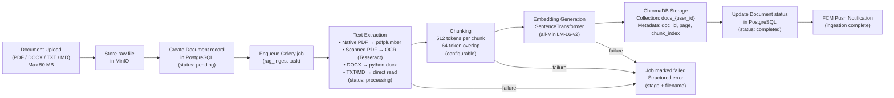
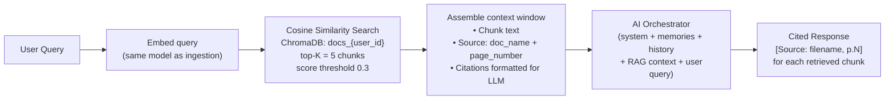

# RAG Pipeline Architecture
## Android AI Assistant — Enterprise Edition

---

## Overview

The Retrieval-Augmented Generation (RAG) Pipeline enables users to upload documents and receive
AI answers grounded in their content. Every response includes citations referencing the exact
document and page number (or character offset) for each retrieved chunk.

---

## End-to-End Pipeline

### Ingestion Path



### Retrieval Path



---

## Chunking Strategy

| Parameter | Default | Min | Max |
|-----------|---------|-----|-----|
| Chunk size (tokens) | 512 | 64 | 2048 |
| Overlap (tokens) | 64 | 0 | 50% of chunk size |
| Splitting strategy | Sentence-boundary aware | — | — |

Overlapping chunks ensure that sentences near chunk boundaries are not lost, preserving semantic
continuity. The union of all chunks covers the full extracted text with no gaps.

---

## Vector Storage Design

**Collection naming:** `docs_{user_id}` — one ChromaDB collection per user.

**Chunk metadata per embedding:**

```json
{
  "document_id": "uuid",
  "document_name": "Q4_Report.pdf",
  "page_number": 3,
  "chunk_index": 7,
  "user_id": "uuid",
  "ingested_at": "2025-01-01T00:00:00Z"
}
```

**User isolation:** All ChromaDB queries filter by `user_id`. Cross-user retrieval is
architecturally impossible — each user has their own collection.

---

## Retrieval Parameters

| Parameter | Value |
|-----------|-------|
| Similarity metric | Cosine similarity |
| Top-K | 5 (configurable) |
| Score threshold | 0.3 (chunks below excluded) |
| Max RAG context | ~2,000 tokens |

---

## Citation Injection

```
[RAG CONTEXT]
[1] (Source: Q4_Report.pdf, p.12)
"The company achieved 23% revenue growth in Q4..."

[2] (Source: Q4_Report.pdf, p.14)
"Operating expenses increased by 18%..."

Please answer using the above sources. Cite each as [1], [2], etc.
```

**TXT / Markdown fallback:** No page numbers available → use character offset range
`[start_char, end_char]` as citation reference. The response schema always includes
`citation_type: "page" | "char_offset"`.

---

## Supported File Formats

| Format | Extraction Method | Scanned (OCR) |
|--------|------------------|---------------|
| PDF (native) | pdfplumber / pdfminer | No |
| PDF (scanned) | Tesseract OCR | Yes |
| DOCX | python-docx | No |
| TXT | Direct read | N/A |
| Markdown (.md) | Direct read | N/A |

Files exceeding 50 MB or in unsupported formats are rejected with HTTP 413 / HTTP 400 before
any bytes are stored in MinIO.

---

## Job Status Lifecycle

```
Document uploaded
  │
  ▼
pending  ──► (Celery worker picks up job)
  │
  ▼
processing  ──► (extraction + chunking + embedding)
  │
  ├─► completed  (all chunks stored in ChromaDB)
  └─► failed     (extraction / chunking / embedding error — structured message returned)
```

Clients poll `GET /jobs/{job_id}` to observe this lifecycle. The Android client polls while
status is `pending` or `processing` and stops on `completed` or `failed`.

---

## Document Deletion

When a user deletes a document:

1. Document record soft-deleted in PostgreSQL (`deleted_at` set)
2. Celery task enqueued to delete all embeddings from ChromaDB
3. ChromaDB deletion completed within **60 seconds**
4. Raw file deleted from MinIO
5. `document_chunks` records hard-deleted from PostgreSQL

---

## Error Handling

| Failure Stage | HTTP Status | Behaviour |
|--------------|-------------|-----------|
| File too large (> 50 MB) | 413 | Rejected before MinIO upload |
| Unsupported format | 400 | Rejected before MinIO upload |
| Text extraction failure | — | Job marked `failed`; structured error with stage + filename |
| Embedding failure | — | Job retried up to 3 times; then `failed` |
| ChromaDB unavailable | — | Exponential backoff retry; admin alert |

---

## Round-Trip Property

For any valid document `D` containing verbatim phrase `P`:
1. Ingest `D` → embedding stored in ChromaDB
2. Query `P` → top-K retrieval returns a chunk containing `P`
3. RAG response references `D` as a source

Verified by property-based test Property 9 (`testing-strategy.md`).
