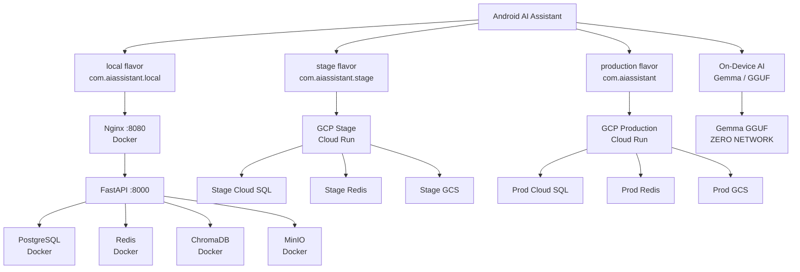

# Environment Configuration

Android AI Assistant — Local / Stage / Production Architecture

---

## Table of Contents

1. [Architecture Overview](#1-architecture-overview)
2. [Environment Matrix](#2-environment-matrix)
3. [Local Environment (Docker)](#3-local-environment-docker)
4. [Stage Environment (GCP)](#4-stage-environment-gcp)
5. [Production Environment (GCP)](#5-production-environment-gcp)
6. [Android Flavors & Build Variants](#6-android-flavors--build-variants)
7. [EnvironmentConfig Abstraction](#7-environmentconfig-abstraction)
8. [Retrofit & WebSocket Configuration](#8-retrofit--websocket-configuration)
9. [On-Device AI Isolation](#9-on-device-ai-isolation)
10. [Android — Emulator Networking](#10-android--emulator-networking)
11. [Android — Physical Device Networking](#11-android--physical-device-networking)
12. [Docker Commands](#12-docker-commands)
13. [Environment Switching](#13-environment-switching)
14. [Secret Management](#14-secret-management)
15. [Database Isolation & Migrations](#15-database-isolation--migrations)
16. [CI/CD Flow](#16-cicd-flow)
17. [Troubleshooting](#17-troubleshooting)

---

## 1. Architecture Overview



### Key principles

- **Local** uses Docker Compose on the developer machine — zero GCP cost.
- **Stage** and **Production** are fully isolated GCP environments.
- No environment shares a database, storage bucket, or secret namespace.
- `EnvironmentConfig` is the single source of truth for all URLs/flags; no
  `BuildConfig` access outside the infrastructure boundary.
- `OnDeviceInferenceClient` makes zero network calls regardless of flavor.

---

## 2. Environment Matrix

| Component       | Local                    | Stage                    | Production                    |
|-----------------|--------------------------|--------------------------|-------------------------------|
| Android flavor  | `localDebug`             | `stageRelease`           | `productionRelease`           |
| Application ID  | `com.aiassistant.local`  | `com.aiassistant.stage`  | `com.aiassistant`             |
| Launcher label  | AI Assistant Local       | AI Assistant Stage       | AI Assistant                  |
| UI badge        | Blue LOCAL               | Amber STAGE              | *(none)*                      |
| API URL         | `https://api.handsonandroid.com/` | `https://api-stage.…/`   | `https://api.…/`              |
| WebSocket URL   | `wss://api.handsonandroid.com`   | `wss://ws-stage.…`       | `wss://ws.…`                  |
| PostgreSQL      | Docker (`localhost:5432`) | GCP Cloud SQL Stage      | GCP Cloud SQL Production      |
| Redis           | Docker (`localhost:6379`) | GCP Redis Stage          | GCP Redis Production          |
| ChromaDB        | Docker (`localhost:8001`) | GCP / managed equivalent | GCP / managed equivalent      |
| Object storage  | MinIO (Docker)            | GCS Stage bucket         | GCS Production bucket         |
| Secrets         | `.env.local`              | GCP Secret Manager       | GCP Secret Manager            |
| Monitoring      | Prometheus/Grafana/Loki   | GCP Cloud Monitoring     | GCP Cloud Monitoring          |
| Cert pinning    | Bypassed (debug)          | Enabled (release)        | Enabled (release)             |
| Data            | Developer test data       | QA / UAT data            | Real user data                |

---

## 3. Local Environment (Docker)

### Service ports

| Service       | Host port | Notes                                      |
|---------------|-----------|--------------------------------------------|
| Nginx         | **8080**  | Primary Android entry-point                |
| FastAPI       | 8000      | Direct access for API tools (Postman, curl)|
| PostgreSQL    | 5432      | pgvector/pgvector:pg16                     |
| Redis         | 6379      | redis:7-alpine                             |
| ChromaDB      | 8001      | Bound to 127.0.0.1 (CVE-2026-45829)       |
| MinIO API     | 9000      | S3-compatible object storage               |
| MinIO Console | 9001      | http://localhost:9001                      |
| Prometheus    | 9090      | http://localhost:9090                      |
| Grafana       | 3000      | http://localhost:3000 (admin / see .env)   |
| Loki          | 3100      | Log aggregation                            |

### First-time setup

```bash
# 1. Copy and fill environment variables
cp .env.local.example .env.local
# Edit .env.local — set SECRET_KEY, AES_ENCRYPTION_KEY, GEMINI_API_KEY

# 2. Start the stack
docker compose -f docker-compose.local.yml up -d

# 3. Run database migrations
docker compose -f docker-compose.local.yml exec backend \
    python -m alembic upgrade head

# 4. Create the MinIO bucket (first run only)
# Open http://localhost:9001, log in with MINIO_ROOT_USER/PASSWORD from .env.local
# Create bucket: aiassistant-local
```

### Docker Compose file

`docker-compose.local.yml` — contains all local services with:
- Hot-reload (`--reload`) on the FastAPI backend
- Source code mounts for instant code changes
- Named volumes with `local_` prefix to avoid conflicts with other stacks
- Nginx on port **8080** (not 80) to avoid conflicts with local web servers

### Nginx configuration

`infrastructure/nginx/nginx.local.conf` — routes:
- `/*` → `http://backend:8000`
- `/ws/*` → `http://backend:8000` with WebSocket upgrade headers
- `/health` → inline 200 response (used by Docker healthcheck)

---

## 4. Stage Environment (GCP)

Stage runs entirely on GCP, isolated from Production.

```
GCP Stage Project
├── Cloud Run — API service      (api-stage.aiassistant.example.com)
├── Cloud Run — Worker service   (Celery background tasks)
├── Cloud SQL — PostgreSQL       (aiassistant-stage-db)
├── Memorystore — Redis          (aiassistant-stage-cache)
├── Cloud Storage                (aiassistant-stage-assets)
└── Secret Manager
    ├── aiassistant-stage-db-password
    ├── aiassistant-stage-redis-password
    ├── aiassistant-stage-jwt-secret
    └── aiassistant-stage-gemini-api-key
```

Stage is deployed from the `develop` branch automatically after CI passes.
A manual approval gate prevents Stage code from reaching Production.

---

## 5. Production Environment (GCP)

```
GCP Production Project
├── Cloud Run — API service      (ai-assistant-backend-*.run.app)
├── Cloud Run — Worker service
├── Cloud SQL — PostgreSQL       (aiassistant-prod-db)
├── Memorystore — Redis          (aiassistant-prod-cache)
├── Cloud Storage                (aiassistant-prod-assets)
└── Secret Manager
    ├── aiassistant-prod-db-password
    ├── aiassistant-prod-redis-password
    ├── aiassistant-prod-jwt-secret
    └── aiassistant-prod-gemini-api-key
```

Production is **never deployed automatically**. Every deployment requires an
explicit approval gate in the GitHub Environment protection rules.

---

## 6. Android Flavors & Build Variants

### Product flavors

```kotlin
// app/build.gradle.kts — flavor dimension: "environment"

create("local") {
    applicationIdSuffix = ".local"    // → com.aiassistant.local(.debug)
    versionNameSuffix   = "-local"
    // API_BASE_URL = "http://10.0.2.2:8080/"
    // WS_BASE_URL  = "ws://10.0.2.2:8080"
    // IS_PRODUCTION = false  IS_LOCAL = true
}

create("stage") {
    applicationIdSuffix = ".stage"    // → com.aiassistant.stage(.debug)
    versionNameSuffix   = "-stage"
    // API_BASE_URL = "https://api-stage.aiassistant.example.com/"
    // IS_PRODUCTION = false  IS_LOCAL = false
}

create("production") {
    // No suffix — uses base applicationId: com.aiassistant
    // API_BASE_URL = "https://ai-assistant-backend-106071012091.asia-south1.run.app/"
    // IS_PRODUCTION = true   IS_LOCAL = false
}
```

### Build variants

| Variant              | Use case                           |
|----------------------|------------------------------------|
| `localDebug`         | Daily Android development          |
| `localRelease`       | Performance testing against Docker |
| `stageDebug`         | Stage QA / debugging               |
| `stageRelease`       | Stage release candidate            |
| `productionDebug`    | Production debugging (internal)    |
| `productionRelease`  | Play Store / release builds        |

### Build commands

```bash
# Local
./gradlew assembleLocalDebug
./gradlew assembleLocalRelease

# Stage
./gradlew assembleStageDebug
./gradlew assembleStageRelease

# Production
./gradlew assembleProductionDebug
./gradlew assembleProductionRelease

# KSP / Hilt verification
./gradlew kspLocalDebugKotlin
./gradlew kspStageDebugKotlin
./gradlew kspProductionDebugKotlin

# Unit tests
./gradlew :core-network:test
./gradlew :core-ai:test
./gradlew :app:testLocalDebugUnitTest
```

---

## 7. EnvironmentConfig Abstraction

`EnvironmentConfig` (in `core-network`) is the single access point for all
environment-specific values. Nothing outside the infrastructure boundary
accesses `BuildConfig` for environment data.

```kotlin
interface EnvironmentConfig {
    val apiBaseUrl: String       // Retrofit base URL (trailing slash required)
    val websocketUrl: String     // WebSocket base URL (ws:// or wss://)
    val environmentName: String  // "local" | "stage" | "production"
    val isProduction: Boolean    // true only in production
    val isLocal: Boolean         // true only in local (Docker) builds
    val isStage: Boolean         // true only in stage builds
}
```

### Implementation chain

```
BuildConfig (flavor-scoped, compile-time)
    ↓
BuildConfigEnvironmentConfig (core-network)
    ↓
EnvironmentModule (@Provides @Singleton, app/di/)
    ↓
EnvironmentConfig (injected everywhere via Hilt)
```

### Test double

```kotlin
// Use in any test that needs environment values:
val env = FakeEnvironmentConfig(
    apiBaseUrl   = "http://localhost:8080/",
    websocketUrl = "ws://localhost:8080",
    isProduction = false,
    isLocal      = true
)
```

---

## 8. Retrofit & WebSocket Configuration

Both are wired through `EnvironmentConfig` — no hardcoded URLs anywhere.

```
NetworkModule.provideRetrofit(environmentConfig)
    → Retrofit.Builder().baseUrl(environmentConfig.apiBaseUrl)

NetworkModule.provideWsBaseUrl(environmentConfig)
    → @Named("wsBaseUrl") String = environmentConfig.websocketUrl

AIStreamClientImpl(@Named("wsBaseUrl") wsBaseUrl: String)
    → connects to "$wsBaseUrl/ws/chat/$conversationId?token=$jwt"
```

### URL flow per environment

```
localDebug     → https://api.handsonandroid.com/  → shared local dev server
stageRelease   → https://api-stage.…/             → GCP Stage Cloud Run
productionRelease → https://api.…/                → GCP Production Cloud Run
```

---

## 9. On-Device AI Isolation

`OnDeviceInferenceClient` implements `AIStreamClient` with zero network calls.

```
AIStreamClient
    ├── AIStreamClientImpl (cloud path)
    │       ↓ @Named("wsBaseUrl") String
    │       ↓ OkHttp WebSocket
    │       └── Local / Stage / Production backend
    │
    └── OnDeviceInferenceClient (on-device path)
            ↓ GGUF model file (local filesystem)
            └── JNI → llama.cpp stub
                └── ZERO NETWORK — works offline in all flavors
```

The on-device client has no `OkHttpClient` or `wsBaseUrl` constructor parameter,
making the zero-network contract verifiable at compile time.

---

## 10. Android — Emulator Networking

The Android Emulator maps `10.0.2.2` to the host machine's loopback (`127.0.0.1`).

```
Android Emulator
    ↓ http://10.0.2.2:8080/
    ↓
Host machine port 8080
    ↓
Nginx container (docker-compose.local.yml)
    ↓ http://backend:8000   (Docker internal DNS)
    ↓
FastAPI container :8000
```

The `local` flavor BuildConfig fields are pre-configured with `10.0.2.2:8080`.
No code changes are needed when switching between emulator and Docker.

---

## 11. Android — Physical Device Networking

Physical Android devices cannot use `10.0.2.2` — they are on the LAN, not the
emulator virtual network.

### Setup

1. Find your developer machine's LAN IP:
   - Windows: `ipconfig` → look for IPv4 Address (e.g. `192.168.1.42`)
   - macOS/Linux: `ifconfig` or `ip addr`

2. Temporarily change the local flavor URL in `app/build.gradle.kts`:
   ```kotlin
   buildConfigField("String", "API_BASE_URL", "\"http://192.168.1.42:8080/\"")
   buildConfigField("String", "WS_BASE_URL",  "\"ws://192.168.1.42:8080\"")
   ```

3. Ensure Docker's Nginx binds to `0.0.0.0` (it already does in
   `nginx.local.conf` — `listen 8080;` without an IP prefix).

4. Open port 8080 in your OS firewall:
   - Windows Defender: allow inbound TCP 8080
   - macOS: `sudo pfctl` or use System Settings → Firewall
   - Linux: `sudo ufw allow 8080/tcp`

> Do **not** commit a hardcoded LAN IP. Revert to `10.0.2.2` before pushing,
> or use a local override that is excluded by `.gitignore`.

---

## 12. Docker Commands

### Start everything

```bash
docker compose -f docker-compose.local.yml up -d
```

### Check service status

```bash
docker compose -f docker-compose.local.yml ps
```

### Stream logs

```bash
# All services
docker compose -f docker-compose.local.yml logs -f

# Single service
docker compose -f docker-compose.local.yml logs -f backend
docker compose -f docker-compose.local.yml logs -f nginx
```

### Stop without removing data

```bash
docker compose -f docker-compose.local.yml down
```

### Stop and remove all local volumes

```bash
docker compose -f docker-compose.local.yml down -v
```

> ⚠ **WARNING**: `down -v` permanently deletes the local PostgreSQL database,
> Redis data, MinIO objects, ChromaDB vectors, Prometheus metrics, Loki logs,
> and Grafana dashboards. This cannot be undone.

### Rebuild backend after code changes

```bash
docker compose -f docker-compose.local.yml up -d --build backend celery_worker
```

### Run database migrations

```bash
docker compose -f docker-compose.local.yml exec backend \
    python -m alembic upgrade head
```

### Local validation script

```powershell
# Windows
.\scripts\local-check.ps1

# Linux / macOS
./scripts/local-check.sh
```

---

## 13. Environment Switching

Switch environments by changing the active build variant in Android Studio:

1. Open **Build Variants** panel (View → Tool Windows → Build Variants)
2. Select the desired variant:
   - `localDebug` — connects to Docker stack
   - `stageDebug` — connects to GCP Stage
   - `productionDebug` — connects to GCP Production

Or build from the command line:

```bash
./gradlew installLocalDebug    # installs on connected device/emulator
./gradlew installStageDebug
./gradlew installProductionDebug
```

The active variant is visible in the app:
- **Local**: blue `LOCAL` badge in the top bar + "AI Assistant Local" launcher label
- **Stage**: amber `STAGE` badge in the top bar + "AI Assistant Stage" launcher label
- **Production**: no badge + "AI Assistant" launcher label

---

## 14. Secret Management

### Why each environment needs its own Gemini API key

Each environment (`local`, `stage`, `production`) uses a **completely independent** Gemini API key:

| Environment | Key location                                     | Naming                              |
|-------------|--------------------------------------------------|-------------------------------------|
| Local       | `.env.local` → `GEMINI_API_KEY`                 | Developer machine only              |
| Stage       | GCP Secret Manager → `aiassistant-stage-gemini-api-key` | Injected as `GEMINI_API_KEY` |
| Production  | GCP Secret Manager → `aiassistant-prod-gemini-api-key`  | Injected as `GEMINI_API_KEY` |

Reasons for isolation:
- **Quota**: Stage load tests cannot exhaust the Production quota.
- **Security**: A leaked Stage key cannot be used against Production data or billing.
- **Billing**: API usage is tracked and billed separately per key.
- **Revocation**: Rotating or revoking a key in one environment doesn't affect others.

The Android APK **never** contains any API key. The app sends requests to its
environment's backend URL; the backend reads the key from its environment at runtime.

### Full secret isolation table

| Secret                | Local (`.env.local`) | Stage (Secret Manager)                   | Production (Secret Manager)              |
|-----------------------|----------------------|------------------------------------------|------------------------------------------|
| `GEMINI_API_KEY`      | local dev key        | `aiassistant-stage-gemini-api-key`       | `aiassistant-prod-gemini-api-key`        |
| `OPENAI_API_KEY`      | local dev key        | `aiassistant-stage-openai-api-key`       | `aiassistant-prod-openai-api-key`        |
| `SECRET_KEY`          | local value          | `aiassistant-stage-secret-key`           | `aiassistant-prod-secret-key`            |
| `AES_ENCRYPTION_KEY`  | local value          | `aiassistant-stage-aes-encryption-key`   | `aiassistant-prod-aes-encryption-key`    |
| `DATABASE_URL`        | Docker postgres URL  | `aiassistant-stage-database-url`         | `aiassistant-prod-database-url`          |
| `REDIS_URL`           | Docker redis URL     | `aiassistant-stage-redis-url`            | `aiassistant-prod-redis-url`             |

### Storing Stage / Production secrets

```powershell
# Store Stage Gemini key
$env:GEMINI_API_KEY = "AIza..."   # Stage-specific key from Google AI Studio
.\scripts\store-secrets.ps1 -Environment stage -Secret gemini-api-key

# Store Production Gemini key (different key!)
$env:GEMINI_API_KEY = "AIza..."   # Production-specific key
.\scripts\store-secrets.ps1 -Environment production -Secret gemini-api-key

# Store all secrets for Stage at once
$env:GEMINI_API_KEY    = "..."
$env:SECRET_KEY        = "..."
$env:AES_ENCRYPTION_KEY = "..."
$env:DATABASE_URL      = "..."
$env:REDIS_URL         = "..."
.\scripts\store-secrets.ps1 -Environment stage -All
```

### How secrets reach the backend container

`deploy-cloud-run.ps1` uses `--set-secrets` to map Secret Manager secrets to
environment variables inside the Cloud Run container:

```
Stage container:
  GEMINI_API_KEY  ←  aiassistant-stage-gemini-api-key:latest
  SECRET_KEY      ←  aiassistant-stage-secret-key:latest
  DATABASE_URL    ←  aiassistant-stage-database-url:latest
  ...

Production container:
  GEMINI_API_KEY  ←  aiassistant-prod-gemini-api-key:latest
  SECRET_KEY      ←  aiassistant-prod-secret-key:latest
  DATABASE_URL    ←  aiassistant-prod-database-url:latest
  ...
```

Both containers see `GEMINI_API_KEY` as the variable name — the difference is
the **Secret Manager secret name** that backs it.

### What NEVER goes in the Android APK

```
GEMINI_API_KEY         → GCP Secret Manager
OPENAI_API_KEY         → GCP Secret Manager
JWT_SECRET             → GCP Secret Manager
DATABASE_PASSWORD      → GCP Secret Manager
GCP_SERVICE_ACCOUNT_KEY → GCP IAM / Workload Identity
REDIS_PASSWORD         → GCP Secret Manager
```

### Local secret setup

```bash
cp .env.local.example .env.local
# Edit .env.local — set your LOCAL Gemini key and other secrets:
#   GEMINI_API_KEY=<your-local-dev-key-from-aistudio.google.com>
#   SECRET_KEY=<python -c "import secrets; print(secrets.token_hex(32))">
#   AES_ENCRYPTION_KEY=<python -c "import base64,os; print(base64.b64encode(os.urandom(32)).decode())">
```

---

## 15. Database Isolation & Migrations

Each environment has its own isolated database. They **must never share** a
Cloud SQL instance, credentials, or data.

| Environment | Database name         | Host               |
|-------------|----------------------|--------------------|
| Local       | `aiassistant_local`   | `localhost:5432`   |
| Stage       | `aiassistant_stage`   | GCP Cloud SQL      |
| Production  | `aiassistant_prod`    | GCP Cloud SQL      |

### Migration workflow

```
Developer machine
    ↓
Local migration (alembic upgrade head against local Docker postgres)
    ↓
Local tests pass
    ↓
Git push / PR
    ↓
CI: Stage migration runs automatically on merge to develop
    ↓
QA validates on Stage
    ↓
Manual approval gate
    ↓
Production migration (explicit deploy step — never automatic)
```

### Running migrations locally

```bash
# Inside Docker (recommended)
docker compose -f docker-compose.local.yml exec backend \
    python -m alembic upgrade head

# Outside Docker (requires POSTGRES_URL pointing to localhost)
cd backend
source venv311/bin/activate   # or venv311\Scripts\activate on Windows
alembic upgrade head
```

---

## 16. CI/CD Flow

```
feature/* branch
    ↓ git push / PR
Pull Request → develop
    ↓ GitHub Actions (android-ci.yml)
┌─────────────────────────────────────────────┐
│ Required checks                             │
│  • Hilt KSP gate (local + stage + prod)     │
│  • Android lint                             │
│  • Android unit tests                       │
│  • ktlint + Detekt                          │
│  • JaCoCo coverage gate (≥70%)              │
│  • Backend unit + integration tests         │
│  • Instrumented tests                       │
└─────────────────────────────────────────────┘
    ↓ PR merged to develop
Automatic deploy → GCP Stage
    ↓
QA / UAT
    ↓
PR: develop → main  (requires reviewer approval)
    ↓ Manual approval gate (GitHub Environment protection)
Deploy → GCP Production
```

### Branch strategy

| Branch    | Environment | Auto-deploy |
|-----------|-------------|-------------|
| `feature/*` | Local (developer machine) | No |
| `develop`  | Stage       | Yes (on merge) |
| `main`     | Production  | No — explicit approval required |

---

## 17. Troubleshooting

### Docker: port already in use

```
Error: bind: address already in use
```

Check what is using the port:
```bash
# Linux / macOS
lsof -i :8080

# Windows PowerShell
netstat -ano | Select-String ":8080"
```

Change the conflicting service or stop it before starting the local stack.

### Docker: Nginx can't reach backend

The Nginx config uses `backend` as the upstream hostname — the Docker service name.
Ensure both services are on the same `local_ai_net` network (they are, by default).

```bash
docker compose -f docker-compose.local.yml logs nginx
docker compose -f docker-compose.local.yml logs backend
```

### Android: connection refused to 10.0.2.2:8080

1. Confirm the Docker stack is running: `docker compose -f docker-compose.local.yml ps`
2. Confirm you are using the `localDebug` build variant in Android Studio.
3. Confirm Nginx is healthy: `curl http://localhost:8080/health`
4. Restart the emulator if it was started before Docker.

### Android: physical device can't connect

See §11. The device must be on the same LAN as the developer machine. Verify:
```bash
ping <device-ip>        # from developer machine
ping <developer-ip>     # from device (use a terminal app)
```

### BuildConfig fields not found after adding local flavor

Run a Gradle sync in Android Studio, or:
```bash
./gradlew kspLocalDebugKotlin
```

This forces AGP to generate the flavor-scoped `BuildConfig` class.

### google-services.json error for local build

The `local` flavor uses package `com.aiassistant.local` (release) or
`com.aiassistant.local.debug` (debug build type). Both are registered in
`app/google-services.json`. If Firebase crashes on startup, verify the JSON
contains the correct `package_name` entries.

### EnvironmentConfig not injected / Hilt binding missing

Run the KSP gate to validate the Hilt graph:
```bash
./gradlew kspLocalDebugKotlin kspStageDebugKotlin kspProductionDebugKotlin
```

A missing `@Provides` or `@Binds` method surfaces as a KSP compilation error,
not a runtime crash.
