# Android Architecture
## Android AI Assistant — Enterprise Edition

---

## Overview

The Android application follows **Clean Architecture** with a strict unidirectional dependency
rule: feature modules depend on the domain module; the domain module has no dependencies on
Android or data frameworks. The `data` module implements domain interfaces and bridges Room,
Retrofit, and the WebSocket client.

The architecture is **offline-first**: Room is the single source of truth. All UI reads from
Room via Kotlin Flow; background sync uses WorkManager.

---

## Module Dependency Graph

```mermaid
graph TD
    APP["app"] --> FEATURE_AUTH["feature-auth"]
    APP --> FEATURE_CHAT["feature-chat"]
    APP --> FEATURE_RAG["feature-rag"]
    APP --> FEATURE_CAMERA["feature-camera"]
    APP --> FEATURE_CODE["feature-code"]
    APP --> FEATURE_VOICE["feature-voice"]
    APP --> FEATURE_SETTINGS["feature-settings"]
    APP --> FEATURE_PROFILE["feature-profile"]
    APP --> FEATURE_HISTORY["feature-history"]
    APP --> FEATURE_NOTES["feature-notes"]
    APP --> FEATURE_MEETING["feature-meeting"]
    APP --> FEATURE_RESUME["feature-resume"]
    APP --> FEATURE_EMAIL["feature-email"]
    APP --> FEATURE_TRANSLATOR["feature-translator"]
    APP --> FEATURE_PRODUCTIVITY["feature-productivity"]

    FEATURE_AUTH --> DOMAIN["domain"]
    FEATURE_CHAT --> DOMAIN
    FEATURE_RAG --> DOMAIN
    FEATURE_CAMERA --> DOMAIN
    FEATURE_CODE --> DOMAIN
    FEATURE_VOICE --> DOMAIN
    FEATURE_SETTINGS --> DOMAIN
    FEATURE_PROFILE --> DOMAIN
    FEATURE_HISTORY --> DOMAIN
    FEATURE_NOTES --> DOMAIN
    FEATURE_MEETING --> DOMAIN
    FEATURE_RESUME --> DOMAIN
    FEATURE_EMAIL --> DOMAIN
    FEATURE_TRANSLATOR --> DOMAIN
    FEATURE_PRODUCTIVITY --> DOMAIN

    DOMAIN --> CORE_COMMON["core-common"]
    DATA["data"] --> DOMAIN
    DATA --> CORE_NETWORK["core-network"]
    DATA --> CORE_DATABASE["core-database"]
    DATA --> CORE_AI["core-ai"]
    DATA --> CORE_SECURITY["core-security"]

    FEATURE_AUTH --> CORE_UI["core-ui"]
    FEATURE_CHAT --> CORE_UI
    FEATURE_RAG --> CORE_UI
    FEATURE_SETTINGS --> CORE_UI
    FEATURE_PROFILE --> CORE_UI
    FEATURE_HISTORY --> CORE_UI
    FEATURE_NOTES --> CORE_UI
    FEATURE_PRODUCTIVITY --> CORE_UI

    CORE_UI --> CORE_COMMON
    CORE_NETWORK --> CORE_COMMON
    CORE_DATABASE --> CORE_COMMON
    CORE_AI --> CORE_COMMON
    CORE_SECURITY --> CORE_COMMON
```



---

## Layer Descriptions

### `app`
Application entry point. Contains `AIAssistantApplication` (Hilt app), `MainActivity`
(single-activity, NavHost), and the top-level navigation graph. Aggregates all feature modules.

### `core-common`
Foundation utilities: `ApiResult<T>` sealed class, `DispatcherProvider`, `DomainError` sealed
class, extension functions, base classes. **No Android framework dependencies.** All other
modules depend on this.

```kotlin
sealed class ApiResult<out T> {
    data class Success<T>(val data: T) : ApiResult<T>()
    data class Error(val code: Int, val message: String) : ApiResult<Nothing>()
    data object Loading : ApiResult<Nothing>()
    data object NetworkUnavailable : ApiResult<Nothing>()
}
```

### `core-ui`
Shared Jetpack Compose design system: `AppTheme`, `MaterialTypography`, color tokens, shape
system. Reusable composables: `ChatBubble`, `LoadingIndicator`, `MarkdownText`, `CodeBlock`,
`ErrorBanner`, `OfflineBanner`. Adaptive layout helpers: `TwoPaneLayout`, `WindowSizeUtils`.
Depends only on `core-common`.

- Material Design 3 with Material You dynamic color (Android 12+)
- 8 dp spacing system constants
- Minimum contrast ratio 4.5:1 normal text, 3:1 large text
- All composables accept `contentDescription` for TalkBack

### `core-network`
Retrofit + OkHttp setup:
- `CertificatePinningInterceptor` — rejects connections where cert SHA-256 does not match pin
- `AuthInterceptor` — attaches `Authorization: Bearer <jwt>` to every request
- `RefreshTokenInterceptor` — intercepts HTTP 401, calls `POST /auth/refresh`, retries original
  request; on refresh failure clears credentials and navigates to Login
- `ConnectivityObserver` — StateFlow of network availability (AVAILABLE / LOST)
- `NetworkModule` (Hilt) — provides configured OkHttpClient and Retrofit instances

### `core-database`
Room 2.x database definition, all DAO interfaces, entity classes, type converters, and migration
scripts. Exposes `DatabaseModule` (Hilt). Feature modules never access Room directly.

**Entities:** `UserEntity`, `ConversationEntity`, `MessageEntity` (FTS4), `DocumentEntity`,
`MemoryEntity`, `NoteEntity`, `TodoItemEntity`, `CalendarEventEntity`, `ReminderEntity`,
`HabitDefinitionEntity`, `HabitEntryEntity`

**DAOs:** `UserDao`, `ConversationDao`, `MessageDao` (FTS4), `DocumentDao`, `MemoryDao`,
`NoteDao`, `TodoItemDao`, `CalendarEventDao`, `ReminderDao`, `HabitDefinitionDao`, `HabitEntryDao`

### `core-ai`
WebSocket client wrapper (OkHttp), streaming response parser, token event models, reconnection
logic with exponential backoff.

```kotlin
interface AIStreamClient {
    fun connect(conversationId: String, jwt: String): Flow<StreamEvent>
    fun sendMessage(payload: MessagePayload)
    fun disconnect()
}

sealed class StreamEvent {
    data class Token(val text: String) : StreamEvent()
    data class Done(val usage: TokenUsage) : StreamEvent()
    data class Error(val message: String) : StreamEvent()
    data class ToolCall(val toolName: String, val toolInput: JsonObject) : StreamEvent()
}
```

Reconnect backoff: 1 s → 2 s → 4 s → 8 s → 16 s, capped at 30 s, max 5 attempts.

### `core-security`
- `SecureStorage` — EncryptedSharedPreferences wrapper for tokens and credentials
- `BiometricAuthManager` — BiometricPrompt wrapper; biometric data never leaves the device
- `RootDetectionUtil` — detects rooted devices and warns the user
- `SecurityModule` (Hilt)

### `domain`
Pure Kotlin business logic. **Zero Android or third-party framework dependencies.**

**Entities:** `User`, `Conversation`, `Message`, `Document`, `Memory`, `Note`, `MCPTool`,
`TodoItem`, `CalendarEvent`, `Reminder`, `HabitDefinition`, `HabitEntry`

**Repository Interfaces:** `AuthRepository`, `ConversationRepository`, `MessageRepository`,
`DocumentRepository`, `MemoryRepository`, `NoteRepository`, `UserRepository`,
`ProductivityRepository`, `CodeRepository`, `MeetingRepository`, `ResumeRepository`,
`TranslationRepository`

**Use Cases** (one public function, no side effects beyond repository calls): 30+ use cases across
auth, conversations, documents, memory, notes, productivity, resume, translation, meeting, and
code domains.

### `data`
Implements all `domain` repository interfaces. Each repository has:
- A **local data source** using Room DAOs (always emits first)
- A **remote data source** using Retrofit services
- A **conflict resolution strategy**: server-wins for messages, local-wins for preferences

`SyncMessagesWorker` (WorkManager) queues and retries offline messages with 3 retries and
exponential backoff (5 s / 10 s / 20 s capped at 60 s). Messages that exhaust retries are
marked `status = "failed"` and a local notification is posted.

### Feature Modules

Each feature module owns its Navigation graph, ViewModels, and Compose screens.

| Module | Primary Screens | ViewModel |
|--------|----------------|-----------|
| `feature-auth` | Splash, Onboarding, Login, Register, BiometricUnlock | `AuthViewModel` |
| `feature-chat` | ChatList, ChatDetail | `ChatViewModel` |
| `feature-rag` | DocumentList, DocumentChat, UploadSheet | `RAGViewModel` |
| `feature-camera` | CameraCapture, ImageAnalysis, OCRResult | `CameraViewModel` |
| `feature-code` | CodeEditor, CodeAnalysis | `CodeViewModel` |
| `feature-voice` | VoiceAssistant | `VoiceViewModel` |
| `feature-settings` | Settings, ProviderSelector, ThemeSelector | `SettingsViewModel` |
| `feature-profile` | Profile, UsageStats, MemoryList | `ProfileViewModel` |
| `feature-history` | HistoryList, SearchHistory | `HistoryViewModel` |
| `feature-notes` | NotesList, NoteEditor | `NotesViewModel` |
| `feature-meeting` | MeetingRecorder, MeetingTranscript, MeetingSummary | `MeetingViewModel` |
| `feature-resume` | ResumeBuilder, CoverLetterEditor | `ResumeViewModel` |
| `feature-email` | EmailComposer, GrammarCorrection | `EmailViewModel` |
| `feature-translator` | TranslatorScreen | `TranslatorViewModel` |
| `feature-productivity` | TodoList, TodoEditor, CalendarView, ReminderList, ReminderEditor, HabitList, HabitEditor, HabitInsights | `ProductivityViewModel` |

---

## MVVM Pattern

```
UI (Compose Screen)
  │   observes StateFlow via collectAsStateWithLifecycle()
  ▼
ViewModel  (@HiltViewModel)
  │   calls use cases, exposes UiState data class via StateFlow
  ▼
Use Case  (domain, pure Kotlin)
  │   business logic; returns Flow<T> or Result<T>
  ▼
Repository Interface  (domain)
  │   (implemented in data module)
  ▼
Local Data Source (Room DAO)  ◄── always read first
  +
Remote Data Source (Retrofit) ◄── sync in background
```

**UiState convention:**

```kotlin
data class ChatListUiState(
    val conversations: PagingData<Conversation> = PagingData.empty(),
    val isOffline: Boolean = false,
    val error: String? = null
)
```

---

## Offline-First Strategy

1. UI always reads from Room via Flow — no loading spinners waiting for network.
2. Writes go to Room immediately with `syncStatus = "pending"`.
3. `SyncMessagesWorker` detects connectivity and retries pending items with exponential backoff.
4. On connectivity restoration the `data` module triggers a full sync; server state wins for
   messages, local state wins for user preferences.
5. `OfflineBanner` displays whenever `ConnectivityObserver` emits `LOST`.

---

## WebSocket Streaming

1. `AIStreamClient.connect()` opens a WebSocket to `wss://host/ws/chat/{conv_id}?token=JWT`.
2. Incoming frames are parsed to `StreamEvent` objects and emitted on a Kotlin Flow.
3. `ChatDetailViewModel` collects the Flow, appending tokens to UI state incrementally.
4. On disconnect, the user initiates reconnection (per Requirement 2.8). If no reconnect within
   5 minutes, the partial response is discarded and an error displayed.
5. Reconnect backoff: 1 s → 2 s → 4 s → 8 s → 16 s (capped at 30 s, max 5 attempts).

---

## Dependency Injection (Hilt)

- Application-scoped: `NetworkModule`, `DatabaseModule`, `AIModule`, `SecurityModule`
- Per-module: each feature module's `di/` package provides feature-specific bindings
- All repository implementations bound via `@Binds` in `*DataModule` Hilt modules in the
  `data` module
- All ViewModels annotated `@HiltViewModel` and injected via `hiltViewModel()` in Compose

---

## Performance Considerations

| Concern | Approach |
|---------|----------|
| Cold start ≤ 2 s | Hilt code-gen (no reflection), lazy Room init, minimal `Application.onCreate()` |
| List performance | Paging 3 (20 items/page), `LazyColumn` with stable item keys |
| FTS search ≤ 300 ms | Room FTS4 virtual table on `messages` + `conversations` |
| Memory efficiency | `Lifecycle.repeatOnLifecycle(STARTED)` cancels collection when backgrounded |
| Image loading | Coil with disk cache |
| Dynamic text scaling | All primary screens support up to 200% text scale without truncation |
| Tablet / foldable | Two-pane layout at ≥ 600 dp; fold/unfold transitions preserve state |
