# System Architecture
## Android AI Assistant — Enterprise Edition

---

## Overview

The system consists of five primary layers:

1. **Android Client** — Kotlin/Jetpack Compose, offline-first, MVVM + Clean Architecture
2. **FastAPI Backend** — Modular monolith, REST + WebSocket, JWT/RBAC security
3. **Data & AI Layer** — PostgreSQL, Redis, ChromaDB, MinIO, Celery
4. **External Integrations** — 6 LLM providers, 8 MCP tool connectors, Firebase
5. **Observability** — Prometheus, Grafana, Loki, Firebase Crashlytics/Analytics

All traffic between the Android client and backend passes over HTTPS/WSS through an Nginx reverse
proxy with TLS termination.

---

## High-Level Component Diagram

```mermaid
graph TB
    subgraph Android["Android Client"]
        UI["Jetpack Compose UI"]
        VM["ViewModels (MVVM)"]
        UC["Use Cases (Domain)"]
        REPO["Repositories (Data)"]
        ROOM["Room Database"]
        DS["DataStore"]
        WM["WorkManager"]
        WS_CLIENT["WebSocket Client (OkHttp)"]
    end

    subgraph Backend["FastAPI Backend (Modular Monolith)"]
        NGINX["Nginx Reverse Proxy"]
        API["FastAPI REST API"]
        WS_SERVER["WebSocket /ws/chat"]
        AUTH_SVC["Auth Service (JWT/OAuth2/RBAC)"]
        AI_ORCH["AI Orchestrator"]
        RAG_SVC["RAG Pipeline Service"]
        MEM_SVC["Memory Service"]
        MCP_BROKER["MCP Broker"]
        PROMPT_SVC["Prompt Template Service"]
        NOTIF_SVC["Notification Service"]
        ANALYTICS_SVC["Analytics Service"]
        ADMIN_SVC["Admin Service"]
    end

    subgraph DataLayer["Data & AI Layer"]
        PG["PostgreSQL 15+"]
        REDIS["Redis 7+ (Cache + Broker)"]
        CHROMA["ChromaDB (Vector Store)"]
        MINIO["MinIO (Object Storage)"]
        CELERY["Celery Workers"]
    end

    subgraph LLM["LLM Providers"]
        OPENAI["OpenAI GPT-4o"]
        GEMINI["Google Gemini 1.5 Pro"]
        CLAUDE["Anthropic Claude 3.5 Sonnet"]
        OLLAMA["Ollama (self-hosted)"]
        LLAMA["Llama 3.x"]
        MISTRAL["Mistral"]
    end

    subgraph MCP_Tools["MCP External Tools"]
        GITHUB["GitHub"]
        GMAIL["Gmail"]
        GDRIVE["Google Drive"]
        GCAL["Google Calendar"]
        SLACK["Slack"]
        JIRA["Jira"]
        NOTION["Notion"]
        FIGMA["Figma"]
    end

    subgraph Observability["Observability"]
        PROM["Prometheus"]
        GRAFANA["Grafana"]
        LOKI["Loki"]
        FIREBASE["Firebase (Crashlytics + Analytics)"]
    end

    UI --> VM --> UC --> REPO
    REPO --> ROOM
    REPO --> WS_CLIENT
    WM --> REPO
    REPO --> API

    Android -->|"HTTPS/WSS (TLS)"| NGINX
    NGINX --> API
    NGINX --> WS_SERVER

    API --> AUTH_SVC
    API --> AI_ORCH
    API --> RAG_SVC
    API --> MEM_SVC
    API --> MCP_BROKER
    API --> ADMIN_SVC
    WS_SERVER --> AI_ORCH

    AI_ORCH --> PROMPT_SVC
    AI_ORCH --> MEM_SVC
    AI_ORCH --> MCP_BROKER
    AI_ORCH --> OPENAI
    AI_ORCH --> GEMINI
    AI_ORCH --> CLAUDE
    AI_ORCH --> OLLAMA
    AI_ORCH --> LLAMA
    AI_ORCH --> MISTRAL

    RAG_SVC --> CHROMA
    RAG_SVC --> MINIO
    RAG_SVC --> CELERY
    MEM_SVC --> CHROMA

    MCP_BROKER --> GITHUB
    MCP_BROKER --> GMAIL
    MCP_BROKER --> GDRIVE
    MCP_BROKER --> GCAL
    MCP_BROKER --> SLACK
    MCP_BROKER --> JIRA
    MCP_BROKER --> NOTION
    MCP_BROKER --> FIGMA

    AUTH_SVC --> PG
    AI_ORCH --> PG
    RAG_SVC --> PG
    CELERY --> REDIS
    API --> REDIS

    Backend --> PROM
    PROM --> GRAFANA
    Backend --> LOKI
    Android --> FIREBASE
```



---

## Request Flow — REST API

```
Android App
  └─► OkHttp (cert-pinned, JWT auth interceptor)
        └─► Nginx (TLS termination)
              └─► FastAPI (middleware: auth, rate-limit, logging, request-size)
                    ├─► Auth Service       →  PostgreSQL
                    ├─► AI Orchestrator    →  LLM Provider  →  PostgreSQL
                    ├─► RAG Service        →  Celery  →  MinIO / ChromaDB  →  PostgreSQL
                    ├─► Memory Service     →  ChromaDB
                    └─► MCP Broker         →  External Tool API
```

## Request Flow — WebSocket Streaming

```
Android App
  └─► OkHttp WebSocket (wss://host/ws/chat/{conv_id}?token=JWT)
        └─► Nginx (wss proxy)
              └─► WebSocket Router (JWT validation)
                    └─► AI Orchestrator
                          ├─► Memory Service (inject top-3 memories)
                          ├─► Prompt Service (build context)
                          ├─► LLM Provider (stream tokens)
                          │     ├─► {"type":"token","data":"..."}  ──► App
                          │     └─► {"type":"done","usage":{...}}  ──► App
                          └─► MCP Broker (tool calls if needed)
                                └─► {"type":"tool_call","toolName":"..."}  ──► App
```

## Background Job Flow — RAG Ingestion

```
Android App  ──upload──►  POST /documents  ──►  MinIO (raw file)
                                            └─►  Celery queue (rag_ingest task)
                                                      └─►  Celery Worker
                                                              ├─►  OCR / text extraction
                                                              ├─►  Chunking (512 tokens, 64 overlap)
                                                              ├─►  Embedding generation
                                                              ├─►  ChromaDB (store embeddings)
                                                              ├─►  PostgreSQL (update document status)
                                                              └─►  Push Notification (ingestion complete)
```

---

## Infrastructure Services (Docker Compose)

| Service | Image | Port | Purpose |
|---------|-------|------|---------|
| `postgres` | `postgres:15-alpine` | 5432 | Primary relational database |
| `redis` | `redis:7-alpine` | 6379 | Cache + Celery broker |
| `chromadb` | `chromadb/chroma:latest` | 8000 | Vector store |
| `minio` | `minio/minio:latest` | 9000/9001 | Document object storage |
| `celery` | (app image) | — | Background task workers |
| `nginx` | `nginx:alpine` | 80, 443 | Reverse proxy + TLS |
| `prometheus` | `prom/prometheus:latest` | 9090 | Metrics collection |
| `grafana` | `grafana/grafana:latest` | 3000 | Metrics dashboards |
| `loki` | `grafana/loki:latest` | 3100 | Log aggregation |

---

## Security Boundary Summary

| Boundary | Control |
|----------|---------|
| Android ↔ Backend | TLS 1.3 + certificate pinning (SHA-256) |
| HTTP requests | JWT validation middleware (HTTP 401 on failure) |
| Endpoint access | RBAC middleware (HTTP 403 on insufficient role) |
| Rate limiting | 60 req/min per authenticated user (HTTP 429) |
| Public endpoints | 20 req/min per IP (HTTP 429) |
| AI inputs | Prompt injection detection (HTTP 400 + audit log) |
| Stored credentials | EncryptedSharedPreferences (Android), AES-256-GCM (backend) |
| Passwords | bcrypt work factor 12 |
| Audit events | 90-day retention |

---

## Technology Stack Summary

| Layer | Technology |
|-------|-----------|
| Android | Kotlin 1.9+, Jetpack Compose, Hilt, Room, WorkManager, OkHttp, Retrofit, Paging 3, DataStore |
| Backend | Python 3.11, FastAPI, SQLAlchemy 2.x, Alembic, Celery, Pydantic v2 |
| Database | PostgreSQL 15+, Redis 7+ |
| AI | ChromaDB, SentenceTransformer (`all-MiniLM-L6-v2`), OpenAI / Gemini / Claude / Ollama / Llama / Mistral |
| Storage | MinIO (S3-compatible) |
| Proxy | Nginx 1.25+ |
| Observability | Prometheus, Grafana, Loki, Firebase Crashlytics/Analytics |
| CI/CD | GitHub Actions |
