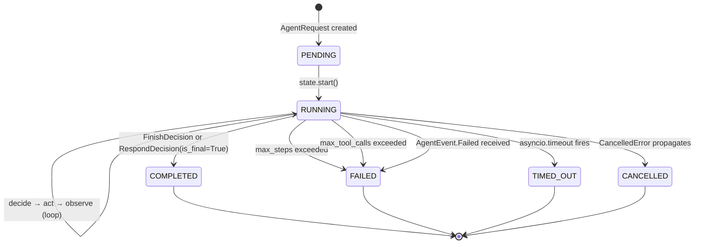

# Agent Execution Flow

> **Updated:** 2026-10-03

Step-by-step walkthrough of what happens from the moment a request arrives at `POST /api/v1/agent/execute` to the final `OrchestrationResult`.

---

## Lifecycle diagram



---

## Step-by-step trace

### 1. Request validation

```
POST /api/v1/agent/execute
{
  "message": "Compare Jira AI-123 with the MCP architecture doc.",
  "enable_rag": true,
  "enable_mcp": true,
  "max_steps": 5
}
```

- `InjectionDetector.check_input()` — blocks prompt injection. HTTP 400 on match.
- `AgentRequest` built with `user_id`, `input`, `capabilities`, `context.rag_document_ids`.
- `AgentServiceFactory.build_runner(db)` assembles the runner with `LLMServiceAdapter`, `RAGPipeline`, `MCPServer`, and `OrchestrationConfig.from_settings()`.

### 2. Planning

```python
OrchestrationPlanner.plan(request)
    AgentRouter.route(request, registry)   # deterministic, no LLM call
    AgentPlanner.build_plan(request, agent, registry)
```

Output: `PlanningResult(plan=AgentPlan, agent_name="ai-assistant", success=True)`

### 3. State initialisation

```python
state = OrchestrationState(
    request_id=request.request_id,
    user_id=request.user_id,
    agent_name="ai-assistant",
)
state.start()  # status = RUNNING, start_time_s = now()
observer.on_run_start(state)
```

Emits: `orchestration.run_start` log event with `run_id`, `request_id`, `user_id` (redacted).

### 4. The decide → act → observe loop

Wrapped in `async with asyncio.timeout(config.timeout_s)`.

**Each iteration:**

#### 4a. Limit checks

```python
if state.step_count >= config.max_steps:       # default 10
    state.fail("Max steps reached.")
    observer.on_limit_exceeded(state, "max_steps", ...)
    break

if state.tool_call_count >= config.max_tool_calls:  # default 20
    state.fail("Max tool calls reached.")
    observer.on_limit_exceeded(state, "max_tool_calls", ...)
    break
```

#### 4b. Decide (LLM call)

```python
decision = await _decide(state, system_prompt, prior_context)
# _decide calls LLMAdapter.generate(decision_prompt)
# _parse_decision extracts JSON from the LLM response
```

The LLM receives:
- A system prompt describing the available actions
- Prior context (accumulated output from previous steps)
- The user's original message

The LLM returns JSON, for example:
```json
{"action": "call_tool", "tool_name": "atlassian_mcp",
 "parameters": "{\"tool_name\": \"jira_get_issue\", \"arguments\": {\"issue_key\": \"AI-123\"}}"}
```

#### 4c. Act (dispatch)

```python
outcome = await dispatcher.dispatch(decision, user_id, system_prompt, document_ids)
```

`ActionDispatcher` routes:
- `CallToolDecision` → `MCPServer.execute()` → `MCPToolResult`
- `RetrieveDecision` → `RAGPipeline.ask()` → `RAGAnswer`
- `RespondDecision` → `LLMService.generate()` → text
- `WaitDecision` → no-op, returns reason
- `FinishDecision` → `is_final=True`

All paths return `ActionOutcome` — **never raises**.

#### 4d. Observe (record span)

```python
span = observer.record_span(
    state,
    step_index=state.step_count,
    action_type=outcome.action_type,
    duration_ms=outcome.duration_ms,
    tokens_used=outcome.tokens_used,
    success=outcome.success,
)
state.record_span(span)   # increments step_count, tool_call_count
state.append_output(outcome.output)
state.citations.extend(outcome.citations)
state.tool_calls.append(outcome.tool_record)
```

Emits: `orchestration.step` debug log with `run_id`, `step_index`, `action_type`, `success`, `duration_ms`.

#### 4e. Termination check

```python
if outcome.is_final:
    state.finish()
    break
```

### 5. Final events

```python
observer.on_run_end(state, elapsed_ms)
yield AgentCompletedEvent(result=AgentResult(...))
# OR
yield AgentFailedEvent(result=AgentResult(...))
```

Emits: `orchestration.run_end` info log with `status`, `step_count`, `total_tokens`, `elapsed_ms`.

### 6. Result assembly

```python
result = OrchestrationResult.from_state(state, elapsed_ms)
```

```
OrchestrationResult
├── run_id, request_id, agent_name
├── status: "completed" | "failed" | "timed_out"
├── output: accumulated answer text
├── citations[]: [{document_id, document_name, excerpt, page_number, score}]
├── tool_calls[]: [{tool_name, input, output, failed}]
├── spans[]: [{step_index, action_type, duration_ms, tokens_used, success}]
├── total_tokens: sum(span.tokens_used)
├── step_count
└── elapsed_ms
```

---

## Observer event table

| Observer method | Log level | Message key | Fields |
|---|---|---|---|
| `on_run_start` | INFO | `orchestration.run_start` | `run_id`, `request_id`, `user_id`*, `agent_name` |
| `record_span` | DEBUG | `orchestration.step` | `run_id`, `step_index`, `action_type`, `success`, `duration_ms`, `tokens_used` |
| `on_limit_exceeded` | WARNING | `orchestration.limit_exceeded` | `run_id`, `violation_kind`, `limit_msg`, `step_count`, `tool_call_count` |
| `on_timeout` | WARNING | `orchestration.timeout` | `run_id`, `elapsed_s`, `step_count` |
| `on_error` | ERROR | `orchestration.error` | `run_id`, `error_msg`, `step_count` |
| `on_run_end` | INFO | `orchestration.run_end` | `run_id`, `status`, `step_count`, `tool_call_count`, `total_tokens`, `elapsed_ms` |

\* `user_id` is redacted to the first 8 characters + `…` in all log records.

---

## AgentEvent streaming table (SSE)

When using `POST /api/v1/agent/stream`, each `AgentEvent` is emitted as an SSE frame:

| AgentEvent type | SSE event name | Key fields |
|---|---|---|
| `AgentStartedEvent` | `started` | `agent_name` |
| `AgentThinkingEvent` | `thinking` | `text` |
| `AgentTokenEvent` | `token` | `token` |
| `AgentToolStartedEvent` | `tool_started` | `tool_name`, `parameters` |
| `AgentToolCompletedEvent` | `tool_completed` | `tool_name`, `output` |
| `AgentToolFailedEvent` | `tool_failed` | `tool_name`, `error` |
| `AgentRetrievalCompletedEvent` | `retrieval_completed` | `chunk_count`, `has_sources` |
| `AgentCompletedEvent` | `completed` | full `AgentExecuteResponse` |
| `AgentFailedEvent` | `failed` | `error_code`, `error_message` |
