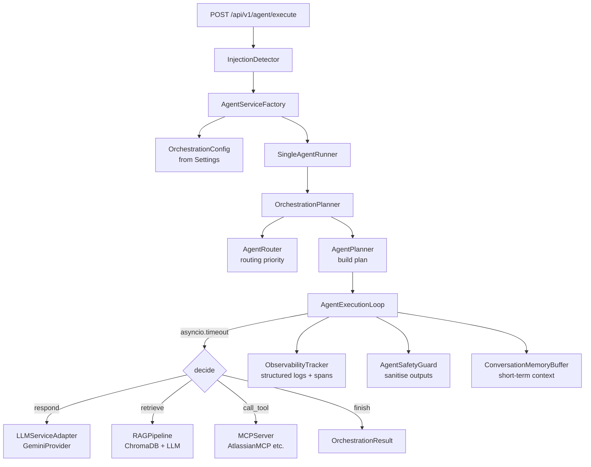

# Agent Overview

> **Module:** `app.orchestration`, `app.agents`, `app.agent`  
> **Updated:** 2026-10-03

The agent layer is the central orchestration system that routes user requests to the right combination of LLM calls, RAG retrieval, and MCP tool invocations.

---

## Table of Contents

1. [What is an agent?](#1-what-is-an-agent)
2. [Architecture diagram](#2-architecture-diagram)
3. [Components](#3-components)
4. [Execution modes](#4-execution-modes)
5. [Configuration](#5-configuration)
6. [Security model](#6-security-model)
7. [Known limitations](#7-known-limitations)
8. [Adding a new agent type](#8-adding-a-new-agent-type)

---

## 1. What is an agent?

An agent is an autonomous executor that decides — step by step — what action to take to satisfy a user's request. Each step the agent can:

- **Respond** — generate a direct LLM answer
- **Retrieve** — search the user's documents via RAG
- **Call a tool** — invoke an MCP tool (Jira, Confluence, etc.)
- **Wait** — pause for user confirmation
- **Finish** — declare the task complete

The cycle repeats until the agent finishes, times out, or hits a step/tool limit.

```
User message
     │
     ▼
AgentExecutionLoop
     │
     ├─ decide (LLM) → CallToolDecision → MCPServer → tool result
     ├─ decide (LLM) → RetrieveDecision → RAGPipeline → document chunks + answer
     ├─ decide (LLM) → RespondDecision → LLMService → answer text
     └─ decide (LLM) → FinishDecision → terminate
```

---

## 2. Architecture diagram



---

## 3. Components

### `SingleAgentRunner` (`app.orchestration.runner`)
Top-level façade. Accepts an `AgentRequest` and returns an `OrchestrationResult` (blocking) or yields `AgentEvent` values (streaming). Wires all other components together.

### `OrchestrationPlanner` (`app.orchestration.planner`)
Routes the request to an agent via `AgentRouter`, then builds an `AgentPlan` with step constraints and timeout.

Routing priority (deterministic, no LLM call):
1. Explicit `metadata["agent_name"]`
2. Capability match (`request.capabilities`)
3. Attachment type routing (image → `IMAGE_UNDERSTANDING`)
4. Conversation context → prefer `"conversational"` agent
5. First capable agent
6. No agent found → planning failure

### `AgentExecutionLoop` (`app.orchestration.loop`)
Drives the decide → act → observe cycle. Key logic:
- Wrapped in `asyncio.timeout(config.timeout_s)` for wall-clock enforcement.
- Checks `step_count < max_steps` and `tool_call_count < max_tool_calls` before each step.
- Calls `_decide()` → LLM returns JSON `AgentDecision`.
- Dispatches via `ActionDispatcher`.
- Records every step as an `ExecutionSpan` via `ObservabilityTracker`.

### `ActionDispatcher` (`app.orchestration.dispatcher`)
Routes each `AgentDecision` to the correct adapter:

| Decision type | Adapter called | Returns |
|---|---|---|
| `respond` | `LLMAdapter.generate()` | Generated text |
| `retrieve` | `RAGAdapter.ask()` | Answer + citations |
| `call_tool` | `MCPAdapter.execute()` | Tool result |
| `wait` | — (no I/O) | Reason string |
| `finish` | — (no I/O) | Termination signal |

All methods return `ActionOutcome` — **never raises**.

### `ObservabilityTracker` (`app.orchestration.observer`)
Emits structured log events at every lifecycle point. See [execution-flow.md](execution-flow.md) for the full event table.

### `AgentSafetyGuard` (`app.orchestration.safety`)
Applied inline during execution:
- `sanitize_tool_output()` — strips harmful patterns from MCP results
- `sanitize_rag_content()` — strips harmful patterns from retrieved chunks
- `redact_sensitive_args()` — removes credentials from tool parameter logs
- `check_user_authorization()` — per-permission checks before tool dispatch
- `check_tool_permission()` — validates tool schema permissions

### `ConversationMemoryBuffer` (`app.orchestration.memory`)
In-process ring buffer (default 20 turns). No DB round-trip. Used for short-term context injection into the decide prompt.

### `AgentServiceFactory` (`app.agent.factory`)
Application-level factory. Holds shared stateless objects (registry, LLM adapter, RAG pipeline). Creates a fresh `MCPServer` (with DB session) per request via `build_runner(db)`.

---

## 4. Execution modes

Set via the `ChatExecutionMode` enum (Android) or `mode` parameter:

| Mode | What happens | AgentMode mapping |
|---|---|---|
| `DIRECT_LLM` | Message sent directly to LLM. No retrieval, no tools. | `AgentMode.CHAT` |
| `RAG` | RAG pipeline retrieves relevant chunks, LLM generates grounded answer. Citations returned. | `AgentMode.DOCUMENT` |
| `AGENT` | Full orchestration — agent decides autonomously which tools and sources to use. | `AgentMode.AUTO` |

Android chat screen shows a mode selector chip row. The selected mode is sent in `AgentExecuteRequest.message` and respected by the backend.

---

## 5. Configuration

All limits are enforced as hard caps in `OrchestrationConfig`:

| Setting | Default | Hard cap | Env var |
|---|---|---|---|
| `max_steps` | 10 | 50 | `MAX_AGENT_STEPS` |
| `max_tool_calls` | 20 | 100 | `MAX_AGENT_TOOL_CALLS` |
| `timeout_s` | 120.0 | 300.0 | `AGENT_TIMEOUT_SECONDS` |
| `max_tokens_per_step` | 2 048 | 8 192 | — |
| `enable_rag` | true | — | per-request |
| `enable_mcp` | true | — | per-request |
| `rag_top_k` | 5 | — | `RAG_TOP_K` |

`OrchestrationConfig.from_settings(settings, **overrides)` reads the three environment variables and supports per-request overrides.

---

## 6. Security model

### Input validation
`InjectionDetector.check_input()` runs on every user message before the agent starts. Returns HTTP 400 on injection detection.

### Output sanitisation
`AgentSafetyGuard` treats all tool output and RAG content as untrusted data. Harmful patterns (script tags, `javascript:` URLs) are stripped. Sanitisation failure returns a safe stub — never propagated to the user.

### Execution limits
`max_steps` and `max_tool_calls` prevent infinite loops. `timeout_s` prevents runaway wall-clock time. All three are enforced in `AgentExecutionLoop` before each iteration, with no way to bypass via user input.

### Permission checks
`AgentSafetyGuard.check_user_authorization()` and `check_tool_permission()` verify that the user holds every permission required by a tool before dispatch. Missing permissions raise `PermissionError` which terminates the run with `status=PERMISSION_DENIED`.

### Sensitive arg redaction
`AgentSafetyGuard.redact_sensitive_args()` deep-copies tool parameters and replaces 14 sensitive key patterns with `"[redacted]"` before any log write. The original `params` dict is never mutated.

---

## 7. Known limitations

- **Single-agent per run** — `SingleAgentRunner` selects one agent per request. Multi-agent handoff (`AgentEvent.HandoffStarted`) is defined in the domain model but requires `AgentOrchestrator` (multi-agent) to be wired to the WebSocket path.
- **No streaming via REST** — `POST /api/v1/agent/execute` is blocking. Use `POST /api/v1/agent/stream` (SSE) for real-time token streaming.
- **Decide prompt is fixed** — the LLM decision prompt (`_DECISION_SYSTEM_PROMPT` in `loop.py`) is not configurable per agent or per request. Custom agent personas require subclassing the loop.
- **No long-term agent state** — `ConversationMemoryBuffer` is in-process. Between runs, no agent state is persisted. The `agent_executions` table (migration 0017) and `AgentMemoryAdapter` provide long-term persistence hooks but are not yet active.

---

## 8. Adding a new agent type

1. Subclass `Agent` in `app/agents/base.py`:

```python
from app.agents.base import Agent
from app.agents.models import AgentCapability, AgentEvent, AgentExecution, AgentRequest

class MyAgent(Agent):
    @property
    def name(self) -> str:
        return "my-agent"

    @property
    def description(self) -> str:
        return "Does specialised things."

    @property
    def capabilities(self) -> frozenset[AgentCapability]:
        return frozenset({AgentCapability.TEXT_GENERATION, AgentCapability.TOOL_USE})

    def execute(self, request: AgentRequest, execution: AgentExecution):
        # Async generator — actual execution driven by AgentExecutionLoop
        raise NotImplementedError("Execution driven by AgentExecutionLoop.")
```

2. Register in `AgentServiceFactory._build_default_registry()` (`app/agent/factory.py`).

3. Add unit tests under `tests/unit/agents/`.

The router picks up the new agent automatically via capability matching — no routing table changes needed.
