# Android Architecture
## Android AI Assistant — Enterprise Edition

---

## Overview

The Android application follows **Clean Architecture** with a strict unidirectional dependency rule: feature modules depend on the domain module; the domain module has no dependencies on Android or data frameworks. The `data` module implements domain interfaces and bridges Room, Retrofit, and the WebSocket client.

The architecture is **offline-first**: Room is the single source of truth. All UI reads from Room via Flow; background sync uses WorkManager.

---

## Module Dependency Graph

```mermaid
graph TD
    APP["app"] --> FEATURE_AUTH["feature-auth"]
    APP --> FEATURE_CHAT["feature-chat"]
    APP --> FEATURE_RAG["feature-rag"]
    APP --> FEATURE_CAMERA["feature-camera"]
    APP --> FEATURE_CODE["feature-code"]
    APP --> FEATURE_VOICE["feature-voice"]
    APP --> FEATURE_SETTINGS["feature-settings"]
    APP --> FEATURE_PROFILE["feature-profile"]
    APP --> FEATURE_HISTORY["feature-history"]
    APP --> FEATURE_NOTES["feature-notes"]
    APP --> FEATURE_MEETING["feature-meeting"]
    APP --> FEATURE_RESUME["feature-resume"]
    APP --> FEATURE_EMAIL["feature-email"]
    APP --> FEATURE_TRANSLATOR["feature-translator"]
    APP --> FEATURE_PRODUCTIVITY["feature-productivity"]

    FEATURE_AUTH --> DOMAIN["domain"]
    FEATURE_CHAT --> DOMAIN
    FEATURE_RAG --> DOMAIN
    FEATURE_CAMERA --> DOMAIN
    FEATURE_CODE --> DOMAIN
    FEATURE_VOICE --> DOMAIN
    FEATURE_SETTINGS --> DOMAIN
    FEATURE_PROFILE --> DOMAIN
    FEATURE_HISTORY --> DOMAIN
    FEATURE_NOTES --> DOMAIN
    FEATURE_MEETING --> DOMAIN
    FEATURE_RESUME --> DOMAIN
    FEATURE_EMAIL --> DOMAIN
    FEATURE_TRANSLATOR --> DOMAIN
    FEATURE_PRODUCTIVITY --> DOMAIN

    DOMAIN --> CORE_COMMON["core-common"]
    DATA["data"] --> DOMAIN
    DATA --> CORE_NETWORK["core-network"]
    DATA --> CORE_DATABASE["core-database"]
    DATA --> CORE_AI["core-ai"]
    DATA --> CORE_SECURITY["core-security"]

    FEATURE_AUTH --> CORE_UI["core-ui"]
    FEATURE_CHAT --> CORE_UI
    FEATURE_RAG --> CORE_UI
    FEATURE_SETTINGS --> CORE_UI
    FEATURE_PROFILE --> CORE_UI
    FEATURE_HISTORY --> CORE_UI
    FEATURE_NOTES --> CORE_UI
    FEATURE_PRODUCTIVITY --> CORE_UI

    CORE_UI --> CORE_COMMON
    CORE_NETWORK --> CORE_COMMON
    CORE_DATABASE --> CORE_COMMON
    CORE_AI --> CORE_COMMON
    CORE_SECURITY --> CORE_COMMON
```



---

## Layer Descriptions

### `app`
Application entry point. Contains `AIAssistantApplication` (Hilt app), `MainActivity` (single-activity, NavHost), and the top-level navigation graph. Aggregates all feature modules.

### `core-common`
Foundation utilities: `ApiResult<T>` sealed class, `DispatcherProvider`, `DomainError`, extension functions, base classes. **No Android framework dependencies.** All other modules may depend on this.

### `core-ui`
Shared Jetpack Compose design system: `AppTheme`, `MaterialTypography`, color tokens, shape system, and reusable composables (`ChatBubble`, `LoadingIndicator`, `MarkdownText`, `CodeBlock`, `ErrorBanner`, `OfflineBanner`). Adaptive layout helpers (`AdaptiveScaffold`, `TwoPaneLayout`, `WindowSizeUtils`). Depends only on `core-common`.

### `core-network`
Retrofit + OkHttp setup with:
- `CertificatePinningInterceptor` — rejects connections with unpinned certificates
- `AuthInterceptor` — attaches `Authorization: Bearer <jwt>` to every request
- `RefreshTokenInterceptor` — intercepts HTTP 401, calls `AuthRefreshApi`, retries
- `ConnectivityObserver` — StateFlow of network availability
- `LogoutEventBus` — triggers logout on unrecoverable auth failure
- `NetworkModule` (Hilt) — provides the configured OkHttpClient and Retrofit instance

### `core-database`
Room 2.x database definition (`AppDatabase`), all DAO interfaces, entity classes, type converters (`DatabaseConverters`), and migration scripts. Exposes `DatabaseModule` (Hilt). Feature modules never access Room directly — only via `data` module repositories.

**Entities:** `UserEntity`, `ConversationEntity`, `MessageEntity` (FTS4 virtual table), `DocumentEntity`, `MemoryEntity`, `NoteEntity`, `TodoItemEntity`, `CalendarEventEntity`, `ReminderEntity`, `HabitDefinitionEntity`, `HabitEntryEntity`

**DAOs:** `UserDao`, `ConversationDao`, `MessageDao`, `DocumentDao`, `MemoryDao`, `NoteDao`, `TodoItemDao`, `CalendarEventDao`, `ReminderDao`, `HabitDefinitionDao`, `HabitEntryDao`

### `core-ai`
WebSocket client wrapper (OkHttp), streaming response parser, token event models, and reconnection logic.

```kotlin
interface AIStreamClient {
    fun connect(conversationId: String, jwt: String): Flow<StreamEvent>
    fun sendMessage(payload: MessagePayload)
    fun disconnect()
}

sealed class StreamEvent {
    data class Token(val text: String) : StreamEvent()
    data class Done(val usage: TokenUsage) : StreamEvent()
    data class Error(val message: String) : StreamEvent()
    data class ToolCall(val toolName: String, val toolInput: JsonObject) : StreamEvent()
}
```

**Reconnect backoff:** 1s → 2s → 4s → 8s → 16s, capped at 30s, maximum 5 attempts.

### `core-security`
- `SecureStorage` — EncryptedSharedPreferences wrapper for tokens and credentials
- `BiometricAuthManager` — BiometricPrompt wrapper; no biometric data leaves the device
- `RootDetectionUtil` — detects rooted devices and warns the user
- `SecurityModule` (Hilt)

### `domain`
Pure Kotlin business logic. **Zero Android or third-party framework dependencies.**

**Entities:** `User`, `Conversation`, `Message`, `Document`, `Memory`, `Note`, `MCPTool`, `TodoItem`, `CalendarEvent`, `Reminder`, `HabitDefinition`, `HabitEntry`

**Repository Interfaces:** `AuthRepository`, `ConversationRepository`, `MessageRepository`, `DocumentRepository`, `MemoryRepository`, `NoteRepository`, `UserRepository`, `ProductivityRepository`, `CodeRepository`, `MeetingRepository`, `ResumeRepository`, `TranslationRepository`

**Use Cases** (one public function, no side effects beyond repository calls): 30+ use cases across auth, conversations, documents, memory, notes, productivity, resume, translation, meeting, and code domains.

### `data`
Implements all `domain` repository interfaces. Each repository has:
- A **local data source** using Room DAOs (always emits first)
- A **remote data source** using Retrofit services
- A **conflict resolution strategy**: server-wins for messages, local-wins for preferences

`SyncMessagesWorker` (WorkManager) queues and retries offline messages with 3 retries and exponential backoff (1s / 2s / 4s). Messages that fail all retries are marked `status = "failed"` and a notification is sent.

### Feature Modules

Each feature module owns its Navigation graph, ViewModels, and Compose screens.

| Module | Screens | ViewModel |
|--------|---------|-----------|
| `feature-auth` | Splash, Onboarding, Login, Register, BiometricUnlock | `AuthViewModel` |
| `feature-chat` | ChatList, ChatDetail | `ChatViewModel`, `ChatDetailViewModel` |
| `feature-rag` | DocumentList, DocumentChat, UploadSheet | `RAGViewModel`, `DocumentChatViewModel` |
| `feature-camera` | CameraCapture, ImageAnalysis, OCRResult | `CameraViewModel` |
| `feature-code` | CodeEditor, CodeAnalysis | `CodeViewModel` |
| `feature-voice` | VoiceAssistant | `VoiceViewModel` |
| `feature-settings` | Settings, ProviderSelector, ThemeSelector | `SettingsViewModel` |
| `feature-profile` | Profile, UsageStats, MemoryList | `ProfileViewModel` |
| `feature-history` | HistoryList, SearchHistory | `HistoryViewModel` |
| `feature-notes` | NotesList, NoteEditor | `NotesViewModel` |
| `feature-meeting` | MeetingRecorder, MeetingTranscript, MeetingSummary | `MeetingViewModel` |
| `feature-resume` | ResumeBuilder, CoverLetterEditor | `ResumeViewModel` |
| `feature-email` | EmailComposer, GrammarCorrection | `EmailViewModel` |
| `feature-translator` | TranslatorScreen | `TranslatorViewModel` |
| `feature-productivity` | TodoList, TodoEditor, CalendarView, ReminderList, ReminderEditor, HabitList, HabitEditor, HabitInsights | `ProductivityViewModel`, `CalendarViewModel`, `HabitViewModel` |

---

## MVVM Pattern

```
UI (Compose Screen)
  │   observes StateFlow / collectAsState
  ▼
ViewModel
  │   calls use cases, exposes UiState sealed class
  ▼
Use Case (domain)
  │   pure business logic, returns Flow / Result
  ▼
Repository Interface (domain)
  │   (implemented in data module)
  ▼
Local Data Source (Room DAO) ←── always read first
  +
Remote Data Source (Retrofit) ←── sync in background
```

---

## Offline-First Strategy

1. **UI always reads from Room** via Flow. No loading spinners waiting for network.
2. **Writes go to Room immediately** with `syncStatus = "pending"`.
3. `SyncMessagesWorker` detects connectivity, retries pending items with exponential backoff.
4. On connectivity restoration, the `data` module triggers a full sync; server state wins for messages, local state wins for user preferences.
5. `OfflineBanner` is displayed whenever `ConnectivityObserver` emits `LOST`.

---

## WebSocket Streaming on Android

1. `AIStreamClient.connect()` opens a WebSocket to `wss://host/ws/chat/{conv_id}?token=JWT`.
2. Incoming frames are parsed to `StreamEvent` objects and emitted on a Kotlin Flow.
3. `ChatDetailViewModel` collects the Flow, appending tokens to the UI state incrementally.
4. On disconnect, the client waits for a retry trigger from the UI (not automatic — per Requirement 2.8).
5. The reconnect backoff schedule: 1s → 2s → 4s → 8s → 16s (capped at 30s, max 5 attempts).

---

## Dependency Injection (Hilt)

- Application-scoped components: `NetworkModule`, `DatabaseModule`, `AIModule`, `SecurityModule`
- Feature-scoped modules: each feature module's `di/` package provides feature-specific ViewModels and use cases
- All repository implementations are bound in the respective `*DataModule` Hilt modules in the `data` module
- `@HiltViewModel` annotation on all ViewModels; injected via `hiltViewModel()` in Compose

---

## Performance Considerations

| Concern | Approach |
|---------|----------|
| App cold start ≤ 2s | Hilt code-gen, lazy Room init, minimal `Application.onCreate()` work |
| List performance | Paging 3 with 20 items/page; `LazyColumn` with stable item keys |
| FTS search ≤ 300ms | Room FTS4 virtual table on `messages` and `conversations` |
| Memory efficiency | Flow collection with `Lifecycle.repeatOnLifecycle(STARTED)` to cancel when backgrounded |
| Image loading | Coil with disk caching |
