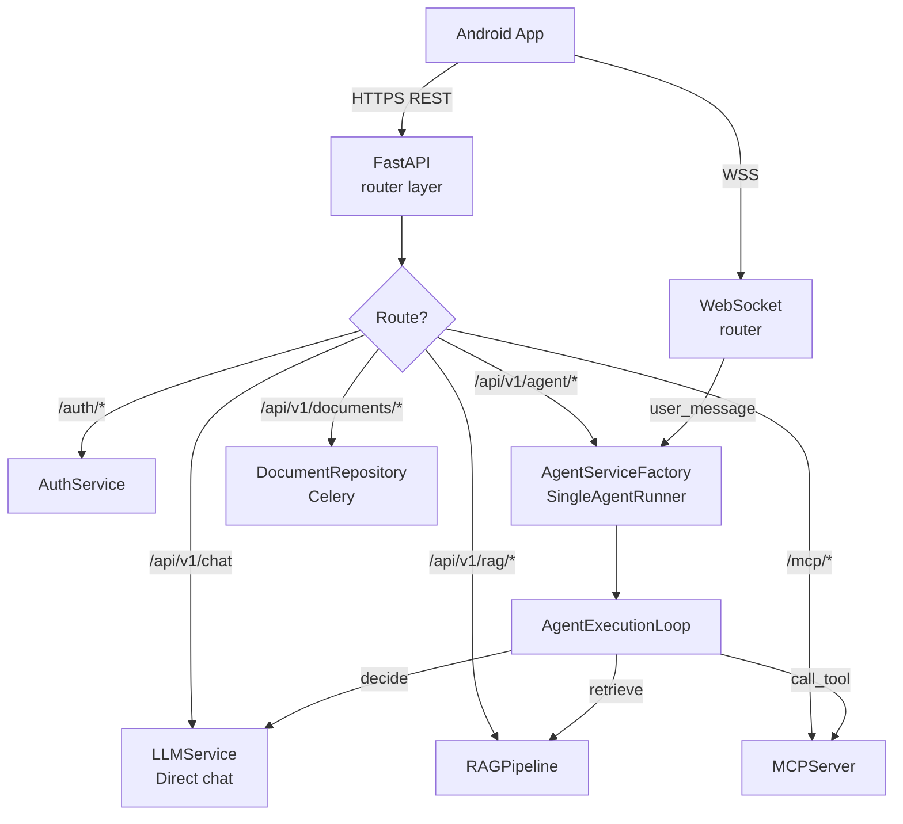
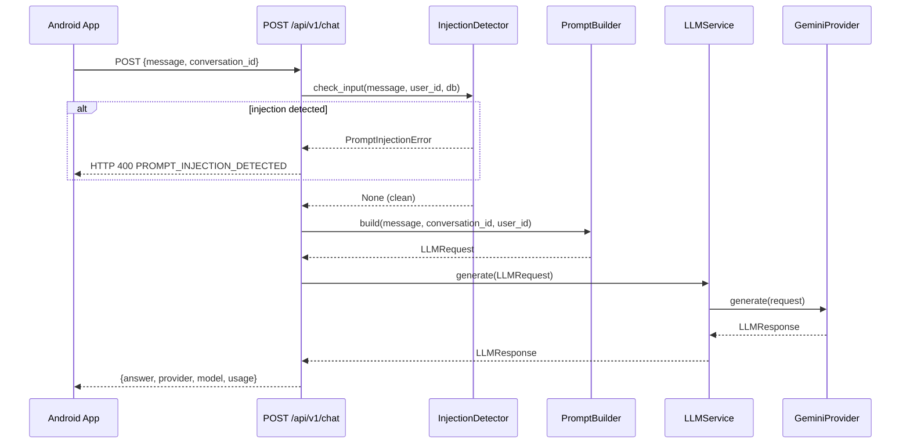
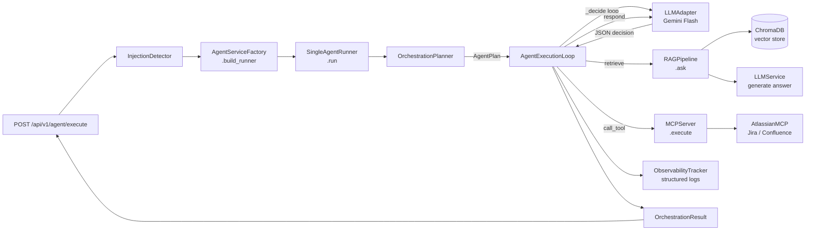
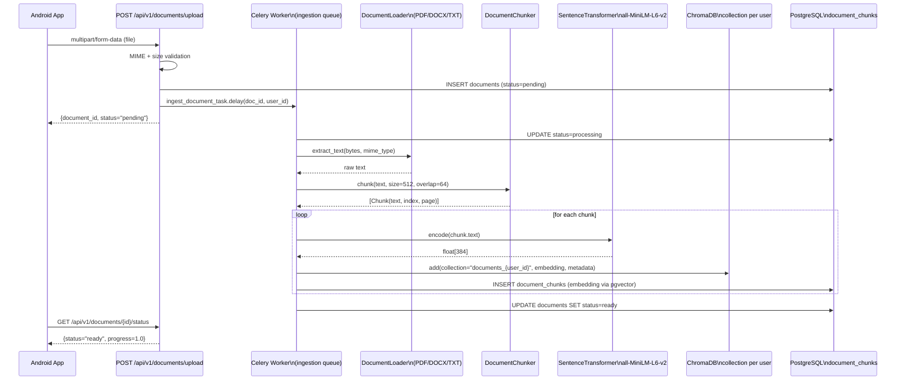
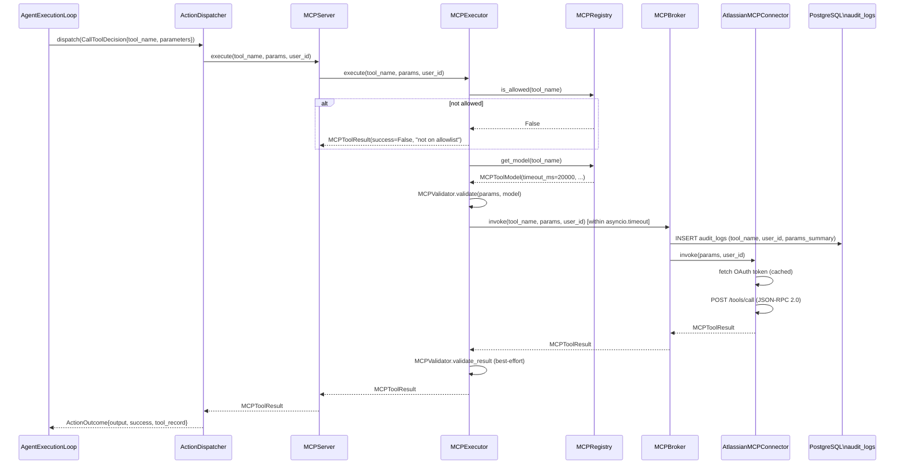
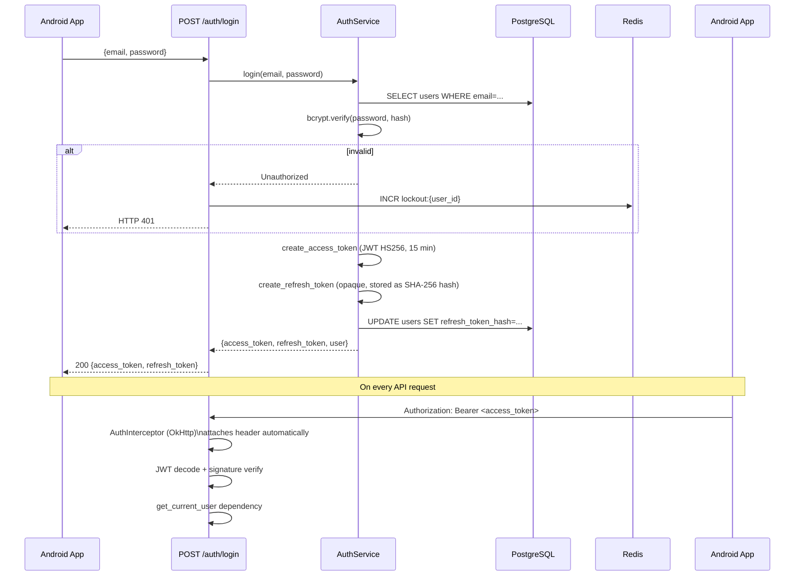
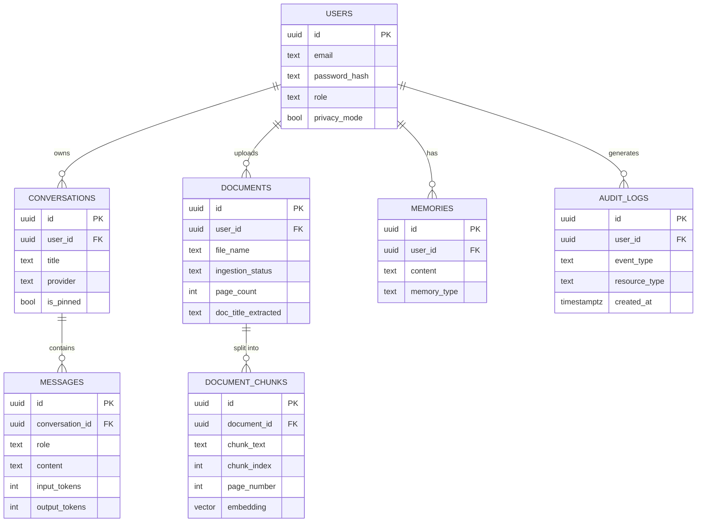

# Data Flow — Android AI Assistant

> **Status:** Current implementation  
> **Updated:** 2026-10-03

This document covers every significant data path through the system — from the Android client through the backend to storage and back. All Mermaid diagrams render in GitHub, GitLab, and most Markdown viewers.

---

## Table of Contents

1. [Request routing overview](#1-request-routing-overview)
2. [Chat / LLM data flow](#2-chat--llm-data-flow)
3. [Agent execution data flow](#3-agent-execution-data-flow)
4. [RAG ingestion data flow](#4-rag-ingestion-data-flow)
5. [RAG query data flow](#5-rag-query-data-flow)
6. [MCP tool execution data flow](#6-mcp-tool-execution-data-flow)
7. [Authentication data flow](#7-authentication-data-flow)
8. [Data storage topology](#8-data-storage-topology)

---

## 1. Request routing overview



---

## 2. Chat / LLM data flow

Direct-LLM mode: the simplest path — no retrieval, no tool calls.



**Key data at each hop:**

| Hop | What travels | What is dropped |
|---|---|---|
| App → API | Raw user message, conversation_id | JWT (in Authorization header, stripped before logging) |
| API → InjDet | message text, user_id | — |
| API → Prompt | message, conversation_id, user_id | — |
| API → LLM | LLMRequest (prompt, system_prompt, user_id) | Full JWT |
| LLM → Gemini | prompt text, temperature, max_tokens | API key set in constructor, never in logs |
| API → App | answer text, token counts | Internal model name variants |

---

## 3. Agent execution data flow



### Step-by-step trace

1. **Request arrives** — `POST /api/v1/agent/execute` with `{message, enable_rag, enable_mcp, max_steps}`.
2. **Injection check** — `InjectionDetector.check_input()` blocks prompt injection attempts; HTTP 400 on match.
3. **Factory builds runner** — `AgentServiceFactory.build_runner(db)` wires `LLMServiceAdapter`, `RAGPipeline`, `MCPServer`, and reads limits from `Settings`.
4. **Planning** — `OrchestrationPlanner` routes via `AgentRouter` (priority: explicit name → capability match → conversation context → first capable) then calls `AgentPlanner.build_plan()`.
5. **Execution loop** — `AgentExecutionLoop._run_inner()` runs under `asyncio.timeout(config.timeout_s)`. Each iteration:
   - Checks `step_count < max_steps` and `tool_call_count < max_tool_calls`.
   - Calls `_decide()` → LLM returns a JSON decision (`respond | retrieve | call_tool | wait | finish`).
   - Dispatches via `ActionDispatcher`.
6. **Result** — `OrchestrationResult` carries `output`, `citations`, `tool_calls`, `spans`, `total_tokens`, `elapsed_ms`.

### Data in `OrchestrationResult`

```
OrchestrationResult
├── run_id          — UUID for this execution
├── request_id      — echoed from AgentRequest
├── agent_name      — e.g. "ai-assistant"
├── status          — "completed" | "failed" | "timed_out"
├── output          — accumulated assistant answer text
├── citations[]     — [{document_id, document_name, excerpt, page_number, score}]
├── tool_calls[]    — [{tool_name, input, output, failed, error_message}]
├── spans[]         — [{step_index, action_type, duration_ms, tokens_used, success}]
├── total_tokens    — sum across all LLM calls
├── step_count
└── elapsed_ms
```

---

## 4. RAG ingestion data flow



**Storage written:**
- `documents` table: status, file metadata, chunk count
- `document_chunks` table: chunk text, page number, embedding (pgvector `vector(384)`)
- ChromaDB collection `documents_{user_id}`: embeddings + metadata for ANN search

---

## 5. RAG query data flow

```mermaid
flowchart TD
    A["POST /api/v1/rag/query\n{question, document_ids?, top_k}"] --> B[RAGPipeline.ask]

    B --> C[VectorRetriever]

    C --> D[SentenceTransformer\nembed question]
    D --> E[ChromaDB.query\ncollection=documents_{user_id}]
    E --> F[Top-K chunks\nby cosine similarity]

    F --> G{chunks found?}
    G -->|no| H["Answer: no relevant information found"]
    G -->|yes| I[ContextBuilder\nbuild_prompt + build_citations]

    I --> J[LLMService.generate\ngrounded answer]
    J --> K[RAGAnswer\nanswer + sources + latency_ms]

    K --> L["Response\n{answer, sources[], request_id}"]
```

**Privacy enforcement:**
- ChromaDB query is scoped to `collection="documents_{user_id}"` — no cross-user access.
- `user_id` in logs is redacted to first 8 characters (e.g. `aaaaaaaa…`).
- Raw question text is never logged — only `question_length`.

---

## 6. MCP tool execution data flow



**Data never logged:**
- `params` containing passwords, tokens, secrets, API keys — the `AgentSafetyGuard` calls `redact_sensitive_args()` before any log write.
- Full `user_id` — only first 8 characters appear in logs.
- OAuth access tokens — the Atlassian connector uses `_redact()` on all exception messages.

---

## 7. Authentication data flow



**JWT claims carried:**
- `sub` — user UUID
- `exp` — expiry epoch (15 minutes from issuance)
- `roles` — list of RBAC roles

**What is NOT in the JWT:**
- Password hash
- Email address
- Any PII beyond the opaque user UUID

---

## 8. Data storage topology



**Storage systems summary:**

| Store | Technology | Data | Isolation |
|---|---|---|---|
| Primary DB | PostgreSQL 16 + pgvector | Users, conversations, messages, documents, chunks, memories, audit logs | Row-level: user_id FK on all tables |
| Vector store | ChromaDB 0.5.20 | Document embeddings, memory embeddings | Collection per user: `documents_{user_id}`, `user_{user_id}_memories` |
| Cache / broker | Redis 7 | Rate-limit counters, session state, Celery tasks, JWT denylist | Key namespace per user |
| Object storage | MinIO (local) / GCS (prod) | Raw document files | Object path includes user_id prefix |
| Android local | Room (SQLite) | Conversations, messages, documents (cache), on-device chunks | Single-user device |
