# Database Design
## Android AI Assistant — Enterprise Edition

---

## Overview

The backend uses **PostgreSQL 15+** as the primary relational database managed via **SQLAlchemy 2.x ORM** and **Alembic** for migrations. The Android client uses **Room 2.x** (SQLite) as the local offline-first store.

---

## ER Diagram

```mermaid
erDiagram
    users {
        UUID id PK
        string email UK
        string password_hash
        string display_name
        string avatar_url
        string role
        string active_provider
        boolean is_active
        timestamp created_at
        timestamp updated_at
    }

    conversations {
        UUID id PK
        UUID user_id FK
        string title
        boolean is_pinned
        boolean is_deleted
        timestamp deleted_at
        string provider
        timestamp created_at
        timestamp updated_at
    }

    messages {
        UUID id PK
        UUID conversation_id FK
        string role
        text content
        integer input_tokens
        integer output_tokens
        string provider
        string sync_status
        timestamp created_at
    }

    documents {
        UUID id PK
        UUID user_id FK
        string file_name
        string mime_type
        bigint size_bytes
        string ingestion_status
        UUID job_id FK
        integer page_count
        timestamp deleted_at
        timestamp created_at
    }

    document_chunks {
        UUID id PK
        UUID document_id FK
        UUID user_id FK
        integer chunk_index
        integer page_number
        text content
        integer token_count
        string chroma_id
        timestamp created_at
    }

    memories {
        UUID id PK
        UUID user_id FK
        text content
        string memory_type
        string chroma_id
        timestamp created_at
    }

    notes {
        UUID id PK
        UUID user_id FK
        string title
        text content
        jsonb tags
        string sync_status
        timestamp created_at
        timestamp updated_at
    }

    todo_items {
        UUID id PK
        UUID user_id FK
        string title
        text description
        boolean is_completed
        timestamp due_date
        string priority
        jsonb tags
        string sync_status
        timestamp created_at
        timestamp updated_at
    }

    calendar_events {
        UUID id PK
        UUID user_id FK
        string title
        text description
        timestamp start_time
        timestamp end_time
        string location
        boolean is_all_day
        string source
        string sync_status
        timestamp created_at
        timestamp updated_at
    }

    reminders {
        UUID id PK
        UUID user_id FK
        string title
        timestamp trigger_time
        string recurrence_rule
        UUID linked_todo_id FK
        boolean is_completed
        string sync_status
        timestamp created_at
        timestamp updated_at
    }

    habit_definitions {
        UUID id PK
        UUID user_id FK
        string name
        text description
        string recurrence
        integer target_frequency
        timestamp created_at
        timestamp updated_at
    }

    habit_entries {
        UUID id PK
        UUID habit_id FK
        UUID user_id FK
        timestamp completed_at
        text note
    }

    api_keys {
        UUID id PK
        UUID user_id FK
        string provider
        text encrypted_key
        boolean is_active
        timestamp created_at
        timestamp updated_at
    }

    audit_logs {
        UUID id PK
        UUID user_id FK
        string event_type
        string ip_address
        string user_agent
        jsonb metadata
        timestamp created_at
    }

    prompt_templates {
        UUID id PK
        string name UK
        string version
        text template
        jsonb variables
        boolean is_active
        timestamp created_at
        timestamp updated_at
    }

    token_usage {
        UUID id PK
        UUID user_id FK
        UUID message_id FK
        string provider
        integer input_tokens
        integer output_tokens
        decimal cost_usd
        timestamp created_at
    }

    jobs {
        UUID id PK
        UUID user_id FK
        string job_type
        string status
        jsonb payload
        text error_message
        timestamp started_at
        timestamp completed_at
        timestamp created_at
    }

    refresh_tokens {
        UUID id PK
        UUID user_id FK
        string token_hash UK
        boolean is_revoked
        timestamp expires_at
        timestamp created_at
    }

    users ||--o{ conversations : "has"
    users ||--o{ messages : "owns"
    users ||--o{ documents : "uploads"
    users ||--o{ memories : "has"
    users ||--o{ notes : "creates"
    users ||--o{ todo_items : "owns"
    users ||--o{ calendar_events : "owns"
    users ||--o{ reminders : "has"
    users ||--o{ habit_definitions : "defines"
    users ||--o{ api_keys : "holds"
    users ||--o{ audit_logs : "generates"
    users ||--o{ token_usage : "accumulates"
    users ||--o{ jobs : "submits"
    users ||--o{ refresh_tokens : "holds"

    conversations ||--o{ messages : "contains"
    documents ||--o{ document_chunks : "split into"
    habit_definitions ||--o{ habit_entries : "logged by"
    todo_items ||--o| reminders : "linked to"
    documents ||--o| jobs : "processed by"
    messages ||--o| token_usage : "tracked by"
```

---

## Table Reference

### `users`
| Column | Type | Constraints | Notes |
|--------|------|-------------|-------|
| `id` | UUID | PK, DEFAULT uuid4 | |
| `email` | VARCHAR(255) | UNIQUE, NOT NULL | |
| `password_hash` | VARCHAR(255) | NOT NULL | bcrypt, work factor 12 |
| `display_name` | VARCHAR(100) | NOT NULL | |
| `avatar_url` | TEXT | NULL | |
| `role` | VARCHAR(20) | NOT NULL, DEFAULT 'user' | `user` / `premium` / `admin` |
| `active_provider` | VARCHAR(50) | NOT NULL, DEFAULT 'openai' | |
| `is_active` | BOOLEAN | NOT NULL, DEFAULT true | |
| `created_at` | TIMESTAMPTZ | NOT NULL, DEFAULT now() | |
| `updated_at` | TIMESTAMPTZ | NOT NULL, DEFAULT now() | |

### `conversations`
| Column | Type | Constraints | Notes |
|--------|------|-------------|-------|
| `id` | UUID | PK | |
| `user_id` | UUID | FK → users.id, NOT NULL | CASCADE DELETE |
| `title` | VARCHAR(500) | NOT NULL | |
| `is_pinned` | BOOLEAN | NOT NULL, DEFAULT false | |
| `is_deleted` | BOOLEAN | NOT NULL, DEFAULT false | Soft delete |
| `deleted_at` | TIMESTAMPTZ | NULL | Set on soft-delete |
| `provider` | VARCHAR(50) | NOT NULL | LLM provider used |
| `created_at` | TIMESTAMPTZ | NOT NULL | |
| `updated_at` | TIMESTAMPTZ | NOT NULL | |

### `messages`
| Column | Type | Constraints | Notes |
|--------|------|-------------|-------|
| `id` | UUID | PK | |
| `conversation_id` | UUID | FK → conversations.id, NOT NULL | CASCADE DELETE |
| `role` | VARCHAR(20) | NOT NULL | `user` / `assistant` / `system` |
| `content` | TEXT | NOT NULL | |
| `input_tokens` | INTEGER | NOT NULL, DEFAULT 0 | |
| `output_tokens` | INTEGER | NOT NULL, DEFAULT 0 | |
| `provider` | VARCHAR(50) | NOT NULL | |
| `sync_status` | VARCHAR(20) | NOT NULL, DEFAULT 'synced' | `synced` / `pending` / `failed` |
| `created_at` | TIMESTAMPTZ | NOT NULL | |

### `documents`
| Column | Type | Constraints | Notes |
|--------|------|-------------|-------|
| `id` | UUID | PK | |
| `user_id` | UUID | FK → users.id, NOT NULL | |
| `file_name` | VARCHAR(500) | NOT NULL | |
| `mime_type` | VARCHAR(100) | NOT NULL | |
| `size_bytes` | BIGINT | NOT NULL | Max 52,428,800 (50 MB) |
| `ingestion_status` | VARCHAR(20) | NOT NULL | `pending` / `processing` / `ready` / `failed` |
| `job_id` | UUID | FK → jobs.id, NULL | |
| `page_count` | INTEGER | NULL | Populated after extraction |
| `deleted_at` | TIMESTAMPTZ | NULL | Soft delete |
| `created_at` | TIMESTAMPTZ | NOT NULL | |

### `document_chunks`
| Column | Type | Constraints | Notes |
|--------|------|-------------|-------|
| `id` | UUID | PK | |
| `document_id` | UUID | FK → documents.id, NOT NULL | CASCADE DELETE |
| `user_id` | UUID | NOT NULL | Denormalised for fast scoping |
| `chunk_index` | INTEGER | NOT NULL | Order within document |
| `page_number` | INTEGER | NOT NULL | For citations |
| `content` | TEXT | NOT NULL | Raw chunk text |
| `token_count` | INTEGER | NOT NULL | |
| `chroma_id` | VARCHAR(255) | NOT NULL | ChromaDB embedding ID |
| `created_at` | TIMESTAMPTZ | NOT NULL | |

### `memories`
| Column | Type | Constraints | Notes |
|--------|------|-------------|-------|
| `id` | UUID | PK | |
| `user_id` | UUID | FK → users.id, NOT NULL | |
| `content` | TEXT | NOT NULL | |
| `memory_type` | VARCHAR(20) | NOT NULL | `preference` / `fact` / `style` |
| `chroma_id` | VARCHAR(255) | NOT NULL | ChromaDB embedding ID |
| `created_at` | TIMESTAMPTZ | NOT NULL | |

### `api_keys`
| Column | Type | Constraints | Notes |
|--------|------|-------------|-------|
| `id` | UUID | PK | |
| `user_id` | UUID | FK → users.id, NOT NULL | |
| `provider` | VARCHAR(50) | NOT NULL | |
| `encrypted_key` | TEXT | NOT NULL | AES-256 encrypted; never returned plaintext |
| `is_active` | BOOLEAN | NOT NULL, DEFAULT true | |
| `created_at` | TIMESTAMPTZ | NOT NULL | |
| `updated_at` | TIMESTAMPTZ | NOT NULL | |

### `audit_logs`
| Column | Type | Constraints | Notes |
|--------|------|-------------|-------|
| `id` | UUID | PK | |
| `user_id` | UUID | FK → users.id, NULL | NULL for anonymous events |
| `event_type` | VARCHAR(100) | NOT NULL | `login` / `logout` / `token_refresh` / `login_failed` / `mcp_invoke` / `prompt_injection_blocked` |
| `ip_address` | VARCHAR(45) | NULL | IPv4 or IPv6 |
| `user_agent` | TEXT | NULL | |
| `metadata` | JSONB | NULL | Event-specific data |
| `created_at` | TIMESTAMPTZ | NOT NULL | Retained ≥ 90 days |

### `token_usage`
| Column | Type | Constraints | Notes |
|--------|------|-------------|-------|
| `id` | UUID | PK | |
| `user_id` | UUID | FK → users.id, NOT NULL | |
| `message_id` | UUID | FK → messages.id, NULL | |
| `provider` | VARCHAR(50) | NOT NULL | |
| `input_tokens` | INTEGER | NOT NULL | |
| `output_tokens` | INTEGER | NOT NULL | |
| `cost_usd` | DECIMAL(10,6) | NOT NULL | |
| `created_at` | TIMESTAMPTZ | NOT NULL | |

### `jobs`
| Column | Type | Constraints | Notes |
|--------|------|-------------|-------|
| `id` | UUID | PK | |
| `user_id` | UUID | FK → users.id, NOT NULL | |
| `job_type` | VARCHAR(50) | NOT NULL | `rag_ingest` / `gdpr_delete` / etc. |
| `status` | VARCHAR(20) | NOT NULL | `pending` / `running` / `complete` / `failed` |
| `payload` | JSONB | NOT NULL | Job input parameters |
| `error_message` | TEXT | NULL | Set on failure |
| `started_at` | TIMESTAMPTZ | NULL | |
| `completed_at` | TIMESTAMPTZ | NULL | |
| `created_at` | TIMESTAMPTZ | NOT NULL | |

---

## Indexes

| Table | Index | Columns | Purpose |
|-------|-------|---------|---------|
| `conversations` | `idx_conv_user_updated` | `(user_id, updated_at DESC)` | Paginated conversation list |
| `messages` | `idx_msg_conv_created` | `(conversation_id, created_at)` | Conversation message history |
| `documents` | `idx_doc_user_status` | `(user_id, ingestion_status)` | Document list by status |
| `audit_logs` | `idx_audit_user_created` | `(user_id, created_at DESC)` | Audit log queries |
| `token_usage` | `idx_usage_user_created` | `(user_id, created_at DESC)` | Cost analytics |
| `memories` | `idx_mem_user` | `(user_id)` | Memory retrieval scoping |
| `todo_items` | `idx_todo_user_due` | `(user_id, due_date)` | Due-date filtered lists |
| `reminders` | `idx_reminder_user_trigger` | `(user_id, trigger_time)` | Upcoming reminders |
