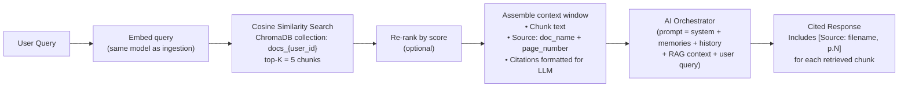

# RAG Architecture
## Android AI Assistant — Enterprise Edition

---

## Overview

The Retrieval-Augmented Generation (RAG) Pipeline enables users to upload documents and receive
AI answers grounded in their content. Every response includes citations referencing the exact
document and page number for each retrieved chunk.

---

## End-to-End Pipeline

### Ingestion Path

```mermaid
flowchart LR
    UPLOAD["Document Upload\n(PDF / DOCX / TXT / MD)\nMax 50 MB"] --> STORE["Store raw file\nin MinIO"]
    STORE --> PG1["Create Document record\nin PostgreSQL\n(status: pending)"]
    PG1 --> QUEUE["Enqueue Celery job\n(rag_ingest task)"]
    QUEUE --> EXTRACT["Text Extraction\n• Native PDF → pdfplumber\n• Scanned PDF → OCR (Tesseract)\n• DOCX → python-docx\n• TXT/MD → direct read"]
    EXTRACT --> CHUNK["Chunking\n512 tokens per chunk\n64-token overlap\n(configurable)"]
    CHUNK --> EMBED["Embedding Generation\n(configured embedding model)"]
    EMBED --> VECSTORE["ChromaDB Storage\nCollection: docs_{user_id}\nMetadata: doc_id, page, chunk_index"]
    VECSTORE --> PG2["Update Document status\nin PostgreSQL\n(status: ready)"]
    PG2 --> NOTIFY["Push Notification\n(ingestion complete)"]
```



### Retrieval Path



---

## Chunking Strategy

| Parameter | Default | Configurable |
|-----------|---------|-------------|
| Chunk size | 512 tokens | Yes |
| Overlap | 64 tokens | Yes |
| Splitting strategy | Sentence-boundary aware | Fixed |
| Minimum chunk size | 50 tokens | No |

Overlapping chunks ensure that sentences near chunk boundaries are not lost between adjacent
chunks, preserving semantic continuity.

---

## Vector Storage Design

**Collection naming:** `docs_{user_id}` — one ChromaDB collection per user.

**Chunk metadata stored per embedding:**
```json
{
  "document_id": "uuid",
  "document_name": "filename.pdf",
  "page_number": 3,
  "chunk_index": 7,
  "user_id": "uuid",
  "ingested_at": "2025-01-01T00:00:00Z"
}
```

**User isolation:** ChromaDB queries always filter by `user_id`. Cross-user retrieval is
architecturally impossible — each user has a separate collection.

---

## Retrieval Parameters

| Parameter | Value |
|-----------|-------|
| Similarity metric | Cosine similarity |
| Top-K | 5 (configurable) |
| Score threshold | 0.3 (chunks below threshold excluded) |
| Max context from RAG | ~2,000 tokens (5 × ~400 token avg chunk) |

---

## Citation Injection

Retrieved chunks are formatted as a structured context block injected into the LLM prompt:

```
[RAG CONTEXT]
[1] (Source: Q4_Report.pdf, p.12)
"The company achieved 23% revenue growth in Q4..."

[2] (Source: Q4_Report.pdf, p.14)
"Operating expenses increased by 18%..."
...

Please answer the question using the above sources. Cite each source as [1], [2], etc.
```

The LLM is instructed to include inline citations (`[1]`, `[2]`) in its response.
The frontend renders these as tappable references linking to the source chunk.

---

## Document Deletion

When a user deletes a document:
1. The document record is soft-deleted in PostgreSQL (`deleted_at` timestamp set)
2. A Celery task is enqueued to delete all embeddings from ChromaDB
3. ChromaDB deletion is completed within **60 seconds**
4. The raw file is deleted from MinIO
5. `document_chunks` records are hard-deleted from PostgreSQL

---

## Supported File Formats

| Format | Extraction Method | Scanned Support |
|--------|------------------|-----------------|
| PDF (native) | pdfplumber / pdfminer | N/A |
| PDF (scanned) | Tesseract OCR | ✓ |
| DOCX | python-docx | ✗ |
| TXT | Direct read | N/A |
| Markdown (.md) | Direct read | N/A |

Images submitted via the camera feature use a separate OCR path (not the RAG pipeline).

---

## Error Handling

| Failure Stage | Behaviour |
|--------------|-----------|
| File too large (>50 MB) | HTTP 413 — client error, no job enqueued |
| Text extraction failure | Job marked `failed`; structured error returned with stage name and filename |
| Embedding generation failure | Job retried up to 3 times; then marked `failed` |
| ChromaDB unavailable | Job retried with exponential backoff; admin alert via error monitoring |
| Unsupported format | HTTP 400 — synchronous rejection before MinIO upload |

---

## Round-Trip Property

For any valid document `D` containing phrase `P`:
1. Ingest `D` → embedding stored in ChromaDB
2. Query `P` verbatim → top-K retrieval returns a chunk containing `P`
3. RAG response references `D` as a source

This property is verified by the property-based test `Property 9` (see testing-strategy.md).
