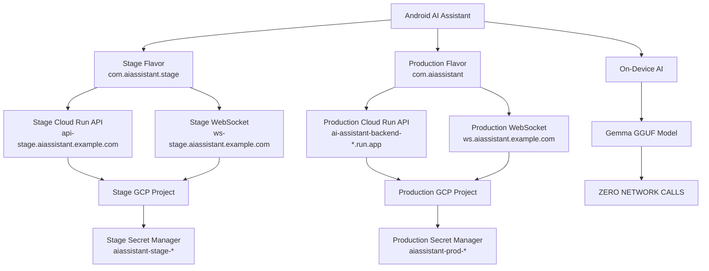

# Environment Configuration

Android AI Assistant — Stage & Production Environment Architecture

---

## Table of Contents

1. [Environment Architecture Overview](#1-environment-architecture-overview)
2. [Android Product Flavors](#2-android-product-flavors)
3. [Environment URLs](#3-environment-urls)
4. [BuildConfig Fields](#4-buildconfig-fields)
5. [EnvironmentConfig Abstraction](#5-environmentconfig-abstraction)
6. [Hilt Dependency Injection](#6-hilt-dependency-injection)
7. [Retrofit Configuration](#7-retrofit-configuration)
8. [WebSocket Configuration](#8-websocket-configuration)
9. [On-Device AI Isolation](#9-on-device-ai-isolation)
10. [App Branding & Stage Indicator](#10-app-branding--stage-indicator)
11. [GCP Backend Architecture](#11-gcp-backend-architecture)
12. [Secret Manager Strategy](#12-secret-manager-strategy)
13. [Build Commands](#13-build-commands)
14. [CI/CD Flow](#14-cicd-flow)
15. [Testing](#15-testing)
16. [Troubleshooting](#16-troubleshooting)
17. [Security Considerations](#17-security-considerations)
18. [Configuration Checklist](#18-configuration-checklist)

---

## 1. Environment Architecture Overview

The application is distributed as two distinct product flavors that connect to fully
isolated GCP environments. On-device AI operates without any network dependency.



### Key principles

- Stage and Production are **completely isolated** — separate Cloud Run services,
  databases, storage buckets, and Secret Manager namespaces.
- Environment-specific decisions are confined to the `EnvironmentConfig` interface.
  No `if (IS_PRODUCTION)` branches appear in repositories, ViewModels, or UI.
- `OnDeviceInferenceClient` has **no OkHttp or Retrofit dependency** and makes zero
  outbound network calls regardless of flavor.
- No secrets (API keys, JWT secrets, database credentials) are embedded in the APK.

---

## 2. Android Product Flavors

### Flavor dimension

```
dimension = "environment"
```

### Flavors

| Flavor       | Application ID              | Launcher Label       | Debug variant          | Release variant           |
|--------------|-----------------------------|----------------------|------------------------|---------------------------|
| `stage`      | `com.aiassistant.stage`     | AI Assistant Stage   | `stageDebug`           | `stageRelease`            |
| `production` | `com.aiassistant`           | AI Assistant         | `productionDebug`      | `productionRelease`       |

> The `debug` build type also appends `.debug` to the application ID via
> `applicationIdSuffix = ".debug"` in `buildTypes`, resulting in
> `com.aiassistant.stage.debug` for `stageDebug`.

### Source sets

```
app/src/
├── main/               ← shared application code
├── stage/
│   └── res/values/strings.xml    ← app_name = "AI Assistant Stage"
├── production/
│   └── res/values/strings.xml    ← app_name = "AI Assistant"
├── debug/              ← LeakCanaryConfig (enables LeakCanary)
├── release/            ← LeakCanaryConfig (no-op stub)
├── test/               ← JVM unit tests
└── androidTest/        ← instrumented tests
```

---

## 3. Environment URLs

> **IMPORTANT — Placeholder URLs**: The Stage URLs below are placeholders.
> Replace them with the real Stage Cloud Run service URLs before deploying to testers.
> The Production API URL points at the existing Cloud Run service and is preserved.

### Stage

| Service       | URL                                           | Status      |
|---------------|-----------------------------------------------|-------------|
| REST API      | `https://api-stage.aiassistant.example.com/`  | PLACEHOLDER |
| WebSocket     | `wss://ws-stage.aiassistant.example.com`      | PLACEHOLDER |

### Production

| Service       | URL                                                                        | Status    |
|---------------|----------------------------------------------------------------------------|-----------|
| REST API      | `https://ai-assistant-backend-106071012091.asia-south1.run.app/`           | REAL      |
| WebSocket     | `wss://ws.aiassistant.example.com`                                         | PLACEHOLDER |

### Where to replace URLs

URLs live in exactly one place each — the flavor `buildConfigField` blocks in:

```
core-network/build.gradle.kts   ← library BuildConfig (networking layer)
app/build.gradle.kts            ← app BuildConfig (IS_PRODUCTION flag)
```

Do **not** search-and-replace URL strings throughout the codebase. Change them only
in the Gradle files above, and `EnvironmentConfig` propagates them everywhere.

---

## 4. BuildConfig Fields

Both `app/build.gradle.kts` and `core-network/build.gradle.kts` declare identical
flavor blocks so the library module's `BuildConfig` matches the app's variant.

| Field           | Stage value                                              | Production value                                           |
|-----------------|----------------------------------------------------------|------------------------------------------------------------|
| `API_BASE_URL`  | `https://api-stage.aiassistant.example.com/`             | `https://ai-assistant-backend-106071012091.../` (Cloud Run)|
| `WS_BASE_URL`   | `wss://ws-stage.aiassistant.example.com`                 | `wss://ws.aiassistant.example.com`                         |
| `IS_PRODUCTION` | `false`                                                  | `true`                                                     |

> **Security**: Never add `GEMINI_API_KEY`, `OPENAI_API_KEY`, `JWT_SECRET`,
> `DATABASE_PASSWORD`, or any GCP service account key to BuildConfig. Those belong
> exclusively in GCP Secret Manager (see §12).

---

## 5. EnvironmentConfig Abstraction

```
core-network/
└── src/main/kotlin/com/aiassistant/core/network/
    ├── EnvironmentConfig.kt              ← interface
    └── BuildConfigEnvironmentConfig.kt   ← implementation (reads BuildConfig)
```

### Interface

```kotlin
interface EnvironmentConfig {
    val apiBaseUrl: String       // trailing slash required for Retrofit
    val websocketUrl: String     // wss:// scheme
    val environmentName: String  // "stage" | "production"
    val isProduction: Boolean
}
```

### Implementation

`BuildConfigEnvironmentConfig` is `internal` to `core-network`. It reads
`BuildConfig.API_BASE_URL`, `BuildConfig.WS_BASE_URL`, and `BuildConfig.IS_PRODUCTION`
— compile-time constants generated by AGP from the flavor `buildConfigField` entries.

### Test double

`FakeEnvironmentConfig` (in `EnvironmentConfigTest.kt`) is a `data class` implementing
`EnvironmentConfig`. Use it in any test that needs to control environment values:

```kotlin
val env = FakeEnvironmentConfig(
    apiBaseUrl   = "http://localhost:8080/",
    websocketUrl = "ws://localhost:8080",
    isProduction = false
)
```

---

## 6. Hilt Dependency Injection

```
app/src/main/kotlin/com/aiassistant/di/
└── EnvironmentModule.kt    ← @Provides @Singleton provideEnvironmentConfig()
```

`EnvironmentModule` follows the same pattern as `AppModule` (which provides
`@Named("isDebugBuild") Boolean`): the binding is declared in the `:app` module so
it can be replaced per test or build variant without touching library code.

### Dependency graph

```
EnvironmentModule (@Singleton)
    └── provideEnvironmentConfig() → EnvironmentConfig
            ↓
    NetworkModule
        ├── provideObservabilityBaseUrl(env) → @ObservabilityBaseUrl String
        ├── provideRetrofit(env, ...) → Retrofit
        └── provideWsBaseUrl(env) → @Named("wsBaseUrl") String
                ↓
        AIStreamClientImpl(@Named("wsBaseUrl") wsBaseUrl: String)
    FederationModule
        └── provideFederationRetrofit(env, ...) → @FederationRetrofit Retrofit
    HomeDashboardViewModel
        └── environmentConfig.isProduction → val isProduction: Boolean
```

### Overriding in tests

```kotlin
@TestInstallIn(
    components = [SingletonComponent::class],
    replaces   = [EnvironmentModule::class]
)
@Module
object FakeEnvironmentModule {
    @Provides @Singleton
    fun provideEnvironmentConfig(): EnvironmentConfig = FakeEnvironmentConfig(
        apiBaseUrl   = "http://localhost:8080/",
        websocketUrl = "ws://localhost:8080",
        isProduction = false
    )
}
```

---

## 7. Retrofit Configuration

`NetworkModule.provideRetrofit` and `FederationModule.provideFederationRetrofit` both
call `.baseUrl(environmentConfig.apiBaseUrl)`. No other code accesses `BuildConfig`
for the base URL.

The full interceptor chain is preserved unchanged:

```
OkHttpClient
  ├── AuthInterceptor             — attaches Bearer JWT
  ├── CertificatePinningInterceptor — validates TLS pins (bypassed in debug)
  ├── authenticator(RefreshTokenInterceptor) — handles HTTP 401
  ├── NetworkObservabilityInterceptor
  ├── (binary-body level-reduction inline interceptor)
  └── HttpLoggingInterceptor      — BODY in debug, NONE in release
```

Timeouts (unchanged): connect 30 s, read 90 s, write 60 s.

### Certificate pinning

Pinning is bypassed in debug (`isDebug = true → bypass = true`). In release, pass the
semicolon-separated SHA-256 SPKI hashes at build time:

```bash
./gradlew assembleProductionRelease -Pcert_pins="<hash1>;<hash2>"
```

Use a backup pin to survive certificate rotation. CI sets `CERT_PINS` as a secret.

---

## 8. WebSocket Configuration

### Cloud AI path

`AIStreamClientImpl` receives `@Named("wsBaseUrl") String` injected by
`NetworkModule.provideWsBaseUrl(environmentConfig)`. The connect URL is:

```
{wsBaseUrl}/ws/chat/{conversationId}?token={jwt}
```

| Flavor     | wsBaseUrl                              |
|------------|----------------------------------------|
| stage      | `wss://ws-stage.aiassistant.example.com` |
| production | `wss://ws.aiassistant.example.com`     |

Reconnection follows exponential backoff: 1 s → 2 s → 4 s → 8 s → 16 s (max 30 s),
up to 5 attempts, then emits `StreamEvent.Error`.

### Why `@Named("wsBaseUrl") String` and not `EnvironmentConfig`?

`core-ai` does not depend on `core-network` (Clean Architecture module boundary).
Passing a resolved `String` via `@Named` keeps `AIStreamClientImpl` free of any
`core-network` import while still being environment-aware.

---

## 9. On-Device AI Isolation

`OnDeviceInferenceClient` implements `AIStreamClient` with **zero network calls**.

```
AIStreamClient
    │
    ├── AIStreamClientImpl (CloudAIStreamClient)
    │       └── OkHttp WebSocket → Stage/Production backend
    │
    └── OnDeviceInferenceClient
            └── GGUF model file (local filesystem)
                └── JNI → llama.cpp (TODO: replace stub)
                    └── NO NETWORK
```

Evidence of isolation:
- `OnDeviceInferenceClient` constructor: `(ramMonitor: RamMonitor, modelFile: File?)`
  — no `OkHttpClient`, no `wsBaseUrl`, no `Retrofit`.
- `OnDeviceAiModule` provides it without any network dependency.
- `WebSocketConfigTest` uses reflection to assert no `OkHttpClient` constructor
  parameter exists on `OnDeviceInferenceClient`.

RAM safety: if free RAM drops below 512 MB during inference, the flow emits
`StreamEvent.Error("Insufficient resources — switching to cloud")` and cancels.

---

## 10. App Branding & Stage Indicator

### Launcher label

Controlled by flavor-specific `strings.xml`:

| Flavor       | `app_name`           |
|--------------|----------------------|
| `stage`      | AI Assistant Stage   |
| `production` | AI Assistant         |

### Stage indicator badge

```kotlin
@Composable
fun EnvironmentIndicator(isStage: Boolean, modifier: Modifier = Modifier)
```

Location: `core-ui/.../components/EnvironmentIndicator.kt`

- Amber badge reading **STAGE** with a `WarningAmber` icon.
- Rendered inside the `HomeDashboard` `TopAppBar` title row.
- Uses `AnimatedVisibility` — fades in/out smoothly.
- When `isStage = false` (production): emits **zero layout nodes**.
- `isStage` is derived from `HomeDashboardViewModel.isProduction` which reads
  `EnvironmentConfig.isProduction` — no `BuildConfig` access in UI.

---

## 11. GCP Backend Architecture

Stage and Production are **fully isolated** GCP environments. They must never share
databases, storage, or secrets.

```
GCP
│
├── Stage Project
│   ├── Cloud Run — API service          (api-stage.aiassistant.example.com)
│   ├── Cloud Run — Worker service       (background task processing)
│   ├── Cloud SQL — PostgreSQL           (aiassistant-stage-db)
│   ├── Memorystore — Redis              (aiassistant-stage-cache)
│   ├── Cloud Storage                    (aiassistant-stage-assets)
│   └── Secret Manager
│       ├── aiassistant-stage-db-password
│       ├── aiassistant-stage-redis-password
│       ├── aiassistant-stage-jwt-secret
│       └── aiassistant-stage-gemini-api-key
│
└── Production Project
    ├── Cloud Run — API service          (ai-assistant-backend-*.run.app)
    ├── Cloud Run — Worker service
    ├── Cloud SQL — PostgreSQL           (aiassistant-prod-db)
    ├── Memorystore — Redis              (aiassistant-prod-cache)
    ├── Cloud Storage                    (aiassistant-prod-assets)
    └── Secret Manager
        ├── aiassistant-prod-db-password
        ├── aiassistant-prod-redis-password
        ├── aiassistant-prod-jwt-secret
        └── aiassistant-prod-gemini-api-key
```

### Isolation rules

- Stage and Production databases **must not** share a Cloud SQL instance.
- Stage and Production storage buckets **must** have separate IAM bindings.
- A Stage service account **must not** have access to Production Secret Manager.

---

## 12. Secret Manager Strategy

### Naming convention

```
aiassistant-{environment}-{secret-name}

Examples:
  aiassistant-stage-db-password
  aiassistant-stage-jwt-secret
  aiassistant-prod-db-password
  aiassistant-prod-gemini-api-key
```

### Secrets that NEVER go into the Android APK

| Secret                    | Location                      |
|---------------------------|-------------------------------|
| `GEMINI_API_KEY`          | GCP Secret Manager            |
| `OPENAI_API_KEY`          | GCP Secret Manager            |
| `JWT_SECRET`              | GCP Secret Manager            |
| `DATABASE_PASSWORD`       | GCP Secret Manager            |
| `GCP_SERVICE_ACCOUNT_KEY` | GCP IAM / Workload Identity   |
| `REDIS_PASSWORD`          | GCP Secret Manager            |
| `POSTGRESQL_CREDENTIALS`  | GCP Secret Manager            |

The Android application communicates exclusively with the authenticated backend API.
Backend secrets are injected into Cloud Run containers at deploy time via Secret Manager
volume mounts — they never transit through the Android build pipeline.

### Android keystore secrets (CI only)

| GitHub Secret             | Purpose                                |
|---------------------------|----------------------------------------|
| `KEYSTORE_BASE64`         | Base64-encoded release keystore (.jks) |
| `KEY_ALIAS`               | Key alias in the keystore              |
| `KEY_PASSWORD`            | Key password                           |
| `STORE_PASSWORD`          | Keystore store password                |
| `CERT_PINS`               | TLS SPKI pin hashes for release builds |

---

## 13. Build Commands

### Prerequisites

```bash
# Java 17 (Temurin recommended)
java -version  # should print openjdk 17

# Use the project's Gradle wrapper — never install Gradle globally
./gradlew --version
```

### Assembling APKs

```bash
# Stage
./gradlew assembleStageDebug
./gradlew assembleStageRelease

# Production
./gradlew assembleProductionDebug
./gradlew assembleProductionRelease

# All variants at once
./gradlew assemble
```

> On Windows use `.\gradlew.bat` or `gradlew` (PowerShell).

### Verifying the Hilt DI graph

```bash
# These must succeed before any PR merge (also enforced by CI)
./gradlew kspStageDebugKotlin
./gradlew kspProductionDebugKotlin
```

### Running tests

```bash
# Unit tests (all modules)
./gradlew test

# Unit tests for specific modules
./gradlew :core-network:test
./gradlew :core-ai:test

# Lint
./gradlew lintStageDebug
./gradlew lintProductionDebug

# ktlint + Detekt
./gradlew ktlintCheck
./gradlew detekt
```

### Production release with certificate pins

```bash
./gradlew assembleProductionRelease \
    -Pcert_pins="<sha256-base64-hash1>;<sha256-base64-hash2>"
```

To derive the pin for the production Cloud Run service:

```bash
openssl s_client -connect ai-assistant-backend-106071012091.asia-south1.run.app:443 2>/dev/null \
  | openssl x509 -pubkey -noout \
  | openssl pkey -pubin -outform DER \
  | openssl dgst -sha256 -binary | base64
```

Always include a **backup pin** so certificate rotation does not lock out users.

---

## 14. CI/CD Flow

```
Developer
    │
    ▼
feature branch (any name)
    │
    ▼  git push / open PR
Pull Request → develop (targets Stage)
    │
    ▼  GitHub Actions: android-ci.yml
┌─────────────────────────────────────┐
│ Required checks (all must pass)     │
│  • validate                         │
│  • dependency-lint                  │
│  • hilt-ksp-gate (stage + prod KSP) │
│  • android-lint                     │
│  • android-unit-tests               │
│  • ktlint-detekt                    │
│  • jacoco-gate (≥70% coverage)      │
│  • backend-unit-tests               │
│  • instrumented-tests               │
└─────────────────────────────────────┘
    │ PR merged
    ▼
develop branch
    │  Auto-deploy
    ▼
Stage environment (GCP Stage Project)
    │
    ▼  QA / UAT sign-off
Pull Request → main  (requires reviewer approval)
    │
    ▼  android-ci / build-signed-apk
    │  Signed APK → Firebase App Distribution (testers)
    ▼
Production approval gate
    │  Explicit manual approval in GitHub Environments
    ▼
Production environment (GCP Production Project)
```

### Branch strategy

| Branch    | Environment | Auto-deploy |
|-----------|-------------|-------------|
| `develop` | Stage       | Yes (on merge) |
| `main`    | Production  | No — requires explicit approval gate |

> Production deployments are **never automatic**. A human must approve the GitHub
> Environment protection rule before the production workflow runs.

### Flavor selection in CI

The CI pipeline builds the `stageDebug` variant for PR checks. The signed release
job on `main` builds `productionRelease`. Update `.github/workflows/android-ci.yml`
if you need to test `stageRelease` artifacts in CI.

---

## 15. Testing

### Unit test coverage

| Test file                    | Module         | What it verifies                                        |
|------------------------------|----------------|---------------------------------------------------------|
| `EnvironmentConfigTest`      | core-network   | Contract: URLs, scheme, trailing slash, IS_PRODUCTION   |
| `RetrofitConfigTest`         | core-network   | Retrofit uses `apiBaseUrl` from `EnvironmentConfig`     |
| `WebSocketConfigTest`        | core-ai        | `wsBaseUrl` injected; no hardcoded IPs; on-device isolation |
| `AuthInterceptorTest`        | core-network   | JWT attachment                                          |
| `CertificatePinningInterceptorTest` | core-network | TLS pin validation                               |
| `WebSocketBackoffPropertyTest` | core-ai      | Exponential backoff formula                             |

### Running environment-specific tests

```bash
# Verify stage variant compiles and tests pass
./gradlew :core-network:testStageDebugUnitTest
./gradlew :core-ai:test

# Verify production variant compiles and tests pass
./gradlew :core-network:testProductionDebugUnitTest
```

---

## 16. Troubleshooting

### Build fails: `Unresolved reference: BuildConfig`

The `core-network` module must declare the same flavor dimension and flavor names as
`:app`. If you add a new flavor to `:app`, add the same flavor to
`core-network/build.gradle.kts`.

### `API_BASE_URL` / `WS_BASE_URL` not found in BuildConfig

These fields require a successful `./gradlew kspStageDebugKotlin` (or equivalent
variant) before they appear. If using Android Studio, sync the project and select a
flavor in the Build Variants panel.

### Wrong URL being used at runtime

1. Confirm the active build variant in Android Studio (Build Variants panel).
2. Check `adb logcat | grep EnvironmentConfig` — `BuildConfigEnvironmentConfig` logs
   nothing by default, but you can add a `Timber.d` call temporarily.
3. Verify `EnvironmentModule` is installed: run `./gradlew kspStageDebugKotlin` and
   check for Hilt binding errors.

### Stage build appearing on same device as Production

Stage uses `applicationIdSuffix = ".stage"`, so both APKs can be installed side-by-side.
The Stage launcher label ("AI Assistant Stage") and the amber **STAGE** badge in the
app's top bar identify the Stage build.

### Certificate pinning failure in release builds

Ensure `-Pcert_pins` was passed at build time (or `CERT_PINS` CI secret is set).
In debug builds pinning is bypassed intentionally — this is expected behaviour.

### On-device model not available

`OnDeviceInferenceClient` emits `StreamEvent.Error("On-device model not available")`
when `modelFile == null`. The model file is set by `OnDeviceAiInitializer` after
startup. Check the `OnDeviceModelManager` download state in Settings.

---

## 17. Security Considerations

- **No secrets in APK**: BuildConfig contains only URLs and boolean flags — nothing
  that grants access to backend resources.
- **JWT is ephemeral**: The JWT is stored in `SecureStorage` (EncryptedSharedPreferences)
  and passed as a WebSocket query parameter. It is never committed to version control.
- **Certificate pinning**: Enabled in production release builds. Bypassed in debug
  to allow local/emulator testing. Always include a backup pin.
- **Stage isolation**: Stage secrets (`aiassistant-stage-*`) and production secrets
  (`aiassistant-prod-*`) are in separate Secret Manager namespaces with separate IAM
  bindings. A misconfigured stage deployment cannot access production secrets.
- **No cross-environment data leakage**: Stage and Production use separate Cloud SQL
  instances, Redis instances, and GCS buckets. There is no shared state.
- **On-device AI**: `OnDeviceInferenceClient` makes zero outbound network calls.
  User prompts processed on-device never leave the device.

---

## 18. Configuration Checklist

Use this checklist when deploying to a new environment or rotating credentials.

```
Android
[ ] Stage API URL updated in core-network/build.gradle.kts (stage flavor)
[ ] Production API URL verified in core-network/build.gradle.kts (production flavor)
[ ] Stage WebSocket URL updated in core-network/build.gradle.kts (stage flavor)
[ ] Production WebSocket URL updated in core-network/build.gradle.kts (production flavor)
[ ] Stage application ID: com.aiassistant.stage (+ .debug for debug variant)
[ ] Production application ID: com.aiassistant (+ .debug for debug variant)
[ ] Stage branding: launcher shows "AI Assistant Stage", amber STAGE badge visible
[ ] Production branding: launcher shows "AI Assistant", no STAGE badge

GCP Stage
[ ] Cloud Run API service deployed to Stage project
[ ] Cloud Run Worker service deployed to Stage project
[ ] PostgreSQL instance created (aiassistant-stage-db) — SEPARATE from Production
[ ] Redis instance created (aiassistant-stage-cache) — SEPARATE from Production
[ ] GCS bucket created (aiassistant-stage-assets) — SEPARATE from Production
[ ] Secret Manager entries created with aiassistant-stage-* prefix

GCP Production
[ ] Cloud Run API service deployed to Production project
[ ] Cloud Run Worker service deployed to Production project
[ ] PostgreSQL instance created (aiassistant-prod-db) — SEPARATE from Stage
[ ] Redis instance created (aiassistant-prod-cache) — SEPARATE from Stage
[ ] GCS bucket created (aiassistant-prod-assets) — SEPARATE from Stage
[ ] Secret Manager entries created with aiassistant-prod-* prefix
[ ] No Stage service account has IAM access to Production Secret Manager

CI/CD
[ ] CERT_PINS GitHub secret set for production release builds
[ ] KEYSTORE_BASE64 / KEY_ALIAS / KEY_PASSWORD / STORE_PASSWORD set
[ ] Production GitHub Environment has approval gate configured
[ ] develop → Stage auto-deploy pipeline verified
[ ] main → Production pipeline requires manual approval

Security
[ ] No API keys or JWT secrets in app/build.gradle.kts
[ ] No API keys or JWT secrets in core-network/build.gradle.kts
[ ] Certificate pins include at least one backup pin
[ ] Stage secret accounts cannot access Production Secret Manager
[ ] OnDeviceInferenceClient confirmed zero-network (WebSocketConfigTest passes)
```
