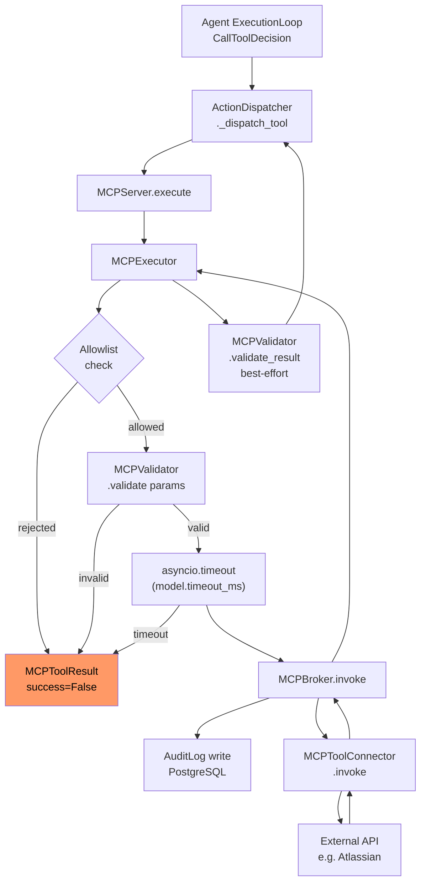

# MCP Overview

> **Module:** `app.mcp`  
> **Updated:** 2026-10-03

The Model Context Protocol (MCP) layer lets the AI agent call external tools — Jira, Confluence, GitHub, Slack, and more — within a single agent execution run. This document covers the architecture, components, security model, and extension points.

---

## Table of Contents

1. [What is MCP?](#1-what-is-mcp)
2. [Architecture](#2-architecture)
3. [Components](#3-components)
4. [Execution pipeline](#4-execution-pipeline)
5. [Security model](#5-security-model)
6. [Observability](#6-observability)
7. [Known limitations](#7-known-limitations)
8. [Adding a new connector](#8-adding-a-new-connector)

---

## 1. What is MCP?

The [Model Context Protocol](https://modelcontextprotocol.io/) is an open standard for connecting LLM applications to external data sources and tools. In this system, MCP is used to:

- **Discover tools** — connectors register schemas describing what parameters each tool accepts.
- **Execute tools** — the agent calls `MCPServer.execute(tool_name, params, user_id)` during an agent run.
- **Audit every call** — every invocation writes an immutable `AuditLog` row regardless of outcome.

MCP is the agent's hands. RAG is the agent's knowledge. The LLM is the agent's brain.

---

## 2. Architecture



---

## 3. Components

### MCPServer (`app.mcp.server`)
The public entry point. Created once per request via `MCPServer.create(db)`. Composes all other components.

```python
server = MCPServer.create(db=db, allowed_tools={"jira_get_issue"})
server.register(AtlassianMCPConnector(config))
result = await server.execute("jira_get_issue", {"issue_key": "AI-1"}, user_id)
```

### MCPRegistry (`app.mcp.registry`)
In-memory store of registered connectors and their schemas. Enforces the allowlist.

- `register(connector)` — adds a connector; builds `MCPToolModel` from its schema.
- `is_allowed(tool_name)` — returns `True` only when the tool is both registered and on the allowlist.
- `get_model(tool_name)` — returns `MCPToolModel` with `timeout_ms`, parameter descriptors, and confirmation requirement.
- `discover()` — returns `List[MCPToolSchema]` for all allowed tools.

### MCPExecutor (`app.mcp.executor`)
Applies the full safety pipeline before every invocation. **Never raises** for expected failures.

| Step | What happens |
|---|---|
| 1. Allowlist | Rejects tools not in registry/allowlist |
| 2. Param validation | Checks required params, types, enums via `MCPValidator` |
| 3. Timeout | `asyncio.timeout(model.timeout_ms / 1000)` wraps the broker call |
| 4. Invocation | `MCPBroker.invoke()` — writes audit log, calls connector |
| 5. Result validation | Best-effort schema check on the result |

### MCPBroker (`app.services.mcp_broker`)
The bridge between the registry/executor and the concrete connectors. Responsible for:
- Writing a mandatory `AuditLog` row on every invocation.
- Surfacing the `requires_confirmation` flag before executing write operations.

### MCPToolConnector (`app.services.mcp_broker.MCPToolConnector`)
Abstract base class all connectors subclass. Two required methods:
- `get_schema() → MCPToolSchema` — declares parameters, confirmation requirement.
- `invoke(params: dict, user_id: str) → MCPToolResult` — performs the actual call.

---

## 4. Execution pipeline

```mermaid
sequenceDiagram
    participant Loop as AgentExecutionLoop
    participant Disp as ActionDispatcher
    participant Srv as MCPServer
    participant Ex as MCPExecutor
    participant Brok as MCPBroker
    participant Conn as Connector
    participant DB as AuditLog

    Loop->>Disp: CallToolDecision{tool_name, parameters}
    Disp->>Srv: execute(name, params, user_id)
    Srv->>Ex: execute(name, params, user_id)
    Ex->>Ex: Step 1 — allowlist check
    Ex->>Ex: Step 2 — param validation
    Ex->>Brok: invoke(...) [within asyncio.timeout]
    Brok->>DB: INSERT audit_logs
    Brok->>Conn: invoke(params, user_id)
    Conn-->>Brok: MCPToolResult
    Brok-->>Ex: MCPToolResult
    Ex->>Ex: Step 5 — result validation
    Ex-->>Srv: MCPToolResult
    Srv-->>Disp: MCPToolResult
    Disp-->>Loop: ActionOutcome
```

### Result shape

```python
MCPToolResult(
    tool_name: str,
    success: bool,           # False on any error
    result: Any,             # serialisable data on success, None on failure
    error: str | None,       # safe human-readable error; never raw exception msg
    result_status: str,      # "success" | "error" | "confirmation_required"
)
```

---

## 5. Security model

### Allowlist
Tools must be explicitly allowed at `MCPServer.create(allowed_tools={"tool_a", "tool_b"})`. `None` or `{"*"}` allows all registered tools. The allowlist is enforced in `MCPRegistry.is_allowed()` before any validation or invocation.

### Parameter sanitisation
`AgentSafetyGuard.redact_sensitive_args()` is called in `ChatDetailViewModel` before parameters reach the dispatcher. Keys matching `password`, `token`, `api_key`, `secret`, `auth`, `bearer`, `jwt`, `ssn`, `cvv`, and others are replaced with `"[redacted]"` in any log output.

### Timeout enforcement
`asyncio.timeout(timeout_ms / 1000)` wraps `MCPBroker.invoke()`. Default: 30 000 ms. Per-tool override via `MCPToolModel.timeout_ms`. Set `default_timeout_ms=0` to disable (not recommended).

### Audit trail
Every invocation — successful or failed — writes an `AuditLog` row:
- `event_type="mcp_tool_invoked"`
- `resource_id=tool_name`
- `user_id=user_id`
- Params are summarised, never stored verbatim.

### Safe error messages
The `MCPExecutor` never returns raw exception messages in `MCPToolResult.error`. Only pre-defined safe strings are returned. The full exception type (`exc_type`) is logged at ERROR level for diagnostics.

### User isolation
`user_id` is forwarded to every connector. Connectors use it for audit and scoping. The `user_id` appears in logs as the first 8 characters only (e.g. `user-123…`).

---

## 6. Observability

All MCP log records use `extra={}` dicts so fields are promoted to queryable JSON keys in Cloud Logging and Loki.

| Log event | Level | Queryable fields |
|---|---|---|
| Allowlist rejection | WARNING | `tool_name`, `user_id` (8 chars) |
| Param validation failure | INFO | `tool_name`, `param_name`, `reason` |
| Timeout | WARNING | `tool_name`, `timeout_ms`, `elapsed_ms` |
| Unexpected exception | ERROR | `tool_name`, `elapsed_ms`, `exc_type` |
| Completed | DEBUG | `tool_name`, `success`, `elapsed_ms` |

---

## 7. Known limitations

- **Single gateway tool name** — `AtlassianMCPConnector` registers as `"atlassian_mcp"`. Individual Jira/Confluence tool names are passed as `params["tool_name"]`. This means the allowlist entry is `"atlassian_mcp"`, not individual tool names. Future: register individual discovered tools directly.
- **No streaming tool results** — `MCPBroker.invoke()` returns a complete result. Long-running tools block the agent step. `invoke_with_streaming()` is documented in the target architecture but not yet implemented.
- **`asyncio.timeout` on Windows IOCP** — Sub-millisecond timeouts are unreliable on the Windows IOCP event loop. Tests use `patch("app.mcp.executor.asyncio.timeout")` to inject controlled `TimeoutError`. Production Linux is unaffected.

---

## 8. Adding a new connector

1. Subclass `MCPToolConnector` in `app/mcp/connectors/your_connector.py`:

```python
from app.schemas.mcp import MCPToolResult, MCPToolSchema
from app.services.mcp_broker import MCPToolConnector

class YourConnector(MCPToolConnector):
    @property
    def tool_name(self) -> str:
        return "your_tool"

    def get_schema(self) -> MCPToolSchema:
        return MCPToolSchema(
            tool_name="your_tool",
            display_name="Your Tool",
            description="What this tool does.",
            parameters={
                "type": "object",
                "properties": {
                    "query": {"type": "string", "description": "Input query."}
                },
                "required": ["query"],
            },
            category="utility",
        )

    async def invoke(self, params: dict, user_id: str) -> MCPToolResult:
        # Never raises — catch all exceptions and return MCPToolResult(success=False)
        try:
            result = await call_your_api(params["query"])
            return MCPToolResult(
                tool_name=self.tool_name, success=True,
                result=result, result_status="success"
            )
        except Exception as exc:
            return MCPToolResult(
                tool_name=self.tool_name, success=False,
                error="Your tool encountered an error.", result_status="error"
            )
```

2. Register in `AgentServiceFactory` (`app/agent/factory.py`):

```python
server.register(YourConnector())
```

3. Add unit tests in `tests/unit/test_mcp_connectors.py` or a new file.

4. Add credentials to `backend/.env.docker.example` if required (with `[OPTIONAL]` label).
