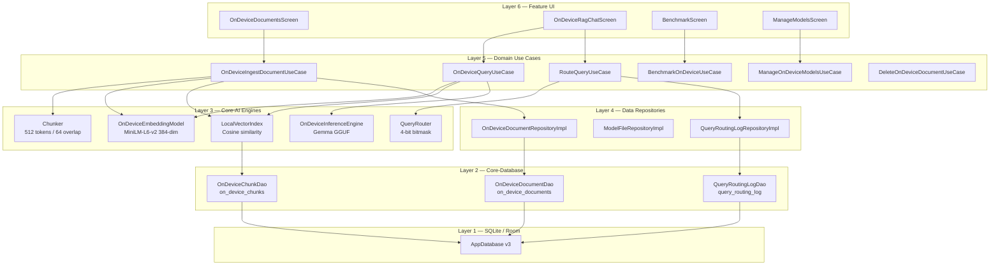
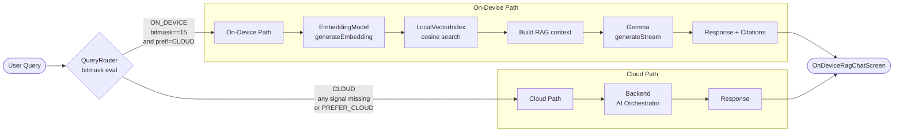
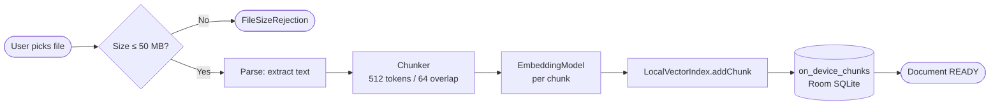

# On-Device RAG — Portfolio Documentation

**Android AI Assistant (Enterprise Edition)**

> All inference, embedding, and retrieval described in this document executes entirely
> on the Android device. No document content, embeddings, or query text is ever sent
> to the Backend or any external service when the on-device path is active.

---

## Table of Contents

1. [Overview](#overview)
2. [Six-Layer Architecture Stack](#six-layer-architecture-stack)
3. [Two Query Paths](#two-query-paths)
4. [Six Implementation Phases](#six-implementation-phases)
5. [Benchmark Results](#benchmark-results)
6. [Offline Demo](#offline-demo)
7. [Privacy & Security](#privacy--security)

---

## Overview

The on-device RAG feature allows users to ingest local documents (PDF, TXT, Markdown) into
a SQLite-backed vector index and query them using Gemma as the generation model — all without
any network connection.

**Key constraint (Property 41 / Requirement 35.7):** Gemma is the generation component only.
A separate embedding model (MiniLM-L6-v2, 384-dim) handles retrieval. The two never share
inference calls. This separation is enforced structurally: `OnDeviceInferenceEngine` exposes
no embedding or search methods.

---

## Six-Layer Architecture Stack



---

## Two Query Paths



### Document Ingestion Pipeline



---

## Six Implementation Phases

### Phase 1 — Database Foundation (Task 44)

**Purpose:** Extend `core-database` with the three Room tables that persist all on-device
RAG state: document metadata, embedding blobs, and routing audit logs.

**Components:**
- `OnDeviceDocumentEntity` — ingestion lifecycle tracker
- `OnDeviceChunkEntity` — text + float32 embedding blob (little-endian IEEE 754)
- `QueryRoutingLogEntity` — 4-bit bitmask audit trail, 30-day retention
- `OnDeviceChunkDao`, `OnDeviceDocumentDao`, `QueryRoutingLogDao`
- `FloatArray↔ByteArray` TypeConverter (4× smaller than JSON arrays)

**Design decision:** Embeddings stored as raw BLOB rather than JSON. A 384-dim float32
embedding is 1,536 bytes as a blob vs ~2,800 bytes as JSON decimal strings. `ByteBuffer`
with `LITTLE_ENDIAN` byte order matches TFLite / MediaPipe native memory layout so bytes
can be passed to native inference APIs without an extra copy.

---

### Phase 2 — Core-AI Engine Components (Task 45)

**Purpose:** Implement the five stateless engine components that the domain use cases
orchestrate: chunker, embedding model, vector index, inference engine, and query router.

**Components:**
- `Chunker` — sliding window (512 tokens / 64 overlap), 4 chars ≈ 1 token approximation,
  `PageOffset` attribution for PDFs, deterministic chunk IDs
- `OnDeviceEmbeddingModel` / `MiniLmEmbeddingModel` — SHA-256 verification at `initialize()`,
  deterministic stub (Property 38), L2-normalised output, 512-token truncation
- `LocalVectorIndex` — in-process dot-product cosine similarity, SQL-level user isolation,
  `DEFAULT_MIN_SIMILARITY = 0.40f`
- `OnDeviceInferenceEngine` / `MediaPipeInferenceEngine` — generation only (Property 41),
  RAM poll every 2 s, thermal check at start, Battery Saver → CPU, cancel within 500 ms
- `QueryRouter` — 4-bit bitmask, offline rule (bits 0-2 set, bit 3 unset → always ON_DEVICE),
  pure function (no side effects)

**Design decision:** `QueryRouter.evaluate()` is a pure function with no I/O so all 48
bitmask × preference combinations are testable without mocking (Property 40).

---

### Phase 3 — Domain & Data Layers (Task 46)

**Purpose:** Define the domain contract (entities, repository interfaces, use cases) and
wire data implementations.

**Components:**
- Domain entities: `OnDeviceDocument`, `IngestionProgress` sealed class, `OnDeviceQueryEvent`
  sealed class, `ChunkCitation`, `OnDeviceRoutingDecision`
- Repository interfaces: `OnDeviceDocumentRepository`, `ModelFileRepository`,
  `QueryRoutingLogRepository`, `QueryMetricsRepository`
- Use cases: `OnDeviceIngestDocumentUseCase`, `OnDeviceQueryUseCase`, `RouteQueryUseCase`,
  `BenchmarkOnDeviceUseCase`, `ManageOnDeviceModelsUseCase`, `DeleteOnDeviceDocumentUseCase`,
  `GetOnDeviceDocumentsUseCase`
- Data impls: `OnDeviceDocumentRepositoryImpl`, `ModelFileRepositoryImpl`,
  `QueryRoutingLogRepositoryImpl`, `QueryMetricsRepositoryImpl`
- Hilt bindings: `OnDeviceRagModule`

**Design decision:** Domain mirror types (`OnDeviceInferencePath`, `OnDevicePathPreference`)
avoid a `domain → core-ai` dependency. `RouteQueryUseCase` translates between domain and
core-ai types at the boundary.

---

### Phase 4 — Feature Module UI (Task 47)

**Purpose:** Build the four user-facing screens backed by Hilt-injected ViewModels.

**Components:**
- `OnDeviceDocumentsScreen` + `OnDeviceDocumentViewModel` — file picker, 50 MB guard,
  ingestion progress banner, low-storage warning (< 100 MB), status badges with chunk count
- `OnDeviceRagChatScreen` + `OnDeviceRagViewModel` — routing → on-device/cloud dispatch,
  "Running on device" / "Using cloud AI" toolbar badge, token streaming, expandable citations
  with cosine similarity score, fallback banner, NoRelevantContent state, Error + retry
- `BenchmarkScreen` + `BenchmarkViewModel` — TTFT p50/p95, tokens/sec p50/p95, RAM peak,
  accelerator display
- `ManageModelsScreen` + `ManageModelsViewModel` — per-model download progress (resume-from-
  byte), Battery Saver notice, in-app update notification
- `OnDeviceRagNavigation` — 4 routes + deep links (`aiassistant://open/ondevicerag/…`)

---

### Phase 5 — Property-Based Tests (Task 48)

**Purpose:** Formally verify five correctness properties using Kotest PropTest.

| Property | File | What it proves |
|----------|------|----------------|
| 37 | `OnDeviceRagRoundTripPropertyTest` | Verbatim phrase from ingested doc appears in Done citations |
| 38 | `EmbeddingDeterminismPropertyTest` | Same input → identical FloatArray on any call count |
| 39 | `LocalVectorIndexIsolationPropertyTest` | User A search never returns user B chunks |
| 40 | `QueryRouterPathSelectionPropertyTest` | All 48 bitmask × preference combos route correctly |
| 41 | `GemmaGenerationOnlyPropertyTest` | Engine spy records only `generateStream` — never embed/search |

---

### Phase 6 — Portfolio Documentation (Task 49)

**Purpose:** Provide reproducible benchmark scripts, README guidance, and Educational Header
blocks so every new source file is self-documenting.

**Components:**
- `docs/on-device-rag.md` (this file)
- `benchmarks/on_device_rag_benchmark.sh`
- README "On-Device RAG" section
- Educational Header blocks in all new source files

---

## Benchmark Results

Run `benchmarks/on_device_rag_benchmark.sh` on a connected device to populate this table.
See [benchmark script documentation](#offline-demo) for prerequisites.

| Device Model | Chipset | Accelerator | Gemma Variant | TTFT p50 (ms) | Tokens/sec p50 | RAM Peak (MB) |
|---|---|---|---|---|---|---|
| Pixel 8 Pro | Google Tensor G3 | NPU | Gemma 2B INT4 | _run benchmark_ | _run benchmark_ | _run benchmark_ |
| Samsung S24 | Snapdragon 8 Gen 3 | GPU | Gemma 2B INT4 | _run benchmark_ | _run benchmark_ | _run benchmark_ |

> Results are generated by `BenchmarkOnDeviceUseCase` which runs 10 inference iterations
> with a 200-token fixed prompt and reports mean and p95 statistics.

---

## Offline Demo

Step-by-step guide to demonstrating on-device RAG without a network connection.

### Prerequisites

- Android device with NPU or GPU ≥ 4 GB dedicated memory
- Gemma 2B INT4 or Gemma 7B INT4 model downloaded via ManageModelsScreen
- At least one document ingested via OnDeviceDocumentsScreen

### Steps

1. **Enable airplane mode** on the device (Settings → Airplane mode ON).

2. **Open the app** → navigate to *On-Device Documents* (bottom nav or deep link
   `aiassistant://open/ondevicerag/documents`).

3. **Verify documents are present.** Status badges should show "Ready" with a chunk count.
   If the list is empty, turn off airplane mode, add a sample document (see below), then
   re-enable airplane mode.

   Sample document (paste into a `.txt` file):
   ```
   The Android AI Assistant uses Gemma as its on-device generation engine.
   MiniLM-L6-v2 provides 384-dimensional embeddings for semantic retrieval.
   All inference runs locally — no data leaves the device during on-device queries.
   ```

4. **Navigate to On-Device RAG Chat.** Tap a ready document.

5. **Submit a sample query** such as:
   ```
   What embedding model does the assistant use?
   ```

6. **Expected output:**
   - Toolbar badge: **"Running on device"**
   - Response generated token by token
   - "Show sources" expandable showing: source document name, chunk index,
     cosine similarity ≥ 0.40, excerpt text
   - No network indicator; airplane mode remains active throughout

7. **Verify no cloud traffic** using Android's built-in network usage monitor
   (Settings → Network → Data usage) — no data should be consumed during the query.

---

## Privacy & Security

### Data That Never Leaves the Device

When the on-device path is active:
- Document text content
- Text chunk embeddings (float32 vectors)
- User queries
- Generated responses
- Citation text excerpts

None of these are transmitted to the Backend, any LLM provider, or any third-party service.
The `QueryRouter` enforces this structurally — when `bit 3 (NETWORK_REACHABLE)` is unset,
the routing decision is always `ON_DEVICE` regardless of user preference.

### Model File Storage & Integrity Verification

Model files (Gemma GGUF, MiniLM-L6-v2 `.tflite`) are stored in `Context.getFilesDir()/models/`,
which is private to the app and inaccessible to other apps without root access.

**SHA-256 checksum verification** is performed at every model load:
- `OnDeviceEmbeddingModel.initialize()` — rejects the file on mismatch → triggers re-download prompt
- `OnDeviceInferenceEngine.loadModel()` — same guard; returns `ModelLoadEvent.Failed`

### User Document Isolation at SQL Layer

Every query to `OnDeviceChunkDao` and `OnDeviceDocumentDao` includes `WHERE userId = ?`.
`LocalVectorIndex.search()` does not apply any in-memory filter as a second guard — the
SQL clause is the sole and sufficient enforcement boundary (verified by Property 39).

### QueryRouter Prevents Inadvertent Cloud Forwarding When Offline

The routing bitmask is evaluated before every query:
- **bit 3 = 0** (network unreachable) → router always returns `ON_DEVICE`
- No user action can override this when the device is offline

This means a user cannot accidentally leak query content to the cloud by selecting
"PREFER_CLOUD" in Settings while offline — the router ignores the preference when the
network signal is absent.

### See Also

- [`benchmarks/on_device_rag_benchmark.sh`](../benchmarks/on_device_rag_benchmark.sh)
- [`docs/security-guide.md`](./security-guide.md)
- [`docs/ARCHITECTURE.md`](./ARCHITECTURE.md)
