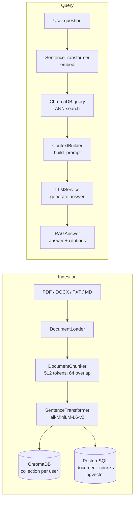

# RAG Overview

> **Module:** `app.rag`, `app.embedding`, `app.vector`, `app.document`  
> **Updated:** 2026-10-03

Retrieval-Augmented Generation (RAG) lets the AI answer questions grounded in the user's own uploaded documents. This document covers the architecture, data flow, and integration points.

---

## Table of Contents

1. [What is RAG?](#1-what-is-rag)
2. [Architecture](#2-architecture)
3. [Pipeline stages](#3-pipeline-stages)
4. [Security model](#4-security-model)
5. [Configuration](#5-configuration)
6. [API endpoints](#6-api-endpoints)
7. [Known limitations](#7-known-limitations)

---

## 1. What is RAG?

RAG is a technique that improves LLM responses by injecting relevant document context into the prompt before generating an answer. The workflow is:

```
User question
     │
     ▼
Embed question → vector search → top-K chunks
     │
     ▼
Build prompt: system + chunks + question
     │
     ▼
LLM generates grounded answer
     │
     ▼
Response + source citations
```

Without RAG, the LLM answers from training data only — which may be stale, incorrect, or missing domain-specific knowledge. With RAG, the LLM can answer from the user's actual documents.

---

## 2. Architecture



---

## 3. Pipeline stages

### Ingestion
1. `DocumentLoader` — extracts text from PDF (pdfplumber + pytesseract OCR fallback), DOCX (python-docx), TXT/MD (UTF-8).
2. `DocumentChunker` — fixed-size sliding window tokenised by tiktoken. Default: 512 tokens, 64 overlap.
3. `SentenceTransformerEmbeddingProvider` — encodes each chunk as a 384-dimensional float vector using `all-MiniLM-L6-v2` (CPU inference).
4. `ChromaVectorStore` — stores embeddings in a per-user ChromaDB collection (`documents_{user_id}`). Also writes chunk metadata to PostgreSQL `document_chunks`.

Ingestion runs asynchronously via Celery (`ingestion` queue). Status polled via `GET /api/v1/documents/{id}/status`.

### Retrieval
1. Embed the user's question with the same model.
2. `ChromaDB.query()` returns the top-K chunks by cosine similarity from `documents_{user_id}`.
3. `ContextBuilder` assembles the retrieved chunks into a context window and generates citations.
4. `LLMService.generate()` produces the grounded answer.

### Structured query (spec endpoint)
`POST /api/v1/rag/query` uses `QueryDocumentWithSourcesUseCase` which calls `DocumentRepository.ragQuery()` — this endpoint returns structured citations with `excerpt` text and cosine `score` per source, without any text parsing.

---

## 4. Security model

### Per-user collection scoping
Every ChromaDB query is scoped to `collection="documents_{user_id}"`. There is no fallback collection — if the user has no documents, the result is an empty list. Cross-user data leakage is structurally impossible through the normal RAG path.

This is validated by property tests in `tests/property/test_property_8_user_scoped_rag_isolation.py`.

### PII in logs
- `user_id` is redacted to the first 8 characters in all RAG log records.
- Raw question text is never logged — only `question_length`.
- Chunk content is never logged — only `chunk_count` and `has_sources`.

### Content sanitisation
Retrieved document chunks are passed through `AgentSafetyGuard.sanitize_rag_content()` before being injected into the LLM prompt. This prevents malicious content embedded in uploaded documents from influencing the LLM response.

---

## 5. Configuration

| Setting | Default | Description |
|---|---|---|
| `RAG_CHUNK_SIZE` | 512 | Token chunk size (tiktoken) |
| `RAG_CHUNK_OVERLAP` | 64 | Token overlap between consecutive chunks |
| `RAG_TOP_K` | 5 | Max chunks retrieved per query |
| `MAX_FILE_SIZE_MB` | 50 | Max upload size |
| `CHROMA_HOST` | `chromadb` | ChromaDB service host (Docker service name) |
| `CHROMA_PORT` | `8000` | ChromaDB HTTP port (container-internal) |
| `CHROMA_SSL` | `false` | Use HTTPS to ChromaDB |

---

## 6. API endpoints

| Method | Path | Description |
|---|---|---|
| `POST` | `/api/v1/documents/upload` | Upload a document (multipart/form-data) |
| `GET` | `/api/v1/documents/` | List user's documents |
| `GET` | `/api/v1/documents/{id}/status` | Poll ingestion status |
| `DELETE` | `/api/v1/documents/{id}` | Delete document + embeddings |
| `POST` | `/api/v1/rag/query` | Submit RAG question, get structured answer + citations |

---

## 7. Known limitations

- **CPU-only embeddings** — `all-MiniLM-L6-v2` runs on CPU. First call after container start takes ~35 s to load the model. Subsequent calls are fast (~35 ms). The production Dockerfile pre-downloads the model at build time.
- **ChromaDB ANN only** — the current implementation uses ChromaDB ANN search only. pgvector cosine and BM25 full-text are documented in the target architecture but not yet active (requires migration 0017).
- **No document update** — documents must be deleted and re-uploaded to update their content. No incremental update or re-chunking is supported.
- **Text extraction only** — tables, charts, and images in PDFs are not semantically indexed (OCR captures visible text only).
- **Single-language embedding** — `all-MiniLM-L6-v2` is primarily trained on English. Non-English documents may have lower retrieval quality.
