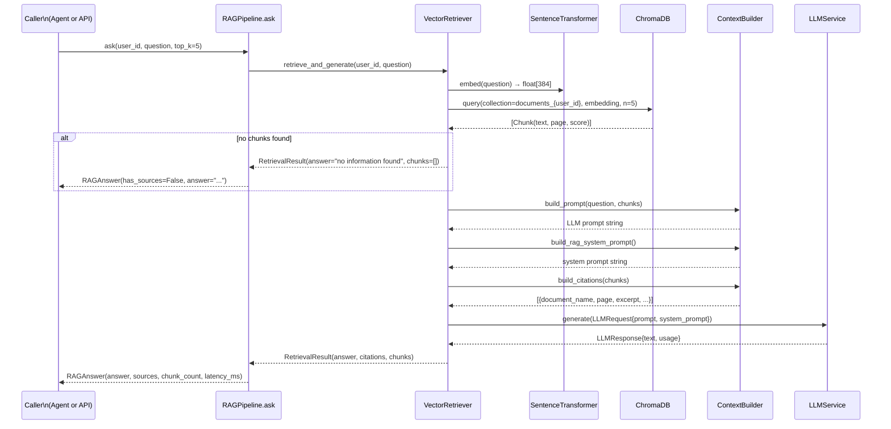

# RAG Retrieval

> **Updated:** 2026-10-03

How the RAG pipeline answers a user question using uploaded documents.

---

## Retrieval flow



---

## Structured query endpoint

`POST /api/v1/rag/query` uses the spec-contract endpoint which returns structured citations:

```json
{
  "answer": "The MCP architecture uses a three-layer design: connector, registry, and executor.",
  "sources": [
    {
      "document_name": "mcp-architecture.md",
      "page_number": 2,
      "excerpt": "Three-layer design: connector, registry, executor.",
      "score": 0.91
    },
    {
      "document_name": "readme.md",
      "page_number": 1,
      "excerpt": "Setup instructions for the MCP server.",
      "score": 0.77
    }
  ],
  "request_id": "abc-def-123"
}
```

This uses `QueryDocumentWithSourcesUseCase` which calls `DocumentRepository.ragQuery()` → `DocumentRemoteDataSource.getRagAnswer()` → `POST /api/v1/rag/query` on the backend.

---

## Citation shape

Each citation carries:

| Field | Type | Description |
|---|---|---|
| `document_name` | string | Original filename (e.g. `annual_report.pdf`) |
| `page_number` | int | 1-based page number (null for TXT/MD) |
| `excerpt` | string | Verbatim text excerpt from the retrieved chunk |
| `score` | float | Cosine similarity score (0.0–1.0, higher = more relevant) |
| `document_id` | string | Document UUID for deduplication |

---

## Prompt construction

`ContextBuilder.build_prompt()` assembles:

```
[Retrieved context]
Source: annual_report.pdf (page 5)
The net profit for Q4 was $12.5 million...
---
Source: annual_report.pdf (page 7)
Revenue breakdown by region shows...
---

[User question]
What was the net profit for Q4?
```

The system prompt (`build_rag_system_prompt()`) instructs the LLM to:
- Answer only from the provided context.
- State "I don't have enough information" if context is insufficient.
- Cite source documents in the answer.
- Never make up facts.

---

## Graceful degradation

`RAGPipeline.ask()` **never raises**. All failure modes return a `RAGAnswer`:

| Failure | `success` | `answer` |
|---|---|---|
| No documents found | True | "I could not find any relevant information..." |
| Embedding fails | False | "I was unable to process your question due to a service error." |
| ChromaDB unreachable | False | Same as above |
| LLM generation fails | True | "I retrieved relevant context but was unable to generate an answer..." |

---

## Retrieve-only mode

For use cases that need chunks without LLM generation:

```python
answer = await pipeline.retrieve_only(user_id, question, top_k=5)
# answer.answer == ""
# answer.sources populated
# No LLM call made
```

---

## Privacy enforcement

- ChromaDB query scoped to `collection="documents_{user_id}"` — no cross-user access.
- `user_id` in logs: first 8 characters only (e.g. `aaaaaaaa…`).
- Raw question never logged — only `question_length`.
- Retrieved chunk content never logged — only `chunk_count` and `has_sources`.
